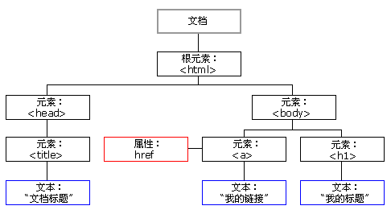

### DOM 

浏览器无法直接理解和使用 HTML，所以需要将 HTML 转换为 DOM（Document Object Model）

> DOM 是保存在内存中树状结构的 HTML

DOM 将 HTML 文档视为树状结构，所有内容都是节点（对象）

- 文档节点：文档的根节点，只有一个子节点（文档元素 &lt;html&gt;）
- 元素节点：HTML 元素（栗子：&lt;p&gt;我是 HTML 元素&lt;p&gt;）
- 属性节点：HTML 属性
- 文本节点
- 注释节点

DOM 树中所有节点均可通过 JavaScript 进行访问和操作

&emsp;

DOM 中所有节点类型都继承自 Node 类型，它们都有一个 nodeType 属性，用于表明节点的类型

Document 类型，表示文档节点，document 对象是它的一个实例

Element 类型，表示元素节点

Attr 类型，表示属性节点

Text 类型，表示文本节点

Comment 类型，表示注释节点

> DOM 树是保存在内存中的对象的集合，一个节点对应一个对象

&emsp;

DOM 定义了用于 HTML 的一系列标准的对象，以及访问和操作 HTML 文档的标准方法：

**document 对象**，表示文档本身

常用属性和方法：

~~~ javascript
/* document 是 Document 类型的对象 */
document.documentElement // 返回文档元素，即 <html> 元素
document.body            // 返回文档的 body 元素

document.createElement(nodename)          // 创建元素节点
document.createAttribute(attributename)   // 创建属性节点
document.createTextNode(text)             // 创建文本节点

document.getElementById(elementID)        // 返回对拥有指定 id 的第一个对象的引用
document.getElementsByTagName(tagname)    // 返回带有指定标签名的对象集合
~~~

&emsp;

**Element 对象**，表示 HTML 元素

常用属性和方法：

~~~ javascript
/* element 是 Element 类型的对象 */
element.childNodes        // 返回元素的子节点数组
element.attributes        // 返回元素的属性数组
element.className         // 设置或返回元素的class属性
element.firstChild        // 返回元素的第一个子节点
element.parentNode        // 返回元素的父节点

element.nodeType          // 返回元素的节点类型
element.id                // 设置或者返回元素的 id
element.innerHTML=new HTML         // 设置或者返回元素的内容
element.style[property]=new style   // 设置或返回元素的样式属性
element[attribute]=new value        // 设置或返回元素的属性

element.appendChild(node)             // 为元素添加一个新的子元素
element.removeChild(element)          // 删除一个子元素
element.getAttribute(attributename)   // 返回指定元素的属性值
element.setAttribute(attributename,attributevalue)  // 设置或者改变指定属性并指定值

element.classList.add(class1, class2, ...)			// 添加一个或多个类名
element.classList.remove(class1, class2, ...)		// 移除元素中一个或多个类名
~~~

&emsp;

**Attr 对象**，表示 HTML 属性

常用属性和方法：

~~~ javascript
/* attribute 是 Attr 类型的对象*/
attribute.name      // 返回属性名称
attribute.value     // 设置或者返回属性值
~~~

&emsp;

### 总结

浏览器会将载入的 HTML 文档解析为一个由节点和对象（包含属性和方法）组成的结构**集合**——DOM （文档对象模型），它将 web 页面和脚本或编程语言关联起来，用一个逻辑树来表示一个文档，树的每个分支都是一个节点，每个节点都包含着对象。DOM 方法可以让你用特定方式操作这个树——改变文档的结构、样式或者内容。节点还可以关联事件处理器，一旦某一事件被触发，那些事件处理器就会被执行。

&emsp;

个人理解：DOM 是一套访问和操作 HTML 文档的标准，它将 HTML 文档解析为按层次结构组织的节点和对象的集合。而虚拟DOM 采用 js 对象模拟一颗简单的 DOM 树，任何 DOM 操作都会在 VNode 上进行，最后新旧 VNode 进行对比，一次性将比较结果更新到 DOM 树上。由于不需要频繁操作 DOM，大大提高了性能。

