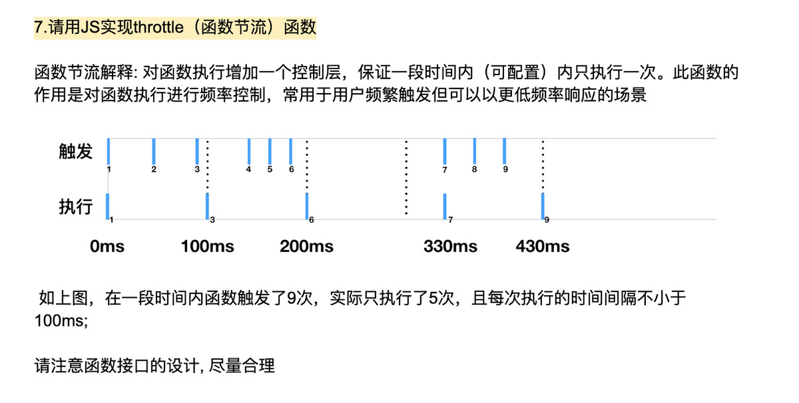

### typeof 和 instanceof

基本类型：Undefined、Null、Boolean、Number、String、BigInt、Symbol

引用类型：

1. 原生引用类型：Object、Array、Date、RegExp、Function等
2. 自定义引用类型


确定一个值是哪种基本类型可用 typeof 操作符

| 操作符 | 值                      | 类型      |
| ------ | ----------------------- | --------- |
| typeof | "abc"                   | string    |
|        | true                    | boolean   |
|        | 123                     | number    |
|        | 123n                    | bigint    |
|        |                         | undefined |
|        | null （对应 Null 类型） | object    |
|        | undefined               | undefined |
|        | new Object()            | object    |
|        | function() {}           | function  |

> 从逻辑角度来看，null 值表示一个**空对象指针**，所以使用 typeof 操作符检测 null 值时会返回 "object"
>
> undefined 派生自 null，所以 undefined == null 的值是 true

&emsp;

确定一个值是哪种引用类型可用 instanceof 操作符

| 值   | 操作符     | 构造函数 | 结果 |
| ---- | ---------- | -------- | ---- |
| obj  | instanceof | Object   | true |

可以使用 instanceof 操作符来测试实例与原型链中出现过的构造函数

> 每个引用类型都有一个对应的构造函数，可通过 new 操作符来创建实例

&emsp;

### window 和 document

window 对象表示浏览器的一个实例，它既是通过 JavaScript 访问浏览器窗口的一个接口，又是 ECMAScript 规定的 Global 对象（因此所有在全局作用域中声明的变量、函数都会变成 window 对象的属性和方法）

document 对象是 window 对象的一个属性，表示整个 HTML 页面

&emsp;

### 闭包

指有权访问另一个函数作用域中的变量的函数

&emsp;

!! 的作用就是把值转化为布尔值，!!a 等效于 Boolean(a)

&emsp;

### for-in 和 for-of

for-in 主要用于遍历对象

~~~javascript
var obj = {a: 1,b: 2};
for(var o in obj) {
  console.log(o);
}
// a
// b

// 遍历数组时，返回的是数组下标
var array  = [2,3,4,5];
for(var i in array) {
  console.log(i);
}
// 0 1 2 3
~~~

&emsp;

for-of 不仅支持数组，还支持大多数类数组对象，还包括字符串

~~~javascript
var array  = [2,3,4,5];
for(var i of array) {
  console.log(i);
}
// 2 3 4 5

var array  = "abc";
for(var i of array) {
  console.log(i);
}
// a b c
~~~

&emsp;

### 对象属性遍历

Object.keys() 返回一个由**对象本身**的可枚举属性组成的数组

for…in 遍历**对象本身**的可枚举属性，以及对象从其**原型**中继承的属性

obj.hasOwnProperty(propertyName) 用于检查给定的属性是否在当前对象实例中（而不是在实例的原型中）

> 在“深拷贝”中，可以用 Object.keys() 代替 for…in + obj.hasOwnProperty(propertyName)

&emsp;

### Object 构造函数的方法

Object.create() 方法创建一个新对象，使用现有的对象来提供新创建的对象的\_\_proto\_\_

Object.defineProperty() 方法会直接在一个对象上定义一个新属性，或者修改一个对象的现有属性， 并返回这个对象。

&emsp;

### Object 构造函数原型的方法

Object.prototype.isPrototypeOf() 方法用于测试一个对象是否存在于另一个对象的原型链上

Object.prototype.hasOwnProperty(prop) 方法会返回一个布尔值，指示对象自身属性中是否具有指定的属性

&emsp;

### 实现继承的几种方式

##### 原型链继承

利用原型让一个引用类型继承另一个引用类型的属性和方法

~~~js
function SuperType() {
    this.name = 'seven';
}

SuperType.prototype.sayName = function() {
    console.log(this.name)
}

function SubType() {
    this.age = 10
}

SubType.prototype = new SuperType()
SubType.prototype.sayAge = function() {
    console.log(this.age)
}
SubType.prototype.constructor = SubType


let sub = new SubType()
sub.sayName()
sub.sayAge()
~~~

> 缺点：
>
> 1. 通过原型来实现继承时，原型会变成另一个类型的实例，原先的实例属性变成了现在的原型属性，该原型的引用类型属性会被所有的实例共享。
>
> 2. 在创建子类型的实例时，没有办法在不影响所有对象实例的情况下给超类型的构造函数中传递参数。


##### 借用构造函数

在子类型的构造函数中调用超类型构造函数

~~~js
function SuperType(name) {
    this.name = name
    this.sayName = function() {
        console.log(this.name)
    }
}
    
function SubType(name, age) {
    SuperType.call(this, name)
    this.age = age
    this.sayAge = function() {
        console.log(this.age)
    }
}

let sub = new SubType('seven', 10)
sub.sayName()
sub.sayAge()
~~~

> 优点：
>
> 1. 可以向超类传递参数
> 2. 解决了原型中包含引用类型值被所有实例共享的问题
>
> 缺点：
>
> 1. 方法都在构造函数中定义，函数复用无从谈起，另外超类型原型中定义的方法对于子类型而言都是不可见的。


##### 组合使用构造函数模式与原型模式

构造函数模式用于定义实例属性，而原型模式用于定义方法和共享的属性

``` javascript
function SuperType(name) {
    this.name = name
}

SuperType.prototype.sayName = function() {
    console.log(this.name);
}

function SubType(name,age) {
    SuperType.call(this,name)
    this.age = age
}

SubType.prototype = new SuperType()
SubType.prototype.constructor = SubType
SubType.prototype.sayAge = function() {
    console.log(this.age)
}

var sub = new SubType('seven', 10)
sub.sayAge()
sub.sayName()
```

> 优点：
>
> 1. 可以向超类传递参数
> 2. 每个实例都有自己的属性
> 3. 实现了函数复用
>
> 缺点：
>
> 1. 无论什么情况下，都会调用两次超类型构造函数：一次是在创建子类型原型的时候，另一次是在子类型构造函数内部


##### 原型式继承

借助原型可以基于已有的对象创建新对象，同时还不必因此创建自定义类型

~~~js
function object(o) {
    function F() {}
    F.prototype = o
    return new F()
}
~~~

> 缺点：
>
> 1. 同原型链实现继承一样，包含引用类型值的属性会被所有实例共享


##### 寄生式继承

创建一个仅用于封装继承过程的函数，该函数在内部已某种方式来增强对象，最后再像真地是它做了所有工作一样返回对象

~~~js
function createAnother(original) {
    let clone = object(original) // 原型式继承函数
    clone.sayHi = function() {
        console.log('hi')
    }
    return clone
}
~~~

> 缺点：
>
> 1. 使用寄生式继承来为对象添加函数，会由于不能做到函数复用而效率低下。
> 2. 同原型链实现继承一样，包含引用类型值的属性会被所有实例共享。


##### 寄生组合式继承

不必为了指定子类型的原型而调用超类型的构造函数，我们需要的仅是超类型原型的一个副本，本质上就是使用寄生式继承来继承超类型的原型，然后再将结果指定给子类型的原型

~~~js
function object(o) {
    function F() {}
    F.prototype = o
    return new F()
}

function inheritPrototype(subType, superType) {
    let prototype = object(superType.prototype)
    prototype.constructor = subType
    subType.prototype = prototype
}

function SuperType(name) {
    this.name = name
}

SuperType.prototype.sayName = function() {
    console.log(this.name);
}

function SubType(name,age) {
    SuperType.call(this,name)
    this.age = age
}

inheritPrototype(SubType, SuperType)
SubType.prototype.sayAge = function() {
    console.log(this.age)
}

var sub = new SubType('seven', 10)
sub.sayAge()
sub.sayName()
~~~

> 优点：
>
> 只调用了一次超类构造函数，效率更高。避免在 `SuberType.prototype`上面创建不必要的、多余的属性，与其同时，原型链还能保持不变。

**因此寄生组合继承是引用类型最理性的继承范式。**

&emsp;

### 深拷贝

``` javascript
function deepClone(obj) {
  if (obj == null) { // 增加对象或属性值为null的情况
    return null;
  }
  var clone = Array.isArray(obj)? [] : {};
  Object.keys(obj).forEach(key => {
    if (typeof obj[key] == 'object') {
      clone[key] = deepClone(obj[key]);
    } else {
      clone[key] = obj[key];
    }
  })
  return clone;
}
```

&emsp;

### 防抖、节流、懒加载

目的：防止频繁触发事件，增加浏览器负担，影响用户体验

#### 防抖

函数防抖：当持续触发事件时，一定时间段内没有再触发事件，事件处理函数才会执行一次，如果设定的时间到来之前，又一次触发了事件，就重新开始延时。原理是维护一个计时器，规定在delay时间后触发函数，但是在delay时间内再次触发的话，就会取消之前的计时器而重新设置。这样一来，只有最后一次操作能被触发

``` javascript
function debounce(func, delay) {
  var timer = null;
  return function() {
    if(timer) {
      clearTimeout(timer);
    }
    timer = setTimeout(() => func.call(this),delay);
  }
}
window.onscroll = debounce(lazyLoad,1000);
```

#### 节流

函数节流：当持续触发事件时，保证一定时间段内只调用一次事件处理函数。原理是通过判断是否到达一定时间来触发函数

``` javascript
function throttle(func, delay) {
  var timer = null, pre = 0;
  return function() {
    var cur = Date.now();
    var remain = delay - (cur - pre);
    clearTimeout(timer);
    if (remain <= 0) {
      func.call(this);
      pre = Date.now();
    } else {
      timer = setTimeout(() => {
        func.call(this);
        pre = Date.now();
      }, remain)
    }
  }
}
```



#### 懒加载

先将img标签中的src链接设为同一张图片（空白图片），将其真正的图片地址存储在img标签的自定义属性中（比如data-src）。当js监听到该图片元素进入可视窗口时，即将自定义属性中的地址存储到src属性中，达到懒加载的效果

``` javascript
var imgs = document.querySelectorAll('img');
var n = 0;

function lazyLoad() {
  var viewHight = document.body.clientHeight;
  var scrollTop =  document.body.scrollTop;
  
  for(var i = n; i < imgs.length; i++) {
    if (imgs[i].offsetTop <= viewHight + scrollTop ) {
      if (imgs[i].getAttribute('src') == '') {
        imgs[i].setAttribute('src', imgs[i].getAttribute('data-src'));
      }
      n = i + 1;
    }
  }
}

window.onload = lazyLoad;
window.onscroll = throttle(lazyLoad, 1000);
```

&emsp;

### bind函数

``` javascript
Function.prototype.bind = function( context ) {
  var self = this; // 保存原函数
  return function(){ // 返回一个新的函数
  	return self.apply( context, arguments ); 
  	// 执行新的函数的时候，会把之前传入的context当作新函数体内的this
  }
}

var obj = { name: 'seven' };

var func = function() { console.log( this.name ); }.bind(obj)

func(); // 输出：seven

/*
*	function() { console.log( this.name ); } 是 Function 类型的实例，可以调用 bind 函数
*	绑定 obj 对象， 返回一个新函数
*/

Function.prototype.bind = function() {
  var self = this;
  var context = [].shift.apply(arguments);
  var args = [].slice.apply(arguments);
  return function() {
    return self.apply( context, [].concat(args, [].slice.apply(arguments)) );
  }
}

var obj = { name: 'seven' };

var func = function( a, b, c, d ) {
  console.log( this.name ); // 输出：seven
  console.log( [ a, b, c, d ] ) // 输出：[ 1, 2, 3, 4 ]
}.bind(obj,1,2);

func(3,4);
```

&emsp;

### 跨浏览器事件处理程序

``` javascript
var addEvent = function(elem, type, handler) {
    if(elem.addEventListener) {
        elem.addEventListener(type, handler, false);
    } else if(elem.attachEvent) {
        elem.attachEvent('on'+type, handler);
    } else {
        elem['on'+type] = handler;
    }
}

var btn = document.getElementById("btn");
addEvent(btn, "click", function() {
    alert("success!");
});
```

&emsp;

### 事件处理程序

~~~javascript
// HTML事件处理程序
<input type="button" value="Click Me" onclick="alert('Clicked')" />

// DOM0级事件处理程序
var btn = document.getElementById("myBtn");
btn.onclick = function() {
	alert("Clicked");
};

// DOM2级事件处理程序
var btn = document.getElementById("myBtn");
btn.addEventListener("click", function() {
	alert(this.id);
}, false);
// 可添加多个，添加顺序触发
// true表示捕获阶段，false表示冒泡阶段

// IE事件处理程序
var btn = document.getElementById("myBtn");
btn.attachEvent("onclick", function() {
alert("Clicked");
});
// 可添加多个，添加相反顺序触发

~~~

&emsp;

### JS 正则表达式

| 元字符 | 描述                       |
| ------ | -------------------------- |
| /      | 表示正则表达式的开始和结束 |
| ^      | 匹配字符串的开始           |
| $      | 匹配字符串的结束           |
| \d     | 匹配一个数字字符           |

&emsp;

### JS 异步编程

- 回调函数
- 事件监听
- 发布/订阅
- Promise 对象

&emsp;

### JS 单线程和异步

js 是单线程的，浏览器只分配给 js 一个主线程，用来执行任务（函数），一次只能执行一个。

浏览器（js的宿主环境）是多线程的，可以为异步任务开辟单独的线程，异步任务完成之后，将回调函数放入任务队列，所以说浏览器是事件驱动的，通过执行一个个事件来运行。

整个执行过程：js 主线程执行一个任务，推入执行栈，执行函数时，如有其他函数，就继续入栈，执行完就出栈。等到执行栈为空时，就从任务栈中读取新任务入栈，读取任务的过程就叫作 event loop。

&emsp;

### Event

e.target：触发事件的元素

e.currentTarget：绑定事件的元素

e.offsetX：当鼠标事件发生时，鼠标相对于触发事件源 x 轴的位置

e.offsetY：当鼠标事件发生时，鼠标相对于触发事件源 y 轴的位置

e.clientX：当鼠标事件发生时，鼠标相对于浏览器（这里说的是浏览器的有效区域）x轴的位置

e.clientY：当鼠标事件发生时，鼠标相对于浏览器（这里说的是浏览器的有效区域）y轴的位置

e.pageX：e.clientX + 横向滚动条距离

e.pageY：e.clientY + 纵向滚动条距离

e.screenX：当鼠标事件发生时，鼠标相对于显示器屏幕 x 轴的位置

e.screenY：当鼠标事件发生时，鼠标相对于显示器屏幕 y 轴的位置

&emsp;

### Dom 元素

HTMLElement.offsetParent，指向最近的包含该元素的定位元素

HTMLElement.offsetLeft，返回当前元素相对于其 offsetParent 元素的左侧的距离

HTMLElement.offsetTop，返回当前元素相对于其 offsetParent 元素的顶部的距离

HTMLElement.offsetWidth，返回元素的布局宽度

HTMLElement.offsetHeight，返回元素的布局高度


Element.scrollLeft，表示元素横向滚动的距离

Element.scrollTop，表示元素纵向滚动的距离

Element.scrollWidth，表示元素滚动视图的宽度（包括由于溢出导致的视图中不可见内容 ）

Element.scrollHeight，表示元素滚动视图的高度（包括由于溢出导致的视图中不可见内容 ）

Element.clientWidth，表示元素内部的宽度

Element.clientHeight，表示元素内部的高度


&emsp;

### 拖放

拖放是 HTML5 标准的组成部分，任何元素都是可拖放的。 

&emsp;

##### 确定什么是可拖动的 

让一个元素被拖动需要添加 draggable 属性，再加上全局事件处理函数 ondragstart

~~~ html
<script>
function dragstart_handler(ev) {
 // Add the target element's id to the data transfer object
 ev.dataTransfer.setData("text/plain", ev.target.innerText);
}
</script>

<p id="p1" draggable="true" ondragstart="dragstart_handler(event)">This element is draggable.</p>
~~~

&emsp;

##### 定义拖动数据

应用程序可以在拖动操作中包含任意数量的数据项。每个数据项都是一个 string 类型，典型的 MIME 类型，如：text/html。 

每个 drag event 都有一个 dataTransfer 属性保保存事件的数据。这个属性（ DataTransfer对象）也有管理拖动数据的方法，setData() 方法添加一个项目的拖拽数据。 

~~~ javascript
function dragstart_handler(ev) {
  // 添加拖拽数据
  ev.dataTransfer.setData("text/plain", ev.target.innerText);
  ev.dataTransfer.setData("text/html", ev.target.outerHTML);
}
~~~

&emsp;

##### 定义拖动图像

拖动过程中，浏览器会在鼠标旁显示一张默认图片。当然，应用程序也可以通过 setDragImage() 方法自定义一张图片。

~~~ javascript
function dragstart_handler(ev) {
  // Create an image and then use it for the drag image.
  // NOTE: change "example.gif" to a real image URL or the image 
  // will not be created and the default drag image will be used.
  var img = new Image(); 
  img.src = 'example.gif'; 
  ev.dataTransfer.setDragImage(img, 10, 10);
}
~~~

&emsp;

#####  定义拖动效果

dropEffect 属性用来控制拖放操作中用户给予的反馈。它会影响到拖动过程中浏览器显示的鼠标样式。比如，当用户悬停在目标元素上的时候，浏览器鼠标也许要反映拖放操作的类型。

有 3 个效果可以定义： 

1. `copy` 表明被拖动的数据将从它原本的位置拷贝到目标的位置。
2. `move` 表明被拖动的数据将被移动。
3. `link` 表明在拖动源位置和目标位置之间将会创建一些关系表格或是连接。

在拖动过程中，拖动效果也许会被修改以用于表明在具体位置上具体效果是否被允许，如果允许，在该位置则被允许放置。

~~~ javascript
function dragstart_handler(ev) {
  ev.dataTransfer.dropEffect = "copy";
}
~~~

&emsp;

##### 定义一个放置区 

当拖动一个项目到 HTML 元素中时，浏览器默认不会有任何响应。想要让一个元素变成可释放区域，该元素必须设置 ondragover 和 ondrop 事件处理程序属性。

~~~html
<script>
function dragover_handler(ev) {
 ev.preventDefault();
 ev.dataTransfer.dropEffect = "move";
}
function drop_handler(ev) {
 ev.preventDefault();
 // Get the id of the target and add the moved element to the target's DOM
 var data = ev.dataTransfer.getData("text/plain");
 ev.target.appendChild(document.getElementById(data));
}
</script>

<p id="target" ondrop="drop_handler(event)" ondragover="dragover_handler(event)">Drop Zone</p>
~~~

调用 ev.preventDefault() 来阻止数据的浏览器默认处理方式（drop 事件的默认行为是以链接形式打开）

 

#####  处理放置效果

drop 事件的处理程序是以程序指定的方法处理拖动数据。一般，程序调用 getData() 方法取出拖动项目并按一定方式处理。程序意义根据 dropEffect 的值与/或可变更关键字的状态而不同 

~~~ html
<script>
function dragstart_handler(ev) {
 // Add the target element's id to the data transfer object
 ev.dataTransfer.setData("application/my-app", ev.target.id);
 ev.dataTransfer.dropEffect = "move";
}
function dragover_handler(ev) {
 ev.preventDefault();
 ev.dataTransfer.dropEffect = "move"
}
function drop_handler(ev) {
 ev.preventDefault();
 // Get the id of the target and add the moved element to the target's DOM
 var data = ev.dataTransfer.getData("application/my-app");
 ev.target.appendChild(document.getElementById(data));
}
</script>

<p id="p1" draggable="true" ondragstart="dragstart_handler(event)">This element is draggable.</p>
<div id="target" ondrop="drop_handler(event)" ondragover="dragover_handler(event)">Drop Zone</div>
~~~

&emsp;

#####  拖动结束

拖动操作结束时，在源元素（开始拖动时的目标元素）上触发 dragend 事件。不管拖动是完成还是被取消这个事件都会被触发。 dragend 事件处理程序可以检查 dropEffect 属性的值来确认拖动成功与否。

&emsp;

### Object.defineProperty()

`Object.defineProperty()` 方法会直接在一个对象上定义一个新属性，或者修改一个对象的现有属性， 并返回这个对象。

> Object.defineProperty(obj, prop, descriptor) // obj：对象，prop：属性，descriptor：属性描述符

属性描述符有两种主要形式：**数据描述符**和**存取描述符**。

**数据描述符**定义了一个具有值的属性，该值可能是可写的，也可能是不可写的。我们将该属性叫作**数据属性**。

**存取描述符**定义了一个由 getter-setter 函数对描述的属性，我们将该属性叫作**访问器属性**。

描述符必须是这两种形式之一，不能同时是两者。

|            | configurable | enumerable | value | writable | get  | set  |
| ---------- | ------------ | ---------- | ----- | -------- | ---- | ---- |
| 数据描述符 | Yes          | Yes        | Yes   | Yes      | No   | No   |
| 存取描述符 | Yes          | Yes        | No    | No       | Yes  | Yes  |

&emsp;

### JavaScript 模块化规范

模块化解决的问题：

- 命名冲突
- 文件依赖

##### CommonJS

`CommonJS`  规范的核心思想是允许模块通过  `require`  方法来**同步**加载所要依赖的其他模块，然后通过  `exports`  或  `module.exports`  来导出需要暴露的接口

- 所有代码都运行在模块作用域，不会污染全局作用域
- 模块可以多次加载，但是只会在第一次加载时运行一次，然后运行结果就被缓存了，以后再加载，就直接读取缓存结果。要想让模块再次运行，必须清除缓存
- 模块加载的顺序，按照其在代码中出现的顺序

~~~js
// module.exports 属性表示当前模块对外输出的接口
// 其他文件加载该模块，实际上就是读取 module.exports 的值
module.exports = someValue;
// 为了方便，Node 为每个模块提供一个 exports 变量，指向 module.exports
exports.message = 'hello world';
// require 的基本功能是，加载并执行一个 JavaScript 文件，然后返回该模块的 exports 属性的值
require("module");
~~~

加载和执行机制：

- 同步加载执行
- 输入的是被输出的值的拷贝。也就是说，一旦输出一个值，模块内部的变化就影响不到这个值

优点：

- 简单并容易使用

缺点：

- 同步加载模块的方式不适合在浏览器环境中，同步意味着阻塞加载
- 不能非阻塞的并行加载多个模块

实现：

- `Node.js` 的模块化规范是参照 `CommonJS` 实现的

适用场景：

服务器环境

> [文档](http://javascript.ruanyifeng.com/nodejs/module.html#toc2)

&emsp;

##### AMD

`AMD` 规范只有一个主要接口 `define(id?, dependencies?, factory)`，它需要在声明模块的时候指定所有的依赖 `dependencies`，并且还要当做形参传到 `factory` 中，对于依赖的模块**提前执行**，依赖前置。

```js
define("module", ["dep1", "dep2"], function(d1, d2) {
  return someExportedValue; // 导出
});
require(["module"], function(module) {});
```

加载和执行机制：异步加载执行

优点：

- 适合在浏览器环境中异步加载模块
- 可以并行加载多个模块

缺点：

- 提高了开发成本，代码的阅读和书写比较困难，模块定义方式的语义不顺畅
- 不符合通用的模块化思维方式，是一种妥协的实现

实现：

- `Require.js` 就是参照 `AMD`  规范实现的

适用场景：

浏览器环境

&emsp;

##### CommonJS 和 AMD 的区别

由于`Node.js`主要用于服务器环境，模块文件一般都已经存在于本地硬盘，所以加载起来比较快，不用考虑非同步加载的方式，所以`CommonJS`规范比较适用。但是，如果是浏览器环境，要从服务器端加载模块，这时就必须采用非同步模式，因此浏览器端一般采用`AMD`规范。

&emsp;

##### CMD

`CMD` 是在 `AMD` 基础上改进的一种规范，和 `AMD`  不同在于对依赖模块的**执行时机**处理不同，并且兼容 `CommonJS` 和 `Node.js` 的 `Modules` 规范

```js
// a.js
define(function(require, exports, module) {
  exports.a = 'hello world';
});
// b.js
define(function(require, exports, module) {
  var module = require('./a.js');
  console.log(module.a);
});
```

加载和执行机制：异步加载执行

优点：

- 就近依赖，延迟执行
- 可以很容易在 `Node.js` 中运行

缺点：

- 依赖 SPM 打包，模块的加载逻辑偏重

实现：

- `Sea.js` 就是参照 `CMD` 规范实现的

适用场景：

浏览器环境

&emsp;

##### AMD 和 CMD 的区别

`AMD` 和`CMD`  都是异步加载模块。`AMD`  是前置依赖，可以方便知道依赖了哪些模块。`CMD`  是就近依赖，需要把模块变为字符串解析一遍才知道依赖了哪些模块。

`AMD` 在加载模块完成后就会执行该模块，所有模块都加载执行完成后会进入`require`的回调函数，执行主逻辑。这样就会出现依赖模块的执行顺序和书写顺序不一致的情况（如上面 `dep2`先加载完先执行，`dep1`后加载完后执行）。

`CMD`  加载完某个依赖模块后并不执行，在所有依赖模块加载完成后进入主逻辑，遇到`require`语句的时候才执行对应的模块，这样模块的执行顺序和书写顺序是完全一致的。

&emsp;

##### UMD

`UMD` 规范类似于兼容 CommonJS 和 AMD 的语法糖，是模块定义的跨平台解决方案

~~~js
(function(root, factory) {
	if (typeof define === 'function' && define.amd) {
       // AMD
       define(['jquery'], factory); 
    } else if (typeof exports === 'object') {
        // CommonJS
        module.exports = factory(require('jquery'));
    } else {
        root.returnExports = factory(root.jQuery);
    }
}(this, function($) {
    // 方法
    function myFunc() {};
    // 暴露公共方法
    return myFunc;
}));
~~~

适用场景：

浏览器或服务器环境

&emsp;

##### ESM(ES6 Module)

ES6 模块的设计思想是尽量的静态化，使得编译时就能确定模块的依赖关系，以及输入和输出的变量

```js
import "jquery";
export function doStuff() {}
```

加载和执行机制：编译时加载，运行时执行

优点：

- 容易进行静态分析
- 面向未来的 ECMAScript 标准

缺点：

- 原生浏览器端还没有实现该标准
- 全新的命令字，新版的 Node.js 才支持

实现：

- Babel

适用场景：

浏览器或服务器环境（以后可能支持）

&emsp;

### DOMContentLoaded 和 Load

- DOMContentLoaded，这个事件发生后，说明页面已经构建好 DOM 了，这意味着构建 DOM 所需要的 HTML 文件、JavaScript 文件、CSS 文件都已经下载完成了。
- Load，说明浏览器已经加载了所有的资源（图像、样式表等）。


# 尾调用优化

https://www.ruanyifeng.com/blog/2015/04/tail-call.html