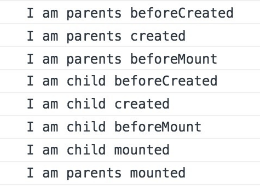
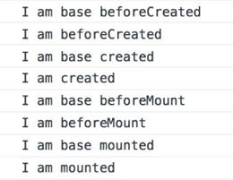
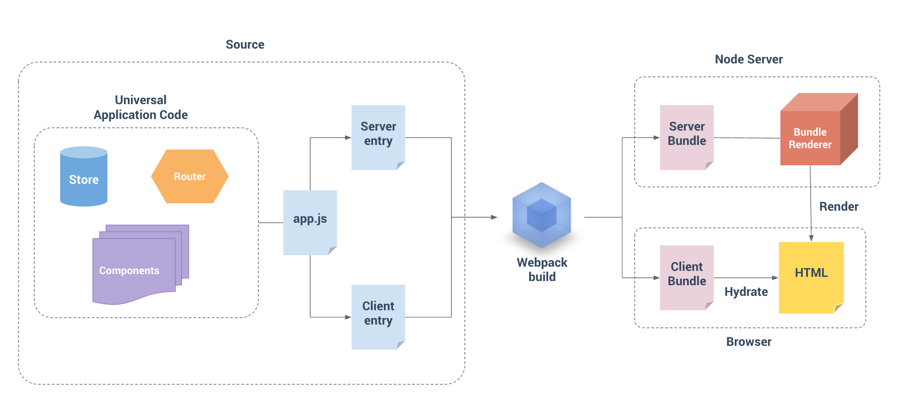

### MVVM

Model–View–ViewModel (MVVM) 是一种软件架构设计模式

Model 层，模型层，后端传递的数据

View 层，视图层，前端展示

ViewModel 层，视图模型层，用于连接 View 层和 Model 层。一方面，实现了与 View 层的双向绑定，通过数据驱动视图，一方面，又与 Model 层进行交互，解耦了 View 层和 Model 层

 

双向绑定，实现数据视图自动更新，不再操作 DOM 对象，专注于业务逻辑

解耦了 View 层和 Model 层，目的在于实现前后端分离

&emsp;

### Vue 优势

1. 通过虚拟 DOM 减少 DOM 操作

   虚拟 DOM 采用 js 对象模拟一颗简单的 DOM 树，任何 DOM 操作都会在 VNode 上进行，最后新旧 VNode 进行对比（优化），最后将比较结果更新到 DOM 树上。由于减少了不必要的 DOM 操作 ，大大提高了性能（js 计算的开销比 DOM 操作要小的多）。

2. 响应式（双向数据绑定）

   通过 Object.defineProperty() 定义对象属性的 getter 和 setter，触发 getter 时进行收集依赖，当数据变更时，触发 setter 通知所有订阅者进行回调。

   Vue 实现双向数据绑定，可以让开发者不再直接操作 DOM 对象，专注于业务逻辑。

   > Vue 基于 MVVM 架构。在 MVVM 中， View 层和 Model 层不能直接通信，需要通过 ViewModel 层进行连接。当数据发生变化时，ViewModel 监听数据变化，更新视图；当用户操作视图时，ViewModel 监听视图变化，通知数据改动。

3. 组件化开发

   Vue 允许我们使用小型、独立和可复用的组件来构建应用。

   优点：组件高内聚低耦合，便于测试和复用

   ​			开发易于管理和协同，提高开发效率

&emsp;

### created 和 mounted 的区别

#### created

在模板渲染成html前调用，即通常初始化某些属性值，然后再渲染成视图

#### mounted

在模板渲染成html后调用，通常是初始化页面完成后，再对html的dom节点进行一些需要的操作

&emsp;

### computed 为什么比 watch method 性能要好

从编码上 computed 实现的功能也可以通过普通 method 实现，但与函数相比，计算属性是基于响应式依赖进行缓存的，只有在依赖的数据发生改变时，才会重新求值，只要依赖没有发生变化，多次访问都只是从缓存中获取。


### 组件的生命周期

#### 父子组件



#### 继承组件



&emsp;

### vue 响应式原理

vue.js 采用数据劫持结合发布-订阅模式的方式，通过 Object.defineProperty() 来劫持各个属性的setter、getter，在数据变动时发布消息给订阅者，触发相应的监听回调

> 属性描述符：数据描述符和存取描述符

~~~js
function defineReactive(obj, key, val) {
    let dep = new Dep()
    Object.defineProperty(obj, key, {
        enumerable: true,
        configurable: true,
        getter: function() {
            if(Dep.target) {
                dep.depend()
            }
            return val
        },
        setter: function(newVal) {
            if(val !== newVal) {
                dep.notify()
            }
        }
    })
}
~~~


&emsp;

### 虚拟DOM

用 js 对象模拟 DOM 节点，用户交互时操作虚拟 DOM，然后通过 diff 算法比较操作前后的虚拟 DOM，最后将 diff 结果更新到实际 DOM 上

> 真实 DOM 树抽象成以 js 对象为节点的虚拟树，创建、修改、删除节点等操作只会对虚拟 DOM 做修改，然后通过 diff 算法得出修改的最小单位，更新到视图上。

##### 优点

虚拟 DOM 具有批处理和高效的 diff 算法，最终表现在 DOM 上的修改只是变更的部分，可以保证非常高效的渲染，优化性能。

##### 缺点

首次渲染大量 DOM 时，由于多了一层虚拟 DOM 的计算，会比 innerHTML 插入慢。


patch 的核心 diff 算法，通过同层的树节点进行比较，时间复杂度只有 O(n)，是一种相当高效的算法。


这两张图代表旧的 VNode 与新 VNode 进行 patch 的过程，他们只是在同层级的 VNode 之间进行比较得到变化（第二张图中相同颜色的方块代表互相进行比较的 VNode 节点），然后修改变化的视图，所以十分高效。


首先，在新老两个 VNode 节点的左右头尾两侧都有一个变量标记，在遍历过程中这几个变量都会向中间靠拢。当oldStartIdx > oldEndIdx 或者 newStartIdx > newEndIdx 时结束循环。

在遍历中，如果存在key，并且满足sameVnode，会将该DOM节点进行复用，否则则会创建一个新的DOM节点。

当新老VNode节点的start或者end满足sameVnode时，也就是sameVnode(oldStartVnode, newStartVnode)或者sameVnode(oldEndVnode, newEndVnode)，直接将该VNode节点进行patchVnode即可。


如果oldStartVnode与newEndVnode满足sameVnode，即sameVnode(oldStartVnode, newEndVnode)。

这时候说明oldStartVnode已经跑到了oldEndVnode后面去了，进行patchVnode的同时还需要将真实DOM节点移动到oldEndVnode的后面。


如果oldEndVnode与newStartVnode满足sameVnode，即sameVnode(oldEndVnode, newStartVnode)。

这说明oldEndVnode跑到了oldStartVnode的前面，进行patchVnode的同时真实的DOM节点移动到了oldStartVnode的前面。


如果以上情况均不符合，则通过createKeyToOldIdx会得到一个oldKeyToIdx，里面存放了一个key为旧的VNode的key，value为对应index序列的哈希表。从这个哈希表中可以找到是否有与newStartVnode一致key的旧的VNode节点，如果同时满足sameVnode，patchVnode的同时会将这个真实DOM（elmToMove）移动到oldStartVnode对应的真实DOM的前面。


当然也有可能找不到一致的key，或者是即便key相同却不是sameVnode，这个时候会调用createElm创建一个新的DOM节点。


到这里循环已经结束了，那么剩下我们还需要处理多余或者不够的真实DOM节点。

1. 当结束时oldStartIdx > oldEndIdx，这个时候老的VNode节点已经遍历完了，但是新的节点还没有。说明了新的VNode节点实际上比老的VNode节点多，也就是比真实DOM多，需要将剩下的（也就是新增的）VNode节点插入到真实DOM节点中去，此时调用addVnodes（**批量调用**createElm的接口将这些节点加入到真实DOM中去）。


2. 同理，当newStartIdx > newEndIdx时，新的VNode节点已经遍历完了，但是老的节点还有剩余，说明真实DOM节点多余了，需要从文档中删除，这时候调用removeVnodes将这些多余的真实DOM删除。


&emsp;

### vuex 缺陷

没有持久化存储的手段，每次刷新都会重置所有的数据

&emsp;

看 vue 源码心得：

1. 数据对象是数组时，数组的索引是非响应式的

   ~~~js
   vm = new Vue({
     data: {
       arr: [1, 2]
     }
   })
   
   vm.arr[0] = 3  // 不能触发响应
   vm.arr.push(4) // 出发响应
   ~~~

   对数组的处理，都是通过拦截数组的变异方法实现的
   
2. 数组的索引是非响应式的原因

   Vue 中通过对对象每个键设置 getter 和 setter 来实现响应式。使用数组的目的往往是遍历，但是调用 getter 开销太大，所以 Vue 不在数组的每个键上定义响应式。
   
3. el 选项提供一个在页面上已经存在的 DOM 元素作为 Vue 实例的挂载目标（挂载点），挂载的元素会被 Vue 生成的 DOM 替换。

4. `Watcher` 的原理是通过对“被观测目标”（expOrFn）的求值，触发数据属性的 `get` 拦截器函数从而收集依赖。

   如果 `expOrFn` 中包含多个数据属性，执行 `expOrFn` 时会触发这些数据属性的 `get` 拦截器函数将当前观察者收集为依赖，即**一个观察者对象对应多个数据属性**

   如果对某个数据属性进行观察（Vue 的 watch 选项或者 vm.$watch），实际上就是定义了 `Watcher` 对象，会触发该数据属性的 `get` 拦截器函数收集依赖，结合上面的情况，即**一个数据属性对应多个观察者对象**
   
5. 读取数据属性的值，能够触发该属性的 get 拦截函数，从而收集依赖。但是其子属性是没有被读取的，所以也不能够收集依赖，千万要和定义响应式区分开来。

6. 如果计算属性 `compA` 依赖了数据对象的 `a` 属性，那么属性 `a` 将收集计算属性 `compA` 的 **计算属性观察者对象**，而 **计算属性观察者对象** 将收集 **渲染函数观察者对象**，实际上是属性`a`收集了**渲染函数观察者对象**，所以改变属性`a`的值，会触发渲染函数重新执行。


### Vue SSR

##### 什么是服务端渲染（SSR）

Vue.js 是构建客户端应用程序的框架。默认情况下，可以在浏览器中输出 Vue 组件，进行生成 DOM 和操作 DOM。然而，也可以将同一个组件渲染为服务器端的 HTML 字符串，将它们直接发送到浏览器，最后将这些静态标记"激活"为客户端上完全可交互的应用程序。

服务器渲染的 Vue.js 应用程序也可以被认为是"同构"或"通用"，因为应用程序的大部分代码都可以在**服务器**和**客户端**上运行。


##### 为什么用服务端渲染

与传统 SPA (Single-Page Application) 相比，服务器端渲染的优势主要在于：

- 更好的 SEO，由于搜索引擎爬虫抓取工具可以直接查看完全渲染的页面。
- 更快的内容到达时间 (time-to-content)，特别是对于缓慢的网络情况或运行缓慢的设备。无需等待所有的 JavaScript 都完成下载并执行，你的用户将会更快速地看到完整渲染的页面，可以产生更好的用户体验。


##### vue-hackernews-2.0

官方示例项目



[客户端应用程序和服务器应用程序](https://wangfuda.github.io/2017/05/14/vue-hackernews-2.0-code-explain/)，都要使用 webpack 打包 ：服务器需要「server bundle」然后用于服务器端渲染(SSR)，而「client bundle」会发送到浏览器，用于混合静态标记。

> bundle 可理解为打包后的东西

服务端应用程序需要打包的原因：	

- 通常 Vue 应用程序是由 webpack 和 vue-loader 构建的，并且许多 webpack 特定功能不能直接在 Node.js 中运行（例如通过 `file-loader` 导入文件，通过 `css-loader` 导入 CSS）。
- 尽管 Node.js 最新版本能够完全支持 ES2015 特性，我们还是需要转译客户端代码以适应老版浏览器。这也会涉及到构建步骤。

此外，bundle renderer 还具有以下优点：

- 内置的 source map 支持（在 webpack 配置中使用 `devtool: 'source-map'`）
- 在开发环境甚至部署过程中热重载（通过读取更新后的 bundle，然后重新创建 renderer 实例）
- 关键 CSS(critical CSS) 注入（在使用 `*.vue` 文件时）：自动内联在渲染过程中用到的组件所需的CSS。
- 使用 [clientManifest](https://ssr.vuejs.org/zh/api/#clientmanifest) 进行资源注入：自动推断出最佳的预加载(preload)和预取(prefetch)指令，以及初始渲染所需的代码分割 chunk。


##### 详细过程

服务器端：当 node server 收到来自 browser 的请求后，会创建一个 Vue 渲染器 Bundle Renderer，它会读取 server bundle（可选读取 template 页面模版和 clientManifest 客户端构建清单）并执行。 server bundle 实现了数据预取并返回已填充数据的 Vue 实例，接下来 Vue 渲染器内部就会将 Vue 实例渲染进 html 模板，最后把这个完整的 html 发送到 browser。

Bundle Renderer 具有 client manifest 和 server bundle 之后，可以自动推断和注入资源预加载 / 数据预取指令(preload / prefetch directive)，以及 css 链接 / script 标签到所渲染的 html。

优点在于：

- 在生成的文件名中有哈希时，可以取代 html-webpack-plugin 来注入正确的资源 URL。
- 在通过 webpack 的按需代码分割特性渲染 bundle 时，我们可以确保对 chunk 进行最优化的资源预加载/数据预取，并且还可以将所需的异步 chunk 智能地注入为 \<script\> 标签，以避免客户端的瀑布式请求 (waterfall request)，以及改善可交互时间 (TTI - time-to-interactive)。

默认情况下，当提供 template 渲染选项时，资源注入是自动执行的。


客户端：当 browser 收到 html 后，开始加载 client bundle，然后以激活模式进行挂载（Vue 在浏览器端接管由服务端发送的静态 html，使其变为由 Vue 管理的动态 DOM）。

客户端激活原因：由于服务器已经渲染好了 html，显然无需将其丢弃再重新创建所有的 DOM 元素。相反，可以“激活"这些静态的 html，然后使他们成为动态的（能够响应后续的数据变化）。


### Nuxt.js

Nuxt.js 是一个基于 Vue.js 的通用应用框架。

通过对客户端/服务端基础架构的抽象组织，Nuxt.js 主要关注的是应用的 **UI渲染**。

我们的目标是创建一个灵活的应用框架，你可以基于它初始化新项目的基础结构代码，或者在已有 Node.js 项目中使用 Nuxt.js。

Nuxt.js 预设了利用 Vue.js 开发**服务端渲染**的应用所需要的各种配置。

我们还提供了一种命令叫：`nuxt generate` ，为基于 Vue.js 的应用提供生成对应的静态站点的功能。

作为框架，Nuxt.js 为 `客户端/服务端` 这种典型的应用架构模式提供了许多有用的特性，例如异步数据加载、中间件支持、布局支持等。

​	

### Vue Router

##### 起步

~~~html
<script src="https://unpkg.com/vue/dist/vue.js"></script>
<script src="https://unpkg.com/vue-router/dist/vue-router.js"></script>

<div id="app">
  <h1>Hello App!</h1>
  <p>
    <!-- 使用 router-link 组件来导航. -->
    <!-- 通过传入 `to` 属性指定链接. -->
    <!-- <router-link> 默认会被渲染成一个 `<a>` 标签 -->
    <router-link to="/foo">Go to Foo</router-link>
    <router-link to="/bar">Go to Bar</router-link>
  </p>
  <!-- 路由出口 -->
  <!-- 路由匹配到的组件将渲染在这里 -->
  <router-view></router-view>
</div>
~~~


~~~js
// 0. 如果使用模块化机制编程，导入Vue和VueRouter，要调用 Vue.use(VueRouter)
import Vue from 'vue'
import VueRouter from 'vue-router'
Vue.use(Router)

// 1. 定义 (路由) 组件。
// 可以从其他文件 import 进来
const Foo = { template: '<div>foo</div>' }
const Bar = { template: '<div>bar</div>' }

// 2. 定义路由
// 每个路由应该映射一个组件。 其中"component" 可以是
// 通过 Vue.extend() 创建的组件构造器，
// 或者，只是一个组件配置对象。
const routes = [
  { path: '/foo', component: Foo },
  { path: '/bar', component: Bar }
]

// 3. 创建 router 实例，然后传 `routes` 配置
const router = new VueRouter({
  routes // (缩写) 相当于 routes: routes
})

// 4. 创建和挂载根实例。
// 记得要通过 router 配置参数注入路由，
// 从而让整个应用都有路由功能
const app = new Vue({
  router
}).$mount('#app')

// 现在，应用已经启动了！
~~~

通过注入路由器，我们可以在任何组件内通过 `this.$router` 访问路由器，也可以通过 `this.$route` 访问当前路由

~~~js
// Home.vue
export default {
  computed: {
    username() {
      return this.$route.params.username
    }
  },
  methods: {
    goBack() {
      window.history.length > 1 ? this.$router.go(-1) : this.$router.push('/')
    }
  }
}
~~~


##### 动态路由匹配

我们经常需要把某种模式匹配到的所有路由，全都映射到同个组件。例如，我们有一个 `User` 组件，对于所有 ID 各不相同的用户，都要使用这个组件来渲染。那么，我们可以在 `vue-router` 的路由路径中使用“动态路径参数”(dynamic segment) 来达到这个效果：

~~~ js
const User = {
  template: '<div>User</div>'
}

const router = new VueRouter({
  routes: [
    // 动态路径参数 以冒号开头
    { path: '/user/:id', component: User }
  ]
})
~~~

一个“路径参数”使用冒号 `:` 标记。当匹配到一个路由时，参数值会被设置到 `this.$route.params`，可以在每个组件内使用。你可以在一个路由中设置多段“路径参数”，对应的值都会设置到 `$route.params` 中。例如：

| 模式                          | 匹配路径            | $route.params                          |
| ----------------------------- | ------------------- | -------------------------------------- |
| /user/:username               | /user/evan          | `{ username: 'evan' }`                 |
| /user/:username/post/:post_id | /user/evan/post/123 | `{ username: 'evan', post_id: '123' }` |


##### 响应路由参数的变化

提醒一下，当使用路由参数时，例如从 `/user/foo` 导航到 `/user/bar`，**原来的组件实例会被复用**。因为两个路由都渲染同个组件，比起销毁再创建，复用则显得更加高效。**不过，这也意味着组件的生命周期钩子不会再被调用**。

复用组件时，想对路由参数的变化作出响应的话，你可以简单地 watch (监测变化) `$route` 对象：

~~~js
const User = {
  template: '...',
  watch: {
    '$route' (to, from) {
      // 对路由变化作出响应...
    }
  }
}
~~~

或者使用 `beforeRouteUpdate` [导航守卫](https://router.vuejs.org/zh/guide/advanced/navigation-guards.html)：

~~~js
const User = {
  template: '...',
  beforeRouteUpdate (to, from, next) {
    // react to route changes...
    // don't forget to call next()
  }
}
~~~


##### 嵌套路由

~~~html
<div id="app">
  <router-view></router-view>
</div>
~~~

这里的 `<router-view>` 是最顶层的出口，渲染最高级路由匹配到的组件。

~~~js
const User = {
  template: `
    <div class="user">
      <h2>User {{ $route.params.id }}</h2>
      <router-view></router-view>
    </div>
  `
}
~~~

同样地，一个被渲染组件同样可以包含自己的嵌套 `<router-view>`。

~~~js
const router = new VueRouter({
  routes: [
    { path: '/user/:id', component: User,
      children: [
        {
          // 当 /user/:id/profile 匹配成功，
          // UserProfile 会被渲染在 User 的 <router-view> 中
          path: 'profile',
          component: UserProfile
        },
        {
          // 当 /user/:id/posts 匹配成功
          // UserPosts 会被渲染在 User 的 <router-view> 中
          path: 'posts',
          component: UserPosts
        }
      ]
    }
  ]
})
~~~

**要注意，以 `/` 开头的嵌套路径会被当作根路径。 这让你充分的使用嵌套组件而无须设置嵌套的路径。**

基于上面的配置，当你访问 `/user/foo` 时，`User` 的出口是不会渲染任何东西，这是因为没有匹配到合适的子路由。如果你想要渲染点什么，可以提供一个**空的**子路由：

~~~js
const router = new VueRouter({
  routes: [
    {
      path: '/user/:id', component: User,
      children: [
        // 当 /user/:id 匹配成功，
        // UserHome 会被渲染在 User 的 <router-view> 中
        { path: '', component: UserHome },

        // ...其他子路由
      ]
    }
  ]
})
~~~


##### 编程式的导航

`router.push(location, onComplete?, onAbort?)`

这个方法会向 history 栈添加一个新的记录，所以，当用户点击浏览器后退按钮时，则回到之前的 URL。

点击 `<router-link :to="...">` 等同于内部调用 `router.push(...)`

| 声明式                    | 编程式             |
| ------------------------- | ------------------ |
| `<router-link :to="...">` | `router.push(...)` |

**注意：在 Vue 实例内部，你可以通过 `$router` 访问路由实例。因此你可以调用 `this.$router.push`。**

该方法的参数可以是一个字符串路径，或者一个描述地址的对象。例如：

~~~js
// 字符串
router.push('home')

// 对象
router.push({ path: 'home' })

// 命名的路由
router.push({ name: 'user', params: { userId: '123' }})

// 带查询参数，变成 /register?plan=private
router.push({ path: 'register', query: { plan: 'private' }})
~~~

**注意：如果提供了 `path`，`params` 会被忽略，上述例子中的 `query` 并不属于这种情况。**

**如果想使用 `params`，你需要提供路由的 `name` 或手写完整的带有参数的 `path`：**

~~~js
const userId = '123'
// 这里需要配合动态路径参数,{ path: '/user/:id', component: User }
router.push({ name: 'user', params: { userId }}) // -> /user/123

router.push({ path: `/user/${userId}` }) // -> /user/123

// 这里的 params 不生效
router.push({ path: '/user', params: { userId }}) // -> /user
~~~


`router.replace(location, onComplete?, onAbort?)`

这个方法不会向 history 添加新记录，而是替换掉当前的 history 记录。

| 声明式                            | 编程式                |
| --------------------------------- | --------------------- |
| `<router-link :to="..." replace>` | `router.replace(...)` |


`router.go(n)`

这个方法的参数是一个整数，意思是在 history 记录中向前或者后退多少步，类似 `window.history.go(n)`。

~~~js
// 在浏览器记录中前进一步，等同于 history.forward()
router.go(1)

// 后退一步记录，等同于 history.back()
router.go(-1)

// 如果 history 记录不够用，那就默默地失败呗
router.go(-100)
router.go(100)
~~~


##### 命名路由

有时候，通过一个名称来标识一个路由显得更方便一些，特别是在链接一个路由，或者是执行一些跳转的时候。

~~~js
const router = new VueRouter({
  routes: [
    {
      path: '/user/:userId',
      name: 'user',
      component: User
    }
  ]
})
~~~


##### 命名视图

有时候想同时 (同级) 展示多个视图，而不是嵌套展示，例如创建一个布局，有 `sidebar` (侧导航) 和 `main` (主内容) 两个视图，这个时候命名视图就派上用场了。你可以在界面中拥有多个单独命名的视图，而不是只有一个单独的出口。如果 `router-view` 没有设置名字，那么默认为 `default`。

~~~html
<router-view class="view one"></router-view>
<router-view class="view two" name="a"></router-view>
<router-view class="view three" name="b"></router-view>
~~~

一个视图使用一个组件渲染，因此对于同个路由，多个视图就需要多个组件。确保正确使用 `components` 配置 (**带上 s**)：

~~~js
const router = new VueRouter({
  routes: [
    {
      path: '/',
      components: {
        default: Foo,
        a: Bar,
        b: Baz
      }
    }
  ]
})
~~~


##### 重定向

重定向也是通过 `routes` 配置来完成，下面例子是从 `/a` 重定向到 `/b`：

~~~js
const router = new VueRouter({
  routes: [
    { path: '/a', redirect: '/b' }
  ]
})
~~~

重定向的目标也可以是一个命名的路由：

~~~js
const router = new VueRouter({
  routes: [
    { path: '/a', redirect: { name: 'foo' }}
  ]
})
~~~


##### 别名

“重定向”的意思是，当用户访问 `/a`时，URL 将会被替换成 `/b`，然后匹配路由为 `/b`。

**`/a` 的别名是 `/b`，意味着，当用户访问 `/b` 时，URL 会保持为 `/b`，但是路由匹配则为 `/a`，就像用户访问 `/a` 一样。**

~~~js
const router = new VueRouter({
  routes: [
    { path: '/a', component: A, alias: '/b' }
  ]
})
~~~


##### 路由组件传参

在组件中使用 `$route` 会使之与其对应路由形成高度耦合，从而使组件只能在某些特定的 URL 上使用，限制了其灵活性。

使用 `props` 将组件和路由解耦：

~~~js
const User = {
  props: ['id'],
  template: '<div>User {{ id }}</div>'
}
const router = new VueRouter({
  routes: [
    { path: '/user/:id', component: User, props: true },

    // 对于包含命名视图的路由，你必须分别为每个命名视图添加 `props` 选项：
    {
      path: '/user/:id',
      components: { default: User, sidebar: Sidebar },
      props: { default: true, sidebar: false }
    }
  ]
})
~~~


##### HTML5 History 模式

`vue-router` 默认 hash 模式 —— 使用 URL 的 hash 来模拟一个完整的 URL，于是当 URL 改变时，页面不会重新加载。

如果不想要很丑的 hash，我们可以用路由的 **history 模式**，这种模式充分利用 `history.pushState` API 来完成 URL 跳转而无须重新加载页面。

```js
const router = new VueRouter({
  mode: 'history',
  routes: [...]
})
```

当你使用 history 模式时，URL 就像正常的 url，例如 `http://yoursite.com/user/id`，也好看！

不过这种模式要玩好，还需要后台配置支持。因为我们的应用是个单页客户端应用，如果后台没有正确的配置，当用户在浏览器直接访问 `http://oursite.com/user/id` 就会返回 404，这就不好看了。

所以呢，你要在服务端增加一个覆盖所有情况的候选资源：如果 URL 匹配不到任何静态资源，则应该返回同一个 `index.html` 页面，这个页面就是你 app 依赖的页面。


### Vue 组件间的通信方式

方法一：props / $emit

父组件 A 通过 props 向子组件 B 传值，子组件 B 通过触发 $emit 事件向父组件 A 传值

~~~vue
// A.vue 父组件
<template>
  <div>
    <div>{{ title }}</div>
    <B v-bind:users="users" @showTitle="handleTitle"></B>
  </div>
</template>
<script>
import B from "./B"
export default {
  name: 'A',
  data() {
    return{
      title: '',
      users:["Henry","Bucky","Emily"]
    }
  },
  components:{
    B
  },
  methods: {
      handleTitle(title) {
        this.title = title
      }
  }
}
</script>
~~~

~~~vue
// B.vue 子组件
<template>
  <div>
    <div>{{ users }}</div>
    <button @click="click">click me</button>
  </div>
</template>
<script>
export default {
  name: 'B',
  props:{
    users:{
      type: Array,
      required: true
    }
  },
  methods: {
      click() {
          this.$emit('showTitle', 'my friends')
      }
  }
}
</script>
~~~


方法二：$emit / $on

这种方法通过一个空的 Vue 实例作为中央事件总线（事件中心），用它来触发事件和监听事件,巧妙而轻量地实现了任何组件间的通信，包括父子、兄弟、跨级。

具体实现方式：

~~~js
var eventBus = new Vue()
eventBus.$emit(事件名, 数据)
eventBus.$on(事件名, data => {})
~~~

~~~js
// vue 根实例
new Vue({
  data() {
    return {
      eventBus: new Vue()
    }
  },
  created() {
    this.eventBus.$on('sayHi', msg => {
      console.log(msg)
    })
  },
  render: h => h(A),
}).$mount('#app')
~~~

~~~vue
// B.vue 孙组件
<template>
  <div>
    <button @click="click">click me</button>
  </div>
</template>
<script>
export default {
  name: 'B',
  methods: {
      click() {
          this.$root.eventBus.$emit('sayHi', 'hi')
      }
  }
}
</script>
~~~

当然，eventBus 还可以通过 provide / inject 注入，后面会介绍。


方法三：Vuex

当项目比较大时，状态管理解决方案 vuex 是更好的选择

说一下 Vuex 与 localStorage

vuex 是 vue 的状态管理器，存储的数据是响应式的。但是并不会保存起来，刷新之后就回到了初始状态，**具体做法应该在 vuex 里数据改变的时候把数据拷贝一份保存到 localStorage 里面，刷新之后，如果 localStorage 里有保存的数据，取出来再替换 store 里的 state。**

~~~js
let defaultCity = "上海"
try {   // 用户关闭了本地存储功能，此时在外层加个try...catch
  if (!defaultCity){
    defaultCity = JSON.parse(window.localStorage.getItem('defaultCity'))
  }
} catch(e){
}
export default new Vuex.Store({
  state: {
    city: defaultCity
  },
  mutations: {
    changeCity(state, city) {
      state.city = city
      try {
          // 数据改变的时候把数据拷贝一份保存到localStorage里面
          window.localStorage.setItem('defaultCity', JSON.stringify(state.city));
      } catch (e) {
      }
    }
  }
})
~~~


方法四：$attrs / $listeners

`$attrs`：包含了父作用域中不被 prop 所识别 (且获取) 的特性绑定 (class 和 style 除外)。当一个组件没有声明任何 prop 时，这里会包含所有父作用域的绑定 (class 和 style 除外)，并且可以通过 v-bind=”\$attrs” 传入内部组件。通常配合 interitAttrs 选项一起使用。

> 在组件定义中添加 inheritAttrs：false，组件将不会把未被注册的 props 呈现为普通的 HTML 属性。也就是说，在 HTML 上不会渲染出来。

`$listeners`：包含了父作用域中的 (不含 .native 修饰器的) v-on 事件监听器。它可以通过 v-on=”\$listeners” 传入内部组件。

~~~vue
<template>
  <div id="app">
    <h2>{{ doo }}</h2>
    <A :foo="foo" :boo="boo" :coo="coo" @changeDoo="changeDoo"></A>
  </div>
</template>

<script>
import A from '@/components/A'
export default {
  name: 'App',
  components: {
    A
  },
  data() {
    return {
      foo: "Javascript",
      boo: "Html",
      coo: "CSS",
      doo: "Vue"
    }
  },
  methods: {
    changeDoo(val) {
      this.doo = val
    }
  }
}
</script>
~~~

~~~ vue
<template>
  <div>
    <p>foo: {{ foo }}</p>
    <p>A 的 $attrs: {{ $attrs }}</p>
    <B v-bind="$attrs" v-on="$listeners"></B>
  </div>
</template>
<script>
import B from './B'
export default {
  components: {
    B
  },
  inheritAttrs: false,
  props: {
    foo: String
  },
  created() {
    console.log(this.$attrs); // { "boo": "Html", "coo": "CSS" }
  }
}
</script>
~~~

~~~vue
<template>
  <div>
    <p>boo: {{ boo }}</p>
    <p>B 的 $attrs: {{ $attrs }}</p>
    <button @click="click">click me</button>
  </div>
</template>
<script>
export default {
  props: {
    boo: String
  },
  created() {
    console.log(this.$attrs); // { "coo": "CSS" }
  },
  methods: {
      click() {
          this.$emit('changeDoo', 'react')
      }
  }
}
</script>
~~~

简单来说：`$attrs` 里存放的是父组件中绑定的非 props 属性，`$listeners` 里存放的是父组件中绑定的非原生事件，两者用法相似。


方法五：provide / inject

祖先组件中通过 provider 来提供，然后在子孙组件中通过 inject 来注入依赖。
**provide / inject API 主要解决了跨级组件间的通信问题，不过它的使用场景，主要是子组件获取上级组件的状态，跨级组件间建立了一种主动提供与依赖注入的关系**。

改造一下方法二的栗子：

~~~js
// 祖先组件
new Vue({
  data() {
    return {
      eventBus: new Vue()
    }
  },
  provide() {
    return {
      eventBus: this.eventBus
    }
  },
  created() {
    this.eventBus.$on('sayHi', msg => {
      console.log(msg)
    })
  },
  render: h => h(A),
}).$mount('#app')
~~~

~~~ vue
// B.vue 子孙组件
<template>
  <div>
    <button @click="click">click me</button>
  </div>
</template>
<script>
export default {
  name: 'B',
  inject: ['eventBus'],
  methods: {
      click() {
          this.eventBus.$emit('sayHi', 'hi')
      }
  }
}
</script>
~~~


方法六：$parent / $children / ref

`ref`：如果在普通的 DOM 元素上使用，引用指向的就是 DOM 元素；如果用在子组件上，引用就指向组件实例

`$parent` / `$children`：访问父 / 子实例

~~~vue
// A.vue 父组件
<template>
  <div>
    <B ref="comB"/>
  </div>
</template>
<script>
import B from './B'
export default {
  components: {
    B
  },
  data() {
      return {
          name: 'i am a'
      }
  },
  mounted () {
    const comB = this.$refs.comB
    console.log('ref: ' + comB.title)  // Vue.js
    console.log('$children: ' + this.$children[0].title)  // Vue.js
  }
}
</script>
~~~

~~~vue
// B.vue 子组件
<template>
  <div>
    <div>{{ title }}</div>
  </div>
</template>
<script>
export default {
  data () {
    return {
      title: 'Vue.js'
    }
  },
  mounted() {
      console.log('$parent: ' + this.$parent.name)
  }
}
</script>
~~~


**总结**

常见使用场景可以分为三类：

- 父子通信：
  父向子传递数据是通过 props，子向父是通过 events（$emit）

  通过父链 / 子链也可以通信（$parent / $children）

  ref 也可以访问组件实例

  provide / inject

  $attrs / $listeners

- 兄弟通信：
  Bus；Vuex

- 跨级通信：
  Bus；Vuex；provide / inject；$attrs / $listeners