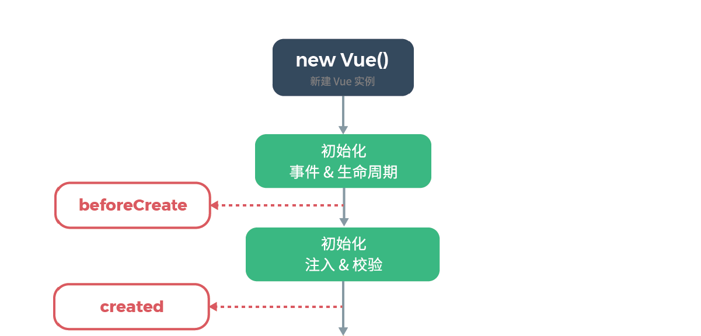

# Vue 源码阅读

~~~ json
"name": "vue"
"version": "2.6.10"
~~~

~~~
├── scripts ------------------------------- 构建相关的文件，一般情况下我们不需要动
│   ├── git-hooks ------------------------- 存放git钩子的目录
│   ├── alias.js -------------------------- 别名配置
│   ├── config.js ------------------------- 生成rollup配置的文件
│   ├── build.js -------------------------- 对 config.js 中所有的rollup配置进行构建
│   ├── ci.sh ----------------------------- 持续集成运行的脚本
│   ├── release.sh ------------------------ 用于自动发布新版本的脚本
├── dist ---------------------------------- 构建后文件的输出目录
├── examples ------------------------------ 存放一些使用Vue开发的应用案例
├── flow ---------------------------------- 类型声明，使用开源项目 [Flow](https://flowtype.org/)
├── packages ------------------------------ 存放独立发布的包的目录
├── test ---------------------------------- 包含所有测试文件
├── src ----------------------------------- 这个是我们最应该关注的目录，包含了源码
│   ├── compiler -------------------------- 编译器代码的存放目录，将 template 编译为 render 函数
│   ├── core ------------------------------ 存放通用的，与平台无关的代码
│   │   ├── observer ---------------------- 响应系统，包含数据观测的核心代码
│   │   ├── vdom -------------------------- 包含虚拟DOM创建(creation)和打补丁(patching)的代码
│   │   ├── instance ---------------------- 包含Vue构造函数设计相关的代码
│   │   ├── global-api -------------------- 包含给Vue构造函数挂载全局方法(静态方法)或属性的代码
│   │   ├── components -------------------- 包含抽象出来的通用组件
│   ├── server ---------------------------- 包含服务端渲染(server-side rendering)的相关代码
│   ├── platforms ------------------------- 包含平台特有的相关代码，不同平台的不同构建的入口文件也在这里
│   │   ├── web --------------------------- web平台
│   │   │   ├── entry-runtime.js ---------- 运行时构建的入口，不包含模板(template)到render函数的编译器，所以不支持 `template` 选项，我们使用vue默认导出的就是这个运行时的版本。大家使用的时候要注意
│   │   │   ├── entry-runtime-with-compiler.js -- 独立构建版本的入口，它在 entry-runtime 的基础上添加了模板(template)到render函数的编译器
│   │   │   ├── entry-compiler.js --------- vue-template-compiler 包的入口文件
│   │   │   ├── entry-server-renderer.js -- vue-server-renderer 包的入口文件
│   │   │   ├── entry-server-basic-renderer.js -- 输出 packages/vue-server-renderer/basic.js 文件
│   │   ├── weex -------------------------- 混合应用
│   ├── sfc ------------------------------- 包含单文件组件(.vue文件)的解析逻辑，用于vue-template-compiler包
│   ├── shared ---------------------------- 包含整个代码库通用的代码
├── package.json -------------------------- 不解释
├── yarn.lock ----------------------------- yarn 锁定文件
├── .editorconfig ------------------------- 针对编辑器的编码风格配置文件
├── .flowconfig --------------------------- flow 的配置文件
├── .babelrc ------------------------------ babel 配置文件
├── .eslintrc ----------------------------- eslint 配置文件
├── .eslintignore ------------------------- eslint 忽略配置
├── .gitignore ---------------------------- git 忽略配置
~~~

&emsp;

```json
// package.json
"main": "dist/vue.runtime.common.js",
"module": "dist/vue.runtime.esm.js",
```

 `main` 和 `module` 指向的都是运行时版的Vue，不同的是：前者是 `cjs` 模块，后者是 `es` 模块。 

&emsp;

如果按照输出的模块形式分类，那么 Vue 有三种不同的构建输出，分别是：`cjs`、`es` 以及 `umd`，打开 `scripts/config.js` 文件，如下图： 

~~~ js
const builds = {
  // Runtime only (CommonJS). Used by bundlers e.g. Webpack & Browserify
  'web-runtime-cjs-dev': {
    entry: resolve('web/entry-runtime.js'),
    dest: resolve('dist/vue.runtime.common.dev.js'),
    format: 'cjs',
    env: 'development',
    banner
  },
  // Runtime+compiler CommonJS build (CommonJS)
  'web-full-cjs-dev': {
    entry: resolve('web/entry-runtime-with-compiler.js'),
    dest: resolve('dist/vue.common.dev.js'),
    format: 'cjs',
    env: 'development',
    alias: { he: './entity-decoder' },
    banner
  },
  // Runtime only ES modules build (for bundlers)
  'web-runtime-esm': {
    entry: resolve('web/entry-runtime.js'),
    dest: resolve('dist/vue.runtime.esm.js'),
    format: 'es',
    banner
  },
  // Runtime+compiler ES modules build (for bundlers)
  'web-full-esm': {
    entry: resolve('web/entry-runtime-with-compiler.js'),
    dest: resolve('dist/vue.esm.js'),
    format: 'es',
    alias: { he: './entity-decoder' },
    banner
  },
  // runtime-only build (Browser)
  'web-runtime-dev': {
    entry: resolve('web/entry-runtime.js'),
    dest: resolve('dist/vue.runtime.js'),
    format: 'umd',
    env: 'development',
    banner
  },
  // Runtime+compiler development build (Browser)
  'web-full-dev': {
    entry: resolve('web/entry-runtime-with-compiler.js'),
    dest: resolve('dist/vue.js'),
    format: 'umd',
    env: 'development',
    alias: { he: './entity-decoder' },
    banner
  },
  ……	
}
~~~

每种模块形式又分别输出了 `运行时版` 以及 `完整版`：

运行时的入口文件名字为：`entry-runtime.js`

完整版的入口文件名字为：`entry-runtime-with-compiler.js`

`运行时版 + Compiler = 完整版`。`完整版`比`运行时版`多了一个 `Compiler`，一个将字符串模板（template）编译为 `render` 函数的东西。大家想一想：将 `template` 编译为 `render` 函数的这个过程，是不是一定要在代码运行的时候再去做？当然不是，实际上这个过程在构建的时候就可以完成，这样真正运行的代码就免去了这样一个步骤，提升了性能。同时，将 `Compiler` 抽离为单独的包，还减小了库的体积。 

那么为什么需要完整版呢？说白了就是允许你在代码运行的时候去现场编译模板，在不配合构建工具的情况下可以直接使用，但是更多的时候推荐你配合构建工具使用运行时版本。 

为什么还要输出不同形式的模块？比如 `cjs`、`es` 和 `umd`？其中 `umd` 是使得你可以直接使用 \<script\> 标签引用 Vue 的模块形式。但我们使用 Vue 的时候更多的是结合构建工具，比如 `webpack`之类的，而 `cjs` 形式的模块就是为 `browserify` 和 `webpack 1` 提供的，他们在加载模块的时候不能直接加载 `ES Module`。而 `webpack2+` 以及 `Rollup` 是可以直接加载 `ES Module` 的，所以就有了 `es` 形式的模块输出。 

&emsp;

### Vue 构造函数

我们以 `entry-runtime-with-compiler.js` 入口文件为切入点， 找到并探究 `Vue` 构造函数。

回顾 `scripts/config.js` ，可以发现入口文件是在 `web` 目录下的，那 `web` 目录到底指向哪里呢？

打开根目录下的 `scripts/alias.js` 文件：

~~~js
module.exports = {
  vue: resolve('src/platforms/web/entry-runtime-with-compiler'),
  compiler: resolve('src/compiler'),
  core: resolve('src/core'),
  shared: resolve('src/shared'),
  web: resolve('src/platforms/web'),
  weex: resolve('src/platforms/weex'),
  server: resolve('src/server'),
  entries: resolve('src/entries'),
  sfc: resolve('src/sfc')
}
~~~

原来 `web` 指向的应该是 `src/platforms/web`。除了 `web` 之外，`alias.js` 文件中还配置了其他的别名。

&emsp;

查找 Vue 构造函数：

~~~js
// src/platforms/web/entry-runtime-with-compiler.js
import Vue from './runtime/index'

// src/platforms/web/runtime/index.js
import Vue from 'core/index'

// src/core/index.js
import Vue from './instance/index'
~~~

终于在 `src/core/instance/index.js` 下找到了！

&emsp;

#### Vue 构造函数的原型

~~~js
// 从五个文件导入五个方法（不包括 warn）
import { initMixin } from './init'
import { stateMixin } from './state'
import { renderMixin } from './render'
import { eventsMixin } from './events'
import { lifecycleMixin } from './lifecycle'
import { warn } from '../util/index'

// 定义 Vue 构造函数
function Vue (options) {
  // 确保被当做构造函数调用，而不是函数调用
  if (process.env.NODE_ENV !== 'production' && !(this instanceof Vue)) {
    warn('Vue is a constructor and should be called with the `new` keyword')
  }
  this._init(options)
}

// 将 Vue 作为参数传递给导入的五个方法
initMixin(Vue)
stateMixin(Vue)
eventsMixin(Vue)
lifecycleMixin(Vue)
renderMixin(Vue)

// 导出 Vue
export default Vue
~~~

下面依次看下这5个方法，对 Vue 做了什么~

&emsp;

Vue 构造函数中调用的 _init 方法就是在这里定义的，并且定义在 Vue 原型对象上。

~~~js
let uid = 0
export function initMixin (Vue: Class<Component>) {
  Vue.prototype._init = function (options?: Object) {
    const vm: Component = this
    // a uid
    vm._uid = uid++
      
    let startTag, endTag
    /* istanbul ignore if */
    if (process.env.NODE_ENV !== 'production' && config.performance && mark) {
      startTag = `vue-perf-start:${vm._uid}`
      endTag = `vue-perf-end:${vm._uid}`
      mark(startTag)
    }

    // a flag to avoid this being observed
    vm._isVue = true
    // merge options
    if (options && options._isComponent) {
      // optimize internal component instantiation
      // 优化内部组件实例化
      // since dynamic options merging is pretty slow, and none of the
      // internal component options needs special treatment.
      // 由于动态选项合并非常慢，而且内部组件选项都不需要特殊处理
      initInternalComponent(vm, options)
    } else {
      vm.$options = mergeOptions(
        resolveConstructorOptions(vm.constructor),
        options || {},
        vm
      )
    }
	/* istanbul ignore else */
    if (process.env.NODE_ENV !== 'production') {
      initProxy(vm)
    } else {
      vm._renderProxy = vm
    }
    // expose real self
    vm._self = vm
    initLifecycle(vm) // 初始化生命周期
    initEvents(vm) // 初始化事件
    initRender(vm) // 初始化渲染
    callHook(vm, 'beforeCreate') // 触发 beforeCreate 回调
    initInjections(vm) // resolve injections before data/props
    initState(vm) // 初始化 props、methods、data、computed、watch
    initProvide(vm) // resolve provide after data/props
    callHook(vm, 'created') // 触发 created 回调
	
    /* istanbul ignore if */
    if (process.env.NODE_ENV !== 'production' && config.performance && mark) {
      vm._name = formatComponentName(vm, false)
      mark(endTag)
      measure(`vue ${vm._name} init`, startTag, endTag)
    }
      
    if (vm.$options.el) {
      vm.$mount(vm.$options.el)
    }
  }
}
~~~

首先声明了常量 `vm`，其值为 `this` 也就是当前这个 `Vue` 实例啦，然后在实例上添加了一个唯一标示：`_uid`，其值为 `uid`，`uid` 这个变量定义在 `initMixin` 方法的上面，初始化为 `0`，可以看到每次实例化一个 `Vue` 实例之后，`uid` 的值都会 `++`。 

~~~js
let startTag, endTag
/* istanbul ignore if */
if (process.env.NODE_ENV !== 'production' && config.performance && mark) {
    startTag = `vue-perf-start:${vm._uid}`
    endTag = `vue-perf-end:${vm._uid}`
    mark(startTag)
}

// 中间的代码省略...

/* istanbul ignore if */
if (process.env.NODE_ENV !== 'production' && config.performance && mark) {
    vm._name = formatComponentName(vm, false)
    mark(endTag)
    measure(`vue ${vm._name} init`, startTag, endTag)
}
~~~

接下来这两段代码拥有相同的判断语句：

~~~js
if (process.env.NODE_ENV !== 'production' && config.performance && mark)
~~~

意思是：在非生产环境下，并且 `config.performance` 和 `mark` 都为真，那么才执行里面的代码，其中 `config.performance` 来自于 `core/config.js` 文件。

`Vue` 提供了全局配置 `Vue.config.performance`，我们通过将其设置为 `true`，即可开启性能追踪，你可以追踪四个场景的性能： 

- 组件初始化(`component init`)
- 编译(`compile`)，将模板(`template`)编译成渲染函数
- 渲染(`render`)，其实就是渲染函数的性能，或者说渲染函数执行且生成虚拟DOM(`vnode`)的性能
- 打补丁(`patch`)，将虚拟DOM渲染为真实DOM的性能

其中*组件初始化*的性能追踪就是我们在 `_init` 方法中看到的那样去实现的，其实现的方式就是在初始化的代码的开头和结尾分别使用 `mark` 函数打上两个标记，然后通过 `measure` 函数对这两个标记点进行性能计算。`mark` 和 `measure` 这两个函数可以在附录 [core/util 目录下的工具方法全解](http://caibaojian.com/vue-design/appendix/core-util.html) 中查看其作用和实现方式。

再来看看这两段代码中间的代码，也就是被追踪性能的代码：

~~~js
// a flag to avoid this being observed
vm._isVue = true
~~~

首先在 `Vue` 实例上添加 `_isVue` 属性，并设置其值为 `true`。目的是用来标识一个对象是 `Vue` 实例，即如果发现一个对象拥有 `_isVue` 属性并且其值为 `true`，那么就代表该对象是 `Vue` 实例。这样可以避免该对象被响应系统观测（其实在其他地方也有用到，但是宗旨都是一样的，这个属性就是用来告诉你：我不是普通的对象，我是Vue实例）。

~~~js
// merge options
if (options && options._isComponent) {
    // optimize internal component instantiation
    // since dynamic options merging is pretty slow, and none of the
    // internal component options needs special treatment.
    initInternalComponent(vm, options)
} else {
    vm.$options = mergeOptions(
        resolveConstructorOptions(vm.constructor),
        options || {},
        vm
    )
}
~~~

然后这段代码是一个 `if` 分支语句，条件是：`options && options._isComponent`，其中 `options` 就是我们调用 `Vue` 时传递的参数选项， `options._isComponent` 是一个内部选项，在 `Vue` 创建组件的时候才会用到。

走到 `else` 分支， 在 `Vue` 实例上添加了 `$options` 属性，这个属性用于当前 `Vue` 的初始化。可以发现，后面这些初始化方法中都用到了实例的 `$options` 属性，即 `vm.$options`。 

`mergeOptions` 具体做了什么，请看 [Vue 选项的规范化与合并]( http://caibaojian.com/vue-design/art/4vue-normalize.html )

&emsp;

_init 是一个内部初始化方法，尤其关注下半部分对 Vue 实例的初始化：

`initLifecycle` 初始化 Vue 实例属性

`initEvents` 初始化事件

`initRender` 初始化渲染

`callHook(vm, 'beforeCreate')`

`initInjections` 初始化 inject

`initState` 初始化 props、methods、data、computed、watch

`initProvide` 初始化 provide

`callHook(vm, 'created')`

&emsp;

可以结合 Vue 生命周期图来看初始化过程



&emsp;

~~~js
export function stateMixin (Vue: Class<Component>) {
  // flow somehow has problems with directly declared definition object
  // flow 在使用 Object.defineProperty 直接定义对象的时候会出现莫名其妙的问题
  // when using Object.defineProperty, so we have to procedurally build up
  // the object here.
  // 所以我们必须循序渐进地建立对象
  const dataDef = {}
  dataDef.get = function () { return this._data }
  const propsDef = {}
  propsDef.get = function () { return this._props }
  if (process.env.NODE_ENV !== 'production') {
    dataDef.set = function () {
      warn(
        'Avoid replacing instance root $data. ' +
        'Use nested data properties instead.',
        this
      )
    }
    propsDef.set = function () {
      warn(`$props is readonly.`, this)
    }
  }
  Object.defineProperty(Vue.prototype, '$data', dataDef)
  Object.defineProperty(Vue.prototype, '$props', propsDef)

  Vue.prototype.$set = set
  Vue.prototype.$delete = del

  Vue.prototype.$watch = function (
    expOrFn: string | Function,
    cb: any,
    options?: Object
  ): Function {
      // ...
  }
}
~~~

先看中间两句，使用 `Object.defineProperty` 在 `Vue.prototype` 上定义了两个属性：`$data` 和 `$props`，这两个属性的定义分别写在了 `dataDef` 以及 `propsDef` 这两个对象里，我们来仔细看一下这两个对象的定义，首先是 `get` ： 

~~~js
 const dataDef = {}
 dataDef.get = function () { return this._data }
 const propsDef = {}
 propsDef.get = function () { return this._props }
~~~

可以看到，`$data` 属性实际上代理的是 `_data` 这个实例属性，而 `$props` 代理的是 `_props` 这个实例属性。然后有一个是否为生产环境的判断，如果不是生产环境的话，就为 `$data` 和 `$props` 这两个属性设置一下 `set`，实际上就是提示你一下：别他娘的想修改我，老子无敌。

也就是说，`$data` 和 `$props` 是两个**只读属性**，所以，现在让你使用 `js` 实现一个只读的属性，你应该知道要怎么做了。

接下来 `stateMixin` 又在 `Vue.prototype` 上定义了三个方法：  `$set`、`$delete` 以及 `$watch` 。

&emsp;

~~~js
export function eventsMixin (Vue: Class<Component>) {
  Vue.prototype.$on = function (event: string | Array<string>, fn: Function): Component {
	// ...
  }

  Vue.prototype.$once = function (event: string, fn: Function): Component {
	// ...
  }

  Vue.prototype.$off = function (event?: string | Array<string>, fn?: Function): Component {
	// ...
  }

  Vue.prototype.$emit = function (event: string): Component {
	// ...
  }
}
~~~

`eventsMixin` 在 `Vue.prototype` 上定义了四个方法：`$on` 、`$once` 、`$off` 、`$emit`

&emsp;

~~~js
export function lifecycleMixin (Vue: Class<Component>) {
  Vue.prototype._update = function (vnode: VNode, hydrating?: boolean) {
	// ...      
  }

  Vue.prototype.$forceUpdate = function () {
	// ...
  }

  Vue.prototype.$destroy = function () {
	// ...
  }
}
~~~

`lifecycleMixin` 在 `Vue.prototype` 上定义了三个方法：`_update` 、`$forceUpdate` 、`$destroy`

&emsp;

~~~js
export function renderMixin (Vue: Class<Component>) {
  // install runtime convenience helpers
  installRenderHelpers(Vue.prototype)

  Vue.prototype.$nextTick = function (fn: Function) {
	// ...
  }

  Vue.prototype._render = function (): VNode {
	// ...
  }
}
~~~

`renderMixin` 一开始以 `Vue.prototype` 为参数调用了 `installRenderHelpers` 函数：

~~~js
export function installRenderHelpers (target: any) {
  target._o = markOnce
  target._n = toNumber
  target._s = toString
  target._l = renderList
  target._t = renderSlot
  target._q = looseEqual
  target._i = looseIndexOf
  target._m = renderStatic
  target._f = resolveFilter
  target._k = checkKeyCodes
  target._b = bindObjectProps
  target._v = createTextVNode
  target._e = createEmptyVNode
  target._u = resolveScopedSlots
  target._g = bindObjectListeners
  target._d = bindDynamicKeys
  target._p = prependModifier
}
~~~

以上代码就是 `installRenderHelpers` 函数的源码，可以发现，这个函数的作用就是在 `Vue.prototype` 上添加一系列方法。

`renderMixin` 方法在执行完 `installRenderHelpers` 函数之后，又在 `Vue.prototype` 上添加了两个方法，分别是：`$nextTick` 和 `_render`。

&emsp;

至此，`instance/index.js` 文件中的代码就运行完毕了（注意：所谓的运行，是指执行 `npm run dev` 命令时**构建的运行**）。我们大概了解了每个 `*Mixin` 方法的作用其实就是包装 `Vue.prototype`，在其上挂载一些属性和方法。

> 下面我们要做一件很重要的事情，就是将上面的内容集中合并起来，放到一个单独的地方，便于以后查看，我将它们整理到了这里：[附录/Vue 构造函数整理-原型](http://caibaojian.com/vue-design/appendix/vue-prototype.html) ，这样当我们在后面详细讲解的时候，提到某个方法就可以迅速定位它的位置，以便于保持我们思路的清晰。 

&emsp;

#### Vue 构造函数的静态属性和方法（全局API）

 `core/instance/index.js` 文件已经看完了，按照之前我们寻找 `Vue` 构造函数时的文件路径回溯，下一个我们要看的文件应该就是 `core/index.js` 文件：

~~~js
// 从 Vue 的出生文件导入 Vue
import Vue from './instance/index'
import { initGlobalAPI } from './global-api/index'
import { isServerRendering } from 'core/util/env'
import { FunctionalRenderContext } from 'core/vdom/create-functional-component'

// 将 Vue 构造函数作为参数，传递给 initGlobalAPI 方法，该方法来自 ./global-api/index.js 文件
initGlobalAPI(Vue)

// 在 Vue.prototype 上添加 $isServer 属性，该属性代理了来自 core/util/env.js 文件的 isServerRendering 方法
Object.defineProperty(Vue.prototype, '$isServer', {
  get: isServerRendering
})

// 在 Vue.prototype 上添加 $ssrContext 属性
Object.defineProperty(Vue.prototype, '$ssrContext', {
  get () {
    /* istanbul ignore next */
    return this.$vnode && this.$vnode.ssrContext
  }
})

// expose FunctionalRenderContext for ssr runtime helper installation
Object.defineProperty(Vue, 'FunctionalRenderContext', {
  value: FunctionalRenderContext
})

// Vue.version 存储了当前 Vue 的版本号
Vue.version = '__VERSION__'

// 导出 Vue
export default Vue
~~~

最下面，在 `Vue` 构造函数上添加了一个静态属性 `version`，存储了当前 `Vue` 的版本值，但是这里的 `'__VERSION__'` 是什么鬼？打开 `scripts/config.js` 文件，找到 `genConfig` 方法，其中有这么一句话：`__VERSION__: version`。这句话被写在了 `rollup` 的 `replace` 插件中，也就是说，`__VERSION__` 最终将被 `version` 的值替换，而 `version` 的值就是 `Vue` 的版本号。 

&emsp;

回过头来看看 `initGlobalAPI(Vue)` ，看上去像是在 `Vue` 上添加一些全局的 API，实际上就是这样的，这些全局 API 以静态属性和方法的形式被添加到 `Vue` 构造函数上。打开 `src/core/global-api/index.js` 文件找到 `initGlobalAPI` 方法： 

~~~js
// config
const configDef = {}
configDef.get = () => config
if (process.env.NODE_ENV !== 'production') {
  configDef.set = () => {
    warn(
      'Do not replace the Vue.config object, set individual fields instead.'
    )
  }
}
Object.defineProperty(Vue, 'config', configDef)
~~~

首先，是在 `Vue` 构造函数上添加 `config` 属性，这个属性的添加方式类似我们前面看过的 `$data` 以及 `$props`，也是一个只读的属性，并且当你试图设置其值时，在非生产环境下会给你一个友好的提示。 

~~~js
// exposed util methods.
// NOTE: these are not considered part of the public API - avoid relying on
// them unless you are aware of the risk.
Vue.util = {
  warn,
  extend,
  mergeOptions,
  defineReactive
}
~~~

接下来，是在 `Vue` 上添加了 `util` 属性，这是一个对象，这个对象拥有四个属性分别是：`warn`、`extend`、`mergeOptions` 以及 `defineReactive`。这四个属性来自于 `core/util/index.js` 文件。 

这里有一段注释，大概意思是 `Vue.util` 以及 `util` 下的四个方法都不被认为是公共 API 的一部分，要避免依赖他们，但是你依然可以使用，只不过风险你要自己控制。并且，在官方文档上也并没有介绍这个全局 API，所以能不用尽量不要用。 

~~~js
Vue.set = set
Vue.delete = del
Vue.nextTick = nextTick

// 2.6 explicit observable API
Vue.observable = <T>(obj: T): T => {
  observe(obj)
  return obj
}

Vue.options = Object.create(null)
~~~

然后，是在 `Vue` 上添加了五个属性分别是 `set`、`delete`、`nextTick`、`observable` 以及 `options`，这里要注意的是 `Vue.options`，现在它还只是一个空的对象，通过 `Object.create(null)` 创建。 

不过接下来，`Vue.options` 就不是一个空的对象了，因为下面这段代码： 

~~~js
ASSET_TYPES.forEach(type => {
  Vue.options[type + 's'] = Object.create(null)
})

// this is used to identify the "base" constructor to extend all plain-object
// components with in Weex's multi-instance scenarios.
Vue.options._base = Vue

extend(Vue.options.components, builtInComponents)
~~~

 `ASSET_TYPES` 来自于 `shared/constants.js` 文件，打开这个文件，发现 `ASSET_TYPES` 是一个数组： 

~~~js
export const ASSET_TYPES = [
  'component',
  'directive',
  'filter'
]
~~~

 紧接着，是这句代码： 

~~~js
extend(Vue.options.components, builtInComponents)
~~~

`extend` 来自于 `shared/util.js` 文件，可以在 [附录/shared/util.js 文件工具方法全解](http://caibaojian.com/vue-design/appendix/shared-util.html) 中查看其作用，总之这句代码的意思就是将 `builtInComponents` 的属性混合到 `Vue.options.components` 中，其中 `builtInComponents` 来自于 `core/components/index.js` 文件。

执行上面的代码后， `Vue.options` 变成了这样： 

~~~js
Vue.options = {
	components: {
		KeepAlive
	},
	directives: Object.create(null),
	filters: Object.create(null),
	_base: Vue
}
~~~

最后部分，以 `Vue` 为参数调用了四个 `init*` 方法： 

~~~js
initUse(Vue)
initMixin(Vue)
initExtend(Vue)
initAssetRegisters(Vue)
~~~

~~~js
export function initUse (Vue: GlobalAPI) {
  Vue.use = function (plugin: Function | Object) {
    const installedPlugins = (this._installedPlugins || (this._installedPlugins = []))
    if (installedPlugins.indexOf(plugin) > -1) {
      return this
    }

    // additional parameters
    const args = toArray(arguments, 1)
    args.unshift(this)
    if (typeof plugin.install === 'function') {
      plugin.install.apply(plugin, args)
    } else if (typeof plugin === 'function') {
      plugin.apply(null, args)
    }
    installedPlugins.push(plugin)
    return this
  }
}
~~~

`initUse` 方法的作用是在 `Vue` 构造函数上添加 `use` 方法，也就是传说中的 `Vue.use` 这个全局 API，这个方法大家应该不会陌生，用来安装 `Vue` 插件。

~~~js
export function initMixin (Vue: GlobalAPI) {
  Vue.mixin = function (mixin: Object) {
    this.options = mergeOptions(this.options, mixin)
    return this
  }
}
~~~

`initMixin` 方法的作用是在 `Vue` 上添加 `mixin` 这个全局 API。

~~~js
export function initExtend (Vue: GlobalAPI) {
  /**
   * Each instance constructor, including Vue, has a unique
   * cid. This enables us to create wrapped "child
   * constructors" for prototypal inheritance and cache them.
   */
  Vue.cid = 0
  let cid = 1

  /**
   * Class inheritance
   */
  Vue.extend = function (extendOptions: Object): Function {
	// ...
  }
}
~~~

`initExtend` 方法在 `Vue` 上添加了 `Vue.cid` 静态属性，和 `Vue.extend` 静态方法。 

~~~js
export function initAssetRegisters (Vue: GlobalAPI) {
  /**
   * Create asset registration methods.
   */
  ASSET_TYPES.forEach(type => {
    Vue[type] = function (
      id: string,
      definition: Function | Object
    ): Function | Object | void {
	// ...
  })
}
~~~

 所以，经过 `initAssetRegisters` 方法，`Vue` 又多了三个静态方法： 

~~~js
Vue.component
Vue.directive
Vue.filter
~~~

&emsp;

这样，`initGlobalAPI` 方法的全部功能我们就介绍完毕了，它的作用就像它的名字一样，是在 `Vue` 构造函数上添加全局的API，类似整理 `Vue.prototype` 上的属性和方法一样，我们同样对 `Vue` 静态属性和方法做一个整理，将它放到 [附录/Vue 构造函数整理-全局API](http://caibaojian.com/vue-design/appendix/vue-global-api.html) 中，便于以后查阅。 

至此，对于 `core/index.js` 文件的作用我们也大概清楚了，在这个文件里，它首先将核心的 `Vue`，也就是在 `core/instance/index.js` 文件中的 `Vue`，也可以说是原型被包装(添加属性和方法)后的 `Vue` 导入，然后使用 `initGlobalAPI` 方法给 `Vue` 添加静态方法和属性，除此之外，在这个文件里，也对原型进行了修改，为其添加了两个属性：`$isServer` 和 `$ssrContext`，最后添加了 `Vue.version` 属性并导出了 `Vue`。 

&emsp;

#### Vue 平台化的包装

现在，在我们弄清 `Vue` 构造函数的过程中已经看了两个主要的文件，分别是：`core/instance/index.js` 文件以及 `core/index.js` 文件，前者是 `Vue` 构造函数的定义文件，我们一直都叫其 `Vue` 的出生文件，主要作用是定义 `Vue` 构造函数，并对其原型添加属性和方法，即实例属性和实例方法。后者的主要作用是，为 `Vue` 添加全局的API，也就是静态的方法和属性。这两个文件有个共同点，就是它们都在 `core` 目录下，我们在介绍 `Vue` 项目目录结构的时候说过：`core` 目录存放的是与平台无关的代码，所以无论是 `core/instance/index.js` 文件还是 `core/index.js` 文件，它们都在包装核心的 `Vue`，且这些包装是与平台无关的。但是，`Vue` 是一个 `Multi-platform` 的项目（web 和 weex），不同平台可能会内置不同的组件、指令，或者一些平台特有的功能等等，那么这就需要对 `Vue` 根据不同的平台进行平台化地包装，这就是接下来我们要看的文件，这个文件也出现在我们寻找 `Vue` 构造函数的路线上，它就是：`platforms/web/runtime/index.js` 文件。下面来看一看里面的代码：

~~~js
// install platform specific utils
Vue.config.mustUseProp = mustUseProp
Vue.config.isReservedTag = isReservedTag
Vue.config.isReservedAttr = isReservedAttr
Vue.config.getTagNamespace = getTagNamespace
Vue.config.isUnknownElement = isUnknownElement
~~~

 设置平台化的 `Vue.config`，覆盖默认导出的 `config` 对象的属性，安装平台特定的工具方法。

~~~js
// install platform runtime directives & components
extend(Vue.options.directives, platformDirectives)
extend(Vue.options.components, platformComponents)
~~~

在 `Vue.options` 上混合了两个指令(`directives`)，分别是 `model` 和 `show`。

在 `Vue.options` 上混合了两个组件(`components`)，分别是 `Transition` 和 `TransitionGroup`。 

在 `Vue.options` 上添加 `web` 平台运行时的特定组件和指令后，`Vue.options` 将变为：

~~~js
Vue.options = {
	components: {
		KeepAlive,
		Transition,
		TransitionGroup
	},
	directives: {
		model,
		show
	},
	filters: Object.create(null),
	_base: Vue
}
~~~

~~~js
// install platform patch function
Vue.prototype.__patch__ = inBrowser ? patch : noop

// public mount method
Vue.prototype.$mount = function (
  el?: string | Element,
  hydrating?: boolean
): Component {
  el = el && inBrowser ? query(el) : undefined
  return mountComponent(this, el, hydrating)
}
~~~

在 `Vue.prototype` 上添加了两个方法：`__patch__` 和 `$mount`。 `$mount` 在 _init 方法中用到了。

再往下的一段代码是 `vue-devtools` 的全局钩子，它被包裹在 `setTimeout` 中，最后导出了 `Vue`。 

&emsp;

#### with compiler

在看完 `runtime/index.js` 文件之后，其实 `运行时` 版本的 `Vue` 构造函数就已经“成型了”。我们可以打开 `entry-runtime.js` 这个入口文件，这个文件只有两行代码：

~~~js
import Vue from './runtime/index'

export default Vue
~~~

可以发现，`运行时` 版的入口文件，导出的 `Vue` 就到 `./runtime/index.js` 文件为止。然而我们所选择的并不仅仅是运行时版，而是完整版的 `Vue`，入口文件是 `entry-runtime-with-compiler.js`，我们知道完整版和运行时版的区别就在于 `compiler`，所以其实在我们看这个文件的代码之前也能够知道这个文件的作用：就是在运行时版的基础上添加 `compiler`，对没错，这个文件就是干这个的，接下来我们就看看它是怎么做的，打开 `entry-runtime-with-compiler.js` 文件： 

~~~js
// ... 其他 import 语句

// 导入运行时的 Vue
import Vue from './runtime/index'

// ... 其他 import 语句

// 从 ./compiler/index.js 文件导入 compileToFunctions
import { compileToFunctions } from './compiler/index'

// 根据 id 获取元素的 innerHTML
const idToTemplate = cached(id => {
  const el = query(id)
  return el && el.innerHTML
})

// 使用 mount 变量缓存 Vue.prototype.$mount 方法
const mount = Vue.prototype.$mount
// 重写 Vue.prototype.$mount 方法
Vue.prototype.$mount = function (
  el?: string | Element,
  hydrating?: boolean
): Component {
	// ... 
}

/**
 * Get outerHTML of elements, taking care
 * of SVG elements in IE as well.
 */
function getOuterHTML (el: Element): string {
  if (el.outerHTML) {
    return el.outerHTML
  } else {
    const container = document.createElement('div')
    container.appendChild(el.cloneNode(true))
    return container.innerHTML
  }
}
// 在 Vue 上添加一个全局API `Vue.compile` 其值为上面导入进来的 compileToFunctions
Vue.compile = compileToFunctions

export default Vue
~~~

