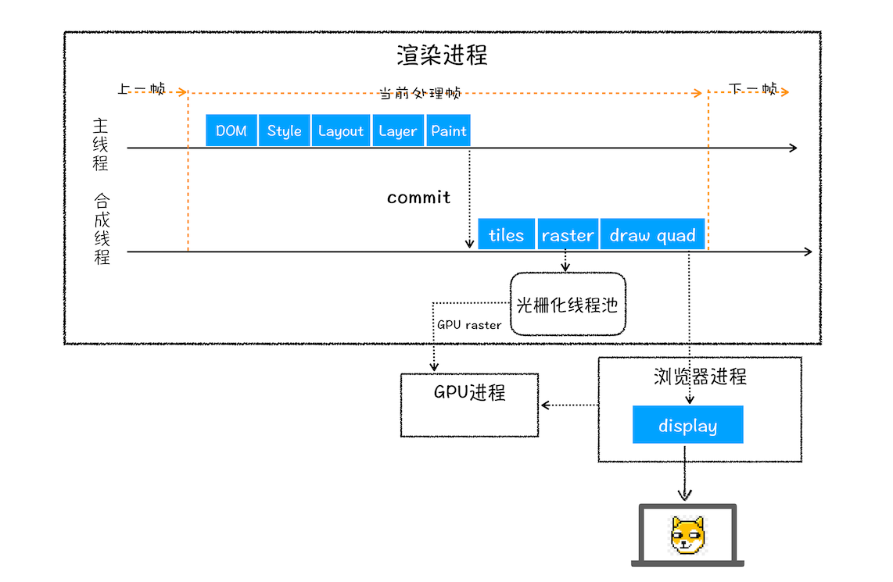

按照渲染的时间顺序，流水线可分为如下几个子阶段：**构建 DOM 树**、**样式计算**、**布局阶段**、**分层**、**绘制**、**分块**、**光栅化**和**合成**。

下面，我们通过**输入内容**，**处理过程**，**输出内容**这三个方面去理解每个子阶段。

&emsp;

#### 构建 DOM 树

因为浏览器无法直接理解和使用 HTML，所以需要将 HTML 转换为浏览器能够理解的结构——DOM 树。 

&emsp;

 #### 样式计算

样式计算大体可分为三步来完成：

1. 把 CSS 转换为浏览器能够理解的结构 （CSSOM，体现在 DOM 中就是 document.styleSheets）

2. 转换样式表中的属性值，使其标准化

   

   

3. 计算出 DOM 树中每个节点的具体样式 

样式计算的目的是为了计算出 DOM 树中每个节点的具体样式，在计算过程中需要遵守 CSS 的继承和层叠两个规则。最终输出的内容是每个 DOM 节点的样式，并被保存在 ComputedStyle 内。

&emsp;

#### 布局阶段

布局阶段计算出 DOM 树中可见元素的几何位置 ，分成两步：创建布局树、布局计算

1. 创建布局树

   

   遍历 DOM 树中的所有节点，并把可见节点加到布局树中，而不可见的节点会被布局树忽略掉，如 head 标签下面的全部内容，再比如 body.p.span 这个元素，因为它的属性包含 dispaly:none，所以这个元素也没有被包进布局树。

   &emsp; 

2. 布局计算

   计算每个节点的几何坐标位置，并将这些信息保存在布局树中

&emsp;

#### 分层

渲染引擎为特定的元素生成专用的图层，并生成一棵对应的图层树

- 拥有**层叠上下文属性**的元素会被提升为单独的一层

  

  

- 需要**剪裁**的地方也会被创建为图层

&emsp;

#### 图层绘制

完成图层树的构建之后，渲染引擎会对图层树中的每个图层进行绘制

渲染引擎会把一个图层的绘制拆分成很多小的绘制指令，然后再把这些指令按照顺序组成一个**待绘制列表**

&emsp;

#### 分块

当图层的绘制列表准备好之后，主线程会把该绘制列表**提交**给合成线程，由合成线程将图层划分为图块

&emsp;

#### 合成(可省略)

计算图层和分块信息，将具有空间变换的元素或使用 will-change 的元素提升为一个**合成层**（compositor layer）。 如果存在重叠的元素，还必须创建额外的合成层，以保持 z-index 等指定的深度顺序。 （我的理解是，这里对图层进行了**部分合成**）

> 参考 chrome DevTools Layers 部分

&emsp;

#### 栅格化

合成线程会按照视口附近的图块来优先生成位图，生成位图的操作就叫作**栅格化**

通常，栅格化过程都会使用 GPU 来加速生成，使用 GPU 生成位图的过程叫快速栅格化，或者 GPU 栅格化。

> GPU 栅格化 和普通栅格化的区别在于，直接在 GPU 进程中调用 draw calls（绘制指令），生成位图（已经在 GPU 进程中了，不需要后续的提交）

&emsp;

#### 显示

生成的位图会提交到 GPU 进程，由 GPU 进程上传到 GPU ，最后显示到屏幕上。

&emsp;

#### 重排、重绘、合成

重排需要更新完整的渲染流水线，所以开销也是最大的

&emsp;

重绘省去了布局和分层阶段，所以执行效率会比重排操作要高一些

&emsp;

在非主线程上合成，并没有占用主线程的资源，另外也避开了布局和绘制两个子阶段，所以相对于重绘和重排，合成能大大提升渲染效率

&emsp;

~~~ html
<html>

<body>
	

		bbb
		

			
所以元素有了层叠上下文的属性或者需要被剪裁，那么就会被提升成为单独一层，你可以参看下图：

			
从上图我们可以看到，document层上有A和B层，而B层之上又有两个图层。这些图层组织在一起也是一颗树状结构。

			
图层树是基于布局树来创建的，为了找出哪些元素需要在哪些层中，渲染引擎会遍历布局树来创建层树（Update LayerTree）。
 
		

	

    
</body>
</html>
~~~

&emsp;

reference:  https://aerotwist.com/blog/the-anatomy-of-a-frame/ 