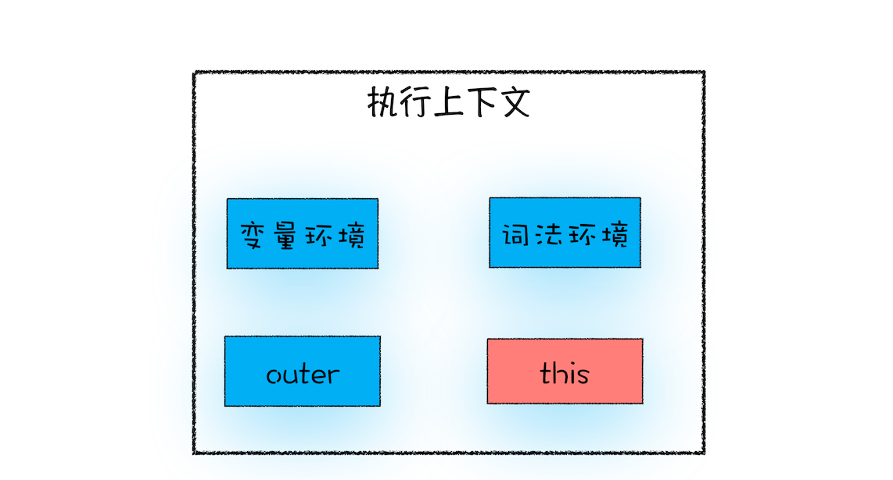

## 宏观视角下的浏览器

### Chrome 架构

最新的 Chrome 浏览器包括：1 个浏览器（Browser）主进程、1 个 GPU 进程、1 个网络（NetWork）进程、多个渲染进程和多个插件进程。 

- **浏览器进程**：主要负责界面显示、用户交互、子进程管理，同时提供存储等功能。 
- **渲染进程**：核心任务是将 HTML、CSS 和 JavaScript 转换为用户可以与之交互的网页，排版引擎 Blink 和 JavaScript 引擎 V8 都是运行在该进程中，默认情况下，Chrome 会为每个 Tab 标签创建一个渲染进程。出于安全考虑，渲染进程都是运行在沙箱模式下。 
- **GPU 进程**：其实，Chrome 刚开始发布的时候是没有 GPU 进程的。而 GPU 的使用初衷是为了实现 3D CSS 的效果，只是随后网页、Chrome 的 UI 界面都选择采用 GPU 来绘制，这使得 GPU 成为浏览器普遍的需求。最后，Chrome 在其多进程架构上也引入了 GPU 进程。 
- **网络进程**：主要负责页面的网络资源加载，之前是作为一个模块运行在浏览器进程里面的，直至最近才独立出来，成为一个单独的进程。 
- **插件进程**：主要是负责插件的运行，因插件易崩溃，所以需要通过插件进程来隔离，以保证插件进程崩溃不会对浏览器和页面造成影响。 

&emsp;

### HTTP 请求流程

&emsp;

### 导航流程

从输入 URL 到页面展示完整流程示意图

#### 用户输入

当用户在地址栏中输入一个查询关键字时，地址栏会判断输入的关键字是搜索内容，还是请求的 URL。

- 如果是搜索内容，地址栏会使用浏览器默认的搜索引擎，来合成新的带搜索关键字的 URL。 
- 如果判断输入内容符合 URL 规则，那么地址栏会根据规则，把这段内容加上协议，合成为完整的 URL。

&emsp;

当用户输入关键字并键入回车之后，浏览器便进入下图的加载状态：

但此时图中页面显示的依然是之前打开的页面内容，并没立即替换为极客时间的页面。因为需要等待提交文档阶段，页面内容才会被替换。 

&emsp;

#### URL 请求过程

接下来，便进入了页面资源请求过程。这时，浏览器进程会通过进程间通信（IPC）把 URL 请求发送至网络进程，网络进程接收到 URL 请求后，会在这里发起真正的 URL 请求流程。具体流程同上 **HTTP 请求流程**。

1. 重定向

   在接收到服务器返回的响应头后，网络进程开始解析响应头，如果发现返回的状态码是 301 或者 302，那么说明服务器需要浏览器重定向到其他 URL。这时网络进程会从响应头的 Location 字段里面读取重定向的地址，然后再发起新的 HTTP 或者 HTTPS 请求。 

2. 响应数据类型处理

   Content-Type 是 HTTP 头中一个非常重要的字段， 它告诉浏览器服务器返回的响应体数据是什么类型，然后浏览器会根据 Content-Type 的值来决定如何显示响应体的内容。 

   如果 Content-Type 字段的值被浏览器判断为下载类型，那么该请求会被提交给浏览器的下载管理器，同时该 URL 请求的导航流程就此结束。但如果是 HTML，那么浏览器则会继续进行导航流程 。

&emsp;

#### 准备渲染进程

默认情况下，Chrome 会为每个页面分配一个渲染进程。但是，也有一些例外，在某些情况下，浏览器会让多个页面直接运行在同一个渲染进程中。 

Chrome 的默认策略是，每个标签页对应一个渲染进程。但如果从一个页面打开了另一个新页面，而新页面和当前页面属于**同一站点**的话，那么新页面会复用父页面的渲染进程。官方把这个默认策略叫 process-per-site-instance。 

> 同一站点（same-site）：具有相同的**协议**（例如，http:// 或者 https://）和**根域名**（例如，geekbang.org）

 渲染进程准备好之后，还不能立即进入文档解析状态，因为此时的文档数据还在网络进程中，并没有提交给渲染进程，所以下一步就进入了提交文档阶段。 

&emsp;

#### 提交文档

 首先要明确一点，这里的“文档”是指 URL 请求的响应体数据。 

- “提交文档”的消息是由浏览器进程发出的，渲染进程接收到“提交文档”的消息后，会和网络进程建立传输数据的“管道”。
- 等文档数据传输完成之后，渲染进程会返回“确认提交”的消息给浏览器进程。
- 浏览器进程在收到“确认提交”的消息后，会更新浏览器界面状态，包括了安全状态、地址栏的 URL、前进后退的历史状态，并更新 Web 页面。

更新内容如下图所示：

 这也就解释了为什么在浏览器的地址栏里面输入了一个地址后，之前的页面没有立马消失，而是要加载一会儿才会更新页面。 

&emsp;

#### 渲染阶段

 一旦文档被提交，渲染进程便开始页面解析和子资源加载了。一旦页面生成完成，渲染进程会发送一个消息给浏览器进程，浏览器接收到消息后，会停止标签图标上的加载动画。如下所示： 

至此，一个完整的页面就生成了。

&emsp;

### 渲染流程

整个渲染流程，包括 DOM 生成、样式计算、布局、图层、绘制、光栅化、合成和显示。

下图是完整的渲染流水线示意图：

1. 渲染进程将 HTML 内容转换为浏览器能够读懂的 **DOM 树**结构。
2. 渲染引擎将 CSS 样式表转化为浏览器可以理解的 **styleSheets**，计算出 DOM 节点的样式。
3. 创建**布局树**，并计算元素的布局信息。
4. 对布局树进行分层，并生成**分层树**。
5. 为每个图层生成**绘制列表**，并将其提交到合成线程。
6. 合成线程将图层分成**图块**，并在**光栅化线程池**中将图块转换成**位图**。
7. 合成线程发送绘制图块命令 **DrawQuad** 给浏览器进程。
8. 浏览器进程根据 DrawQuad 消息**生成**页面，并**显示**到显示器上。

> 渲染引擎就是渲染进程
>
> 7 GPU 内存中的位图是否需要合成？
>
> 8 浏览器进程将最终要显示的位图提交到操作系统？

&emsp;

#### 更新了元素的几何属性（重排）

从上图可以看出，如果你通过 JavaScript 或者 CSS 修改元素的几何位置属性，例如改变元素的宽度、高度等，那么浏览器会触发重新布局，解析之后的一系列子阶段，这个过程就叫**重排**。无疑，重排需要更新完整的渲染流水线，所以开销也是最大的。

#### 更新元素的绘制属性（重绘）

从图中可以看出，如果修改了元素的背景颜色，那么布局阶段将不会被执行，因为并没有引起几何位置的变换，所以就直接进入了绘制阶段，然后执行之后的一系列子阶段，这个过程就叫**重绘**。相较于重排操作，重绘省去了布局和分层阶段，所以执行效率会比重排操作要高一些。

&emsp;

#### 直接合成阶段

在上图中，我们使用了 CSS 的 transform 来实现动画效果，这可以避开重排和重绘阶段，直接在非主线程上执行合成动画操作。这样的效率是最高的，因为是在非主线程上合成，并没有占用主线程的资源，另外也避开了布局和绘制两个子阶段，所以相对于重绘和重排，合成能大大提升绘制效率。

&emsp;

## 浏览器中的 JavaScript 执行机制

### 变量提升

所谓的变量提升，是指在 JavaScript 代码执行过程中，JavaScript 引擎把变量的声明部分和函数的声明部分提升到代码开头的“行为”。变量被提升后，会给变量设置默认值，这个默认值就是我们熟悉的 **undefined**。 

&emsp;

#### JavaScript 代码的执行流程

JavaScript 代码在执行之前需要先编译，在编译阶段，变量和函数会被存放到**变量环境**中，变量的默认值会被设置为 undefined；在代码执行阶段，JavaScript 引擎会从变量环境中去查找自定义的变量和函数。

从上图可以看出，输入一段代码，经过编译后，会生成两部分内容：**执行上下文**（Execution context）和**可执行代码**。

**执行上下文**是 JavaScript 执行一段代码时的运行环境，比如调用一个函数，就会进入这个函数的执行上下文，确定该函数在执行期间用到的诸如 this、变量、对象以及函数等。 

在执行上下文中存在一个**变量环境的对象**（Viriable Environment），该对象中保存了变量提升的内容，比如上面代码中的变量 myname 和函数 showName，都保存在该对象中。 

可以简单地把变量环境对象看成是如下结构：

~~~javascript
VariableEnvironment:
     myname -> undefined, 
     showName ->function : {console.log(myname)

~~~

&emsp;

当一段代码被执行时，JavaScript 引擎先会对其进行编译，并创建执行上下文。一般说来，有这么三种情况：

1. 当 JavaScript 执行全局代码的时候，会编译全局代码并创建全局执行上下文，而且在整个页面的生存周期内，全局执行上下文只有一份。
2. 当调用一个函数的时候，函数体内的代码会被编译，并创建函数执行上下文，一般情况下，函数执行结束之后，创建的函数执行上下文会被销毁。
3. 当使用 eval 函数的时候，eval 的代码也会被编译，并创建执行上下文。

&emsp;

### 调用栈

#### 函数调用

函数调用就是运行一个函数，具体使用方式是使用函数名称跟着一对小括号。下面我们看个简单的示例代码：

~~~ javascript
var a = 2
function add(){
	var b = 10
	return  a+b
}
add()
~~~

在执行到函数 add() 之前，JavaScript 引擎会为上面这段代码创建全局执行上下文，包含了声明的函数和变量，可以参考下图：

执行上下文准备好之后，便开始执行全局代码，当执行到 add 这儿时，JavaScript 判断这是一个函数调用，那么将执行以下操作： 

- 首先，从全局执行上下文中，取出 add 函数代码。
- 其次，对 add 函数的这段代码进行编译，并创建该函数的执行上下文和可执行代码。
- 最后，执行代码，输出结果。

&emsp;

完整流程你可以参考下图：

#### 调用栈

调用栈是 JavaScript 引擎用来管理执行上下文的。

- 每调用一个函数，JavaScript 引擎会为其创建执行上下文，并把该执行上下文压入调用栈，然后 JavaScript 引擎开始执行函数代码。
- 如果在一个函数 A 中调用了另外一个函数 B，那么 JavaScript 引擎会为 B 函数创建执行上下文，并将 B 函数的执行上下文压入栈顶。
- 当前函数执行完毕后，JavaScript 引擎会将该函数的执行上下文弹出栈。
- 当分配的调用栈空间被占满时，会引发“堆栈溢出”问题。

&emsp;

### 块级作用域

#### 作用域（scope）

作用域是指在程序中定义变量的区域，该位置决定了变量的生命周期。通俗地理解，作用域就是变量与函数的可访问范围，即作用域控制着变量和函数的可见性和生命周期。 

在 ES6 之前，ES 的作用域只有两种：全局作用域和函数作用域。 

- **全局作用域**中的对象在代码中的任何地方都能访问，其生命周期伴随着页面的生命周期。 
- **函数作用域**就是在函数内部定义的变量或者函数，并且定义的变量或者函数只能在函数内部被访问。函数执行结束之后，函数内部定义的变量会被销毁。 

还有一种作用域，

**块级作用域**就是使用一对大括号包裹的一段代码，代码块内部定义的变量在代码块外部是访问不到的，并且等该代码块中的代码执行完成之后，代码块中定义的变量会被销毁。

&emsp;

#### 变量提升所带来的问题

- 变量容易在不被察觉的情况下被覆盖掉（变量覆盖）
- 本应销毁的变量没有被销毁（变量污染）

&emsp;

ES6 通过块级作用域关键字 let 和 const 解决变量提升带来的缺陷。来看下面这个栗子：

~~~ javascript
function foo(){
    var a = 1
    let b = 2
    {
      let b = 3
      var c = 4
      let d = 5
      console.log(a)
      console.log(b)
    }
    console.log(b) 
    console.log(c)
    console.log(d)
}   
foo()
~~~

第一步，编译并创建执行上下文

通过上图，我们可以得出以下结论：

- 函数内部通过 var 声明的变量，在编译阶段全都被存放到**变量环境**里面了。
- 通过 let 声明的变量，在编译阶段会被存放到**词法环境**（Lexical Environment）中。
- 在函数的作用域内部，通过 let 声明的变量并没有被存放到词法环境中。

&emsp;

第二步，继续执行代码，当执行到代码块里面时，变量环境中 a 的值已经被设置成了 1，词法环境中 b 的值已经被设置成了 2，这时候函数的执行上下文就如下图所示：

 从图中可以看出，当进入函数的作用域块时，作用域块中通过 let 声明的变量，会被存放在词法环境的一个单独的区域中，这个区域中的变量并不影响作用域块外面的变量，比如在作用域外面声明了变量 b，在该作用域块内部也声明了变量 b，当执行到作用域内部时，它们都是独立的存在。 

再接下来，当执行到作用域块中的 console.log(a) 这行代码时，就需要在词法环境和变量环境中查找变量 a 的值了，具体查找方式是：沿着词法环境的栈顶向下查询，如果在词法环境中的某个块中查找到了，就直接返回给 JavaScript 引擎，如果没有查找到，那么继续在变量环境中查找。 

当作用域块执行结束之后，其内部定义的变量就会从词法环境的栈顶弹出，最终执行上下文如下图所示：

通过上面的分析，想必你已经理解了词法环境的结构和工作机制，块级作用域就是通过词法环境的栈结构来实现的，而变量提升是通过变量环境来实现，通过这两者的结合，JavaScript 引擎也就同时支持了变量提升和块级作用域了。 

&emsp;

### 作用域链和闭包

#### 作用域链

其实在每个执行上下文的变量环境中，都包含了一个外部引用，用来指向外部的执行上下文，我们把这个外部引用称为 **outer**。

当一段代码使用了一个变量时，JavaScript 引擎首先会在“当前的执行上下文”中查找该变量，如果在当前的变量环境中没有查找到，那么 JavaScript 引擎会继续在 outer 所指向的执行上下文中查找。为了直观理解，你可以看下面这张图： 

#### 词法作用域

词法作用域就是指作用域是由代码中函数声明的位置来决定的，所以词法作用域是静态的作用域，通过它就能够预测代码在执行过程中如何查找标识符。 

从图中可以看出，词法作用域就是根据代码的位置来决定的，其中 main 函数包含了 bar 函数，bar 函数中包含了 foo 函数，因为 JavaScript **作用域链是由词法作用域决定**的，所以整个词法作用域链的顺序是：foo 函数作用域—>bar 函数作用域—>main 函数作用域—> 全局作用域。 

&emsp;

#### 闭包

在 JavaScript 中，根据词法作用域的规则，**内部函数总是可以访问其外部函数中声明的变量**，当通过调用一个外部函数返回一个内部函数后，即使该外部函数已经执行结束了，但是内部函数引用外部函数的变量依然保存在内存中，我们就把这些变量的集合称为闭包。比如外部函数是 foo，那么这些变量的集合就称为 foo 函数的闭包。

&emsp;

#### 闭包回收

如果该闭包会一直使用，那么它可以作为全局变量而存在；但如果使用频率不高，而且占用内存又比较大的话，那就尽量让它成为一个局部变量。

&emsp;

### this

执行上下文中包含了变量环境、词法环境、外部环境，this。this 有三种：全局执行上下文中的 this、函数中的 this 和 eval 中的 this。

#### 函数执行上下文中 this 设置

- 通过函数的 call、apply、bind 方法设置
- 通过对象调用方法设置
- 通过构造函数中设置

&emsp;

#### this 的设计缺陷以及应对方案

- 嵌套函数中的 this 不会从外层函数中继承

  解决方案：

  1. 声明一个变量 self 用来保存 this，再利用变量的作用域机制传递给嵌套函数。

  2. 嵌套函数改为箭头函数，因为箭头函数没有自己的执行上下文，所以它会继承调用函数中的 this。

- 普通函数中的 this 默认指向全局对象 window

  解决方案： 设置 JavaScript 的“严格模式”

&emsp;

#### this 避坑总结

1. 当函数作为对象的方法调用时，函数中的 this 就是该对象
2. 当函数被正常调用时，在严格模式下，this 值是 undefined，非严格模式下 this 指向的是全局对象 window
3. 嵌套函数中的 this 不会继承外层函数的 this 值
4. 箭头函数没有自己的执行上下文，所以箭头函数的 this 就是它外层函数的 this

&emsp;

## V8 工作原理

### 栈空间和堆空间

#### JavaScript 是什么类型的语言

JavaScript 是一种**弱类型**的、**动态**的语言

> 我们把这种在声明之前就需要确认变量数据类型的语言称为静态语言
>
> 我们把在运行过程中需要检查变量数据类型的语言称为动态语言
>
> 支持隐式类型转换的语言称为弱类型语言
>
> 不支持隐式类型转换的语言称为强类型语言

&emsp;

#### JavaScript 的数据类型

JavaScript 中的数据类型一种有 8 种，它们分别是：

有三点需要注意一下：

1. 使用 typeof 检测 Null 类型时，返回的是 Object。这是当初 JavaScript 语言的一个 Bug，一直保留至今，之所以一直没修改过来，主要是为了兼容老的代码。 
2. Object 类型比较特殊，它是由上述 7 种类型组成的一个包含了 key-value 对的数据类型。其中的 vaule 可以是任何类型，包括函数，这也就意味着你可以通过 Object 来存储函数，Object 中的函数又称为方法。
3. 我们把前面的 7 种数据类型称为原始类型，把最后一个对象类型称为引用类型，之所以把它们区分为两种不同的类型，是因为它们在内存中存放的位置不一样（原始类型的数据是存放在**栈**中，引用类型的数据是存放在**堆**中）。
4. 极客时间版权所有: https://time.geekbang.org/column/article/129596）。

&emsp;

#### 内存空间

JavaScript 内存模型

从图中可以看出， 在 JavaScript 的执行过程中，主要有三种类型内存空间，分别是代码空间、栈空间和堆空间。

代码空间主要是存储可执行代码。

栈空间就是之前反复提及的调用栈，用来存储执行上下文，原始类型的值可直接保存在栈空间中。

堆空间用于存放引用类型的值。

&emsp;

#### 闭包内存模型

~~~ javascript
function foo() {
    var myName = " 极客时间 "
    let test1 = 1
    const test2 = 2
    var innerBar = { 
        setName:function(newName){
            myName = newName
        },
        getName:function(){
            console.log(test1)
            return myName
        }
    }
    return innerBar
}
var bar = foo()
bar.setName(" 极客邦 ")
bar.getName()
console.log(bar.getName())
~~~

站在内存模型的角度来分析这段代码的执行流程：

1. 当 JavaScript 引擎执行到 foo 函数时，首先会编译，并创建一个空执行上下文。 
2. 在编译过程中，遇到内部函数 setName，JavaScript 引擎还要对内部函数做一次快速的词法扫描，发现该内部函数引用了 foo 函数中的 myName 变量，由于是内部函数引用了外部函数的变量，所以 JavaScript 引擎判断这是一个闭包，于是在堆空间创建换一个“closure(foo)”的对象（这是一个内部对象，JavaScript 是无法访问的），用来保存 myName 变量。 
3. 接着继续扫描到 getName 方法时，发现该函数内部还引用变量 test1，于是 JavaScript 引擎又将 test1 添加到“closure(foo)”对象中。这时候堆中的“closure(foo)”对象中就包含了 myName 和 test1 两个变量了。 
4. 由于 test2 并没有被内部函数引用，所以 test2 依然保存在调用栈中。 

从上图你可以清晰地看出，当执行到 foo 函数时，闭包就产生了；当 foo 函数执行结束之后，返回的 getName 和 setName 方法都引用“clourse(foo)”对象，所以即使 foo 函数退出了，“clourse(foo)”依然被其内部的 getName 和 setName 方法引用。所以在下次调用 bar.setName 或者 bar.getName 时，创建的执行上下文中就包含了“clourse(foo)”。

总的来说，产生闭包的核心有两步：第一步，是需要预扫描内部函数；第二步，是把内部函数引用的外部变量保存到堆中。 

&emsp;

### 垃圾回收

垃圾数据回收分为**手动回收**和**自动回收**。

手动回收：何时分配内存、何时销毁内存都是由代码控制，代表性语言 C/C++

自动回收：产生的垃圾数据是由垃圾回收器来释放，代表性语言 JavaScript、Java

&emsp;

#### JavaScript 的数据是如何回收的

##### 调用栈中的数据是如何回收的

当一个函数执行结束之后，JavaScript 引擎会通过向下移动 ESP 来销毁该函数保存在栈中的执行上下文。

> ESP 一个记录当前执行状态的指针

&emsp;

##### 堆中的数据是如何回收的

回收堆中的垃圾数据，就需要用到 JavaScript 中的垃圾回收器了。

&emsp;

#### chrome v8 垃圾回收

##### 代际假说（The Generational Hypothesis）

- 大部分对象在内存中存在的时间很短，简单来说，就是很多对象一经分配内存，很快就变得不可访问
- 不死的对象，会活得更久

> 代际假说，垃圾回收领域中一个重要的术语，后续垃圾回收的策略都是建立在该假说的基础之上。

&emsp;

通常，垃圾回收算法有很多种，但是并没有哪一种能胜任所有的场景，你需要权衡各种场景，根据对象的生存周期的不同而使用不同的算法，以便达到最好的效果。 

所以，在 V8 中会把堆分为**新生代**和**老生代**两个区域，新生代中存放的是生存时间短的对象，老生代中存放的生存时间久的对象。

新生区通常只支持 1～8M 的容量，而老生区支持的容量就大很多了。对于这两块区域，V8 分别使用两个不同的垃圾回收器，以便更高效地实施垃圾回收。 

- **副垃圾回收器**，主要负责新生代的垃圾回收。 
- **主垃圾回收器**，主要负责老生代的垃圾回收。 

&emsp;

##### 垃圾回收器的工作流程

其实不论什么类型的垃圾回收器，它们都有一套共同的执行流程。

第一步，是标记空间中活动对象和非活动对象。所谓活动对象就是还在使用的对象，非活动对象就是可以进行垃圾回收的对象。 

第二步，是回收非活动对象所占据的内存。其实就是在所有的标记完成之后，统一清理内存中所有被标记为可回收的对象。 

第三步是做内存整理。一般来说，频繁回收对象后，内存中就会存在大量不连续空间，我们把这些不连续的内存空间称为**内存碎片**。当内存中出现了大量的内存碎片之后，如果需要分配较大连续内存的时候，就有可能出现内存不足的情况。所以最后一步需要整理这些内存碎片，但这步其实是可选的，因为有的垃圾回收器不会产生内存碎片，比如接下来我们要介绍的副垃圾回收器。 

&emsp;

##### 副垃圾回收器

副垃圾回收器主要负责新生区的垃圾回收。而通常情况下，大多数小的对象都会被分配到新生区，所以说这个区域虽然不大，但是垃圾回收还是比较频繁的。 

新生代中用 Scavenge 算法来处理。所谓 **Scavenge 算法**，是把新生代空间对半划分为两个区域，一半是对象区域，一半是空闲区域，如下图所示：

新加入的对象都会存放到对象区域，当对象区域快被写满时，就需要执行一次垃圾清理操作。 

在垃圾回收过程中，首先要对对象区域中的垃圾做标记；标记完成之后，就进入垃圾清理阶段，副垃圾回收器会把这些存活的对象复制到空闲区域中，同时它还会把这些对象有序地排列起来，所以这个复制过程，也就相当于完成了内存整理操作，复制后空闲区域就没有内存碎片了。 

完成复制后，对象区域与空闲区域进行角色翻转，也就是原来的对象区域变成空闲区域，原来的空闲区域变成了对象区域。这样就完成了垃圾对象的回收操作，同时这种角色翻转的操作还能让新生代中的这两块区域无限重复使用下去。

为了执行效率，一般新生区的空间会被设置得比较小，很容易被存活的对象装满整个区域。为了解决这个问题，JavaScript 引擎采用了**对象晋升策略**，也就是经过两次垃圾回收依然还存活的对象，会被移动到老生区中。

&emsp;

##### 主垃圾回收器

主垃圾回收器主要负责老生区中的垃圾回收。除了新生区中晋升的对象，一些大的对象会直接被分配到老生区。因此老生区中的对象有两个特点，一个是对象占用空间大，另一个是对象存活时间长。 

主垃圾回收器是采用**标记 - 清除**（Mark-Sweep）的算法进行垃圾回收的。下面我们来看看该算法是如何工作的：

首先是标记过程阶段。标记阶段就是从一组根元素开始，递归遍历这组根元素，在这个遍历过程中，能到达的元素称为**活动对象**，没有到达的元素就可以判断为**垃圾数据**。

从上图你可以大致看到垃圾数据的标记过程，当 showName 函数执行结束之后，ESP 向下移动，指向了 foo 函数的执行上下文，这时候如果遍历调用栈，是不会找到引用 1003 地址的变量，也就意味着 1003 这块数据为垃圾数据，被标记为红色。由于 1050 这块数据被变量 b 引用了，所以这块数据会被标记为活动对象。这就是大致的标记过程。 

接下来就是垃圾的清除过程。它和副垃圾回收器的垃圾清除过程完全不同，你可以理解这个过程是清除掉红色标记数据的过程，可参考下图大致理解下其清除过程： 

上面的标记过程和清除过程就是**标记 - 清除**算法，不过对一块内存多次执行标记 - 清除算法后，会产生大量不连续的内存碎片。而碎片过多会导致大对象无法分配到足够的连续内存，于是又产生了另外一种算法——标记 - 整理（Mark-Compact），这个标记过程仍然与标记 - 清除算法里的是一样的，但后续步骤不是直接对可回收对象进行清理，而是让所有存活的对象都向一端移动，然后直接清理掉端边界以外的内存。你可以参考下图： 

#### 全停顿

由于 JavaScript 是运行在主线程之上的，一旦执行垃圾回收算法，都需要将正在执行的 JavaScript 脚本暂停下来，待垃圾回收完毕后再恢复脚本执行。我们把这种行为叫做**全停顿**（Stop-The-World）。

在 V8 新生代的垃圾回收中，因其空间较小，且存活对象较少，所以全停顿的影响不大，但老生代就不一样了。如果在执行垃圾回收的过程中，占用主线程时间过久，就像上面图片展示的那样，花费了 200 毫秒，在这 200 毫秒内，主线程是不能做其他事情的。比如页面正在执行一个 JavaScript 动画，因为垃圾回收器在工作，就会导致这个动画在这 200 毫秒内无法执行的，这将会造成页面的卡顿现象。 

