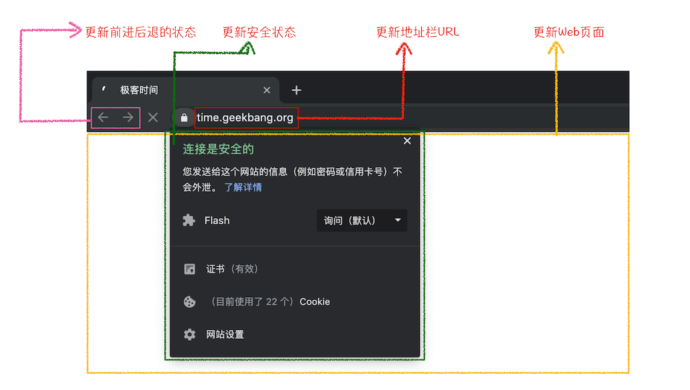
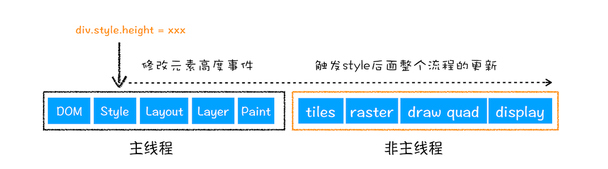
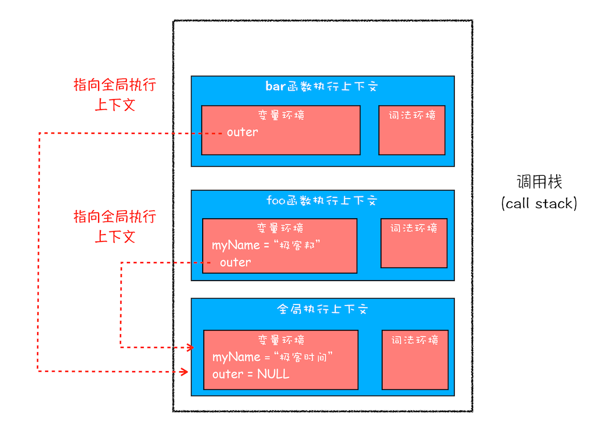
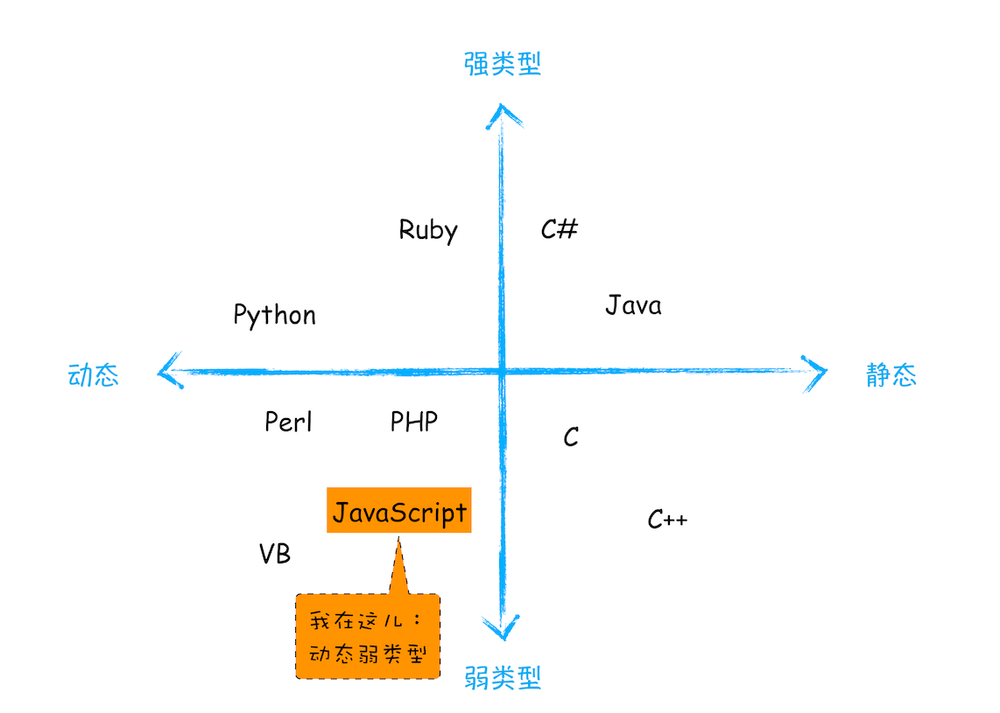
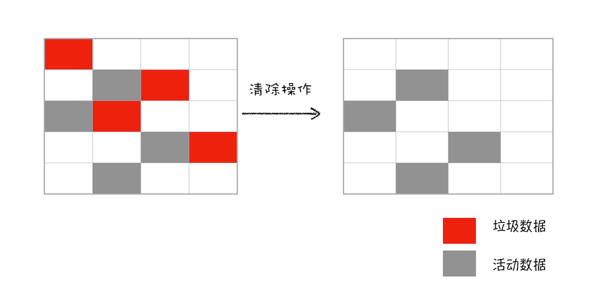
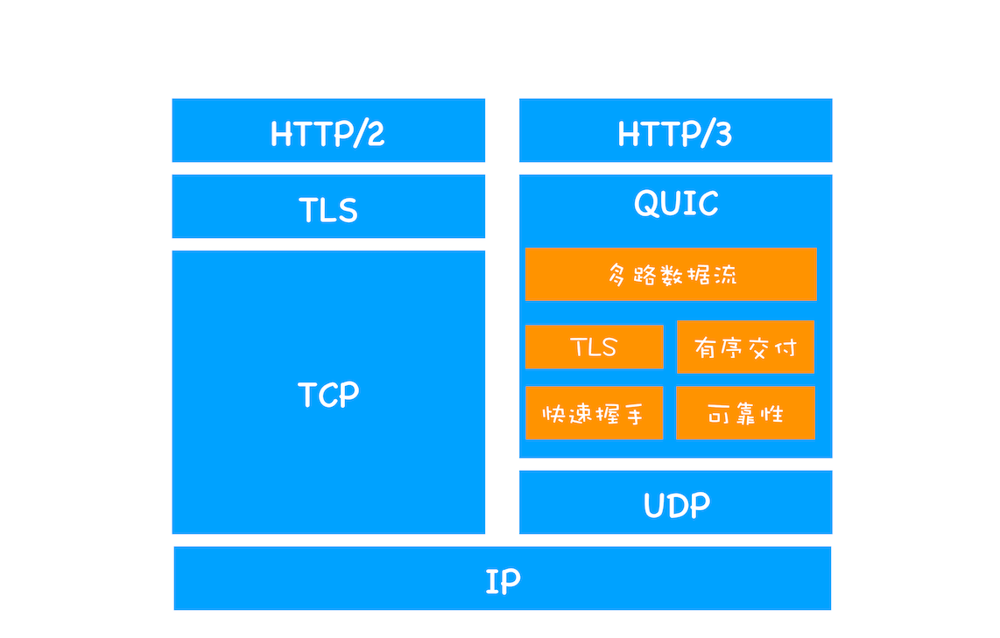

## 宏观视角下的浏览器

### Chrome 架构

最新的 Chrome 浏览器包括：1 个浏览器（Browser）主进程、1 个 GPU 进程、1 个网络（NetWork）进程、多个渲染进程和多个插件进程。 

- **浏览器进程**：主要负责界面显示、用户交互、子进程管理，同时提供存储等功能。 
- **渲染进程**：核心任务是将 HTML、CSS 和 JavaScript 转换为用户可以与之交互的网页，排版引擎 Blink 和 JavaScript 引擎 V8 都是运行在该进程中，默认情况下，Chrome 会为每个 Tab 标签创建一个渲染进程。出于安全考虑，渲染进程都是运行在沙箱模式下。 
- **GPU 进程**：其实，Chrome 刚开始发布的时候是没有 GPU 进程的。而 GPU 的使用初衷是为了实现 3D CSS 的效果，只是随后网页、Chrome 的 UI 界面都选择采用 GPU 来绘制，这使得 GPU 成为浏览器普遍的需求。最后，Chrome 在其多进程架构上也引入了 GPU 进程。 
- **网络进程**：主要负责页面的网络资源加载，之前是作为一个模块运行在浏览器进程里面的，直至最近才独立出来，成为一个单独的进程。 
- **插件进程**：主要是负责插件的运行，因插件易崩溃，所以需要通过插件进程来隔离，以保证插件进程崩溃不会对浏览器和页面造成影响。 

&emsp;

### HTTP 请求流程

&emsp;

### 导航流程

从输入 URL 到页面展示完整流程示意图

#### 用户输入

当用户在地址栏中输入一个查询关键字时，地址栏会判断输入的关键字是搜索内容，还是请求的 URL。

- 如果是搜索内容，地址栏会使用浏览器默认的搜索引擎，来合成新的带搜索关键字的 URL。 
- 如果判断输入内容符合 URL 规则，那么地址栏会根据规则，把这段内容加上协议，合成为完整的 URL。

&emsp;

当用户输入关键字并键入回车之后，浏览器便进入下图的加载状态：

但此时图中页面显示的依然是之前打开的页面内容，并没立即替换为极客时间的页面。因为需要等待提交文档阶段，页面内容才会被替换。 

&emsp;

#### URL 请求过程

接下来，便进入了页面资源请求过程。这时，浏览器进程会通过进程间通信（IPC）把 URL 请求发送至网络进程，网络进程接收到 URL 请求后，会在这里发起真正的 URL 请求流程。具体流程同上 **HTTP 请求流程**。

1. 重定向

   在接收到服务器返回的响应头后，网络进程开始解析响应头，如果发现返回的状态码是 301 或者 302，那么说明服务器需要浏览器重定向到其他 URL。这时网络进程会从响应头的 Location 字段里面读取重定向的地址，然后再发起新的 HTTP 或者 HTTPS 请求。 

2. 响应数据类型处理

   Content-Type 是 HTTP 头中一个非常重要的字段， 它告诉浏览器服务器返回的响应体数据是什么类型，然后浏览器会根据 Content-Type 的值来决定如何显示响应体的内容。 

   如果 Content-Type 字段的值被浏览器判断为下载类型，那么该请求会被提交给浏览器的下载管理器，同时该 URL 请求的导航流程就此结束。但如果是 HTML，那么浏览器则会继续进行导航流程 。

&emsp;

#### 准备渲染进程

默认情况下，Chrome 会为每个页面分配一个渲染进程。但是，也有一些例外，在某些情况下，浏览器会让多个页面直接运行在同一个渲染进程中。 

Chrome 的默认策略是，每个标签页对应一个渲染进程。但如果从一个页面打开了另一个新页面，而新页面和当前页面属于**同一站点**的话，那么新页面会复用父页面的渲染进程。官方把这个默认策略叫 process-per-site-instance。 

> 同一站点（same-site）：具有相同的**协议**（例如，http:// 或者 https://）和**根域名**（例如，geekbang.org）

 渲染进程准备好之后，还不能立即进入文档解析状态，因为此时的文档数据还在网络进程中，并没有提交给渲染进程，所以下一步就进入了提交文档阶段。 

&emsp;

#### 提交文档

 首先要明确一点，这里的“文档”是指 URL 请求的响应体数据。 

- “提交文档”的消息是由浏览器进程发出的，渲染进程接收到“提交文档”的消息后，会和网络进程建立传输数据的“管道”。
- 等文档数据传输完成之后，渲染进程会返回“确认提交”的消息给浏览器进程。
- 浏览器进程在收到“确认提交”的消息后，会更新浏览器界面状态，包括了安全状态、地址栏的 URL、前进后退的历史状态，并更新 Web 页面。

更新内容如下图所示：

 这也就解释了为什么在浏览器的地址栏里面输入了一个地址后，之前的页面没有立马消失，而是要加载一会儿才会更新页面。 

&emsp;

#### 渲染阶段

 一旦文档被提交，渲染进程便开始页面解析和子资源加载了。一旦页面生成完成，渲染进程会发送一个消息给浏览器进程，浏览器接收到消息后，会停止标签图标上的加载动画。如下所示： 

至此，一个完整的页面就生成了。

&emsp;

### 渲染流程

整个渲染流程，包括 DOM 生成、样式计算、布局、图层、绘制、光栅化、合成和显示。

下图是完整的渲染流水线示意图：

1. 渲染进程将 HTML 内容转换为浏览器能够读懂的 **DOM 树**结构。
2. 渲染引擎将 CSS 样式表转化为浏览器可以理解的 **styleSheets**，计算出 DOM 节点的样式。
3. 创建**布局树**，并计算元素的布局信息。
4. 对布局树进行分层，并生成**分层树**。
5. 为每个图层生成**绘制列表**，并将其提交到合成线程。
6. 合成线程将图层分成**图块**，并在**光栅化线程池**中将图块转换成**位图**。
7. 合成线程发送绘制图块命令 **DrawQuad** 给浏览器进程。
8. 浏览器进程根据 DrawQuad 消息**生成**页面，并**显示**到显示器上。

> 渲染引擎就是渲染进程
>
> 7 GPU 内存中的位图是否需要合成？
>
> 8 浏览器进程将最终要显示的位图提交到操作系统？

&emsp;

#### 更新了元素的几何属性（重排）

从上图可以看出，如果你通过 JavaScript 或者 CSS 修改元素的几何位置属性，例如改变元素的宽度、高度等，那么浏览器会触发重新布局，解析之后的一系列子阶段，这个过程就叫**重排**。无疑，重排需要更新完整的渲染流水线，所以开销也是最大的。

#### 更新元素的绘制属性（重绘）

从图中可以看出，如果修改了元素的背景颜色，那么布局阶段将不会被执行，因为并没有引起几何位置的变换，所以就直接进入了绘制阶段，然后执行之后的一系列子阶段，这个过程就叫**重绘**。相较于重排操作，重绘省去了布局和分层阶段，所以执行效率会比重排操作要高一些。

&emsp;

#### 直接合成阶段

在上图中，我们使用了 CSS 的 transform 来实现动画效果，这可以避开重排和重绘阶段，直接在非主线程上执行合成动画操作。这样的效率是最高的，因为是在非主线程上合成，并没有占用主线程的资源，另外也避开了布局和绘制两个子阶段，所以相对于重绘和重排，合成能大大提升绘制效率。

&emsp;

## 浏览器中的 JavaScript 执行机制

### 变量提升

所谓的变量提升，是指在 JavaScript 代码执行过程中，JavaScript 引擎把变量的声明部分和函数的声明部分提升到代码开头的“行为”。变量被提升后，会给变量设置默认值，这个默认值就是我们熟悉的 **undefined**。 

&emsp;

#### JavaScript 代码的执行流程

JavaScript 代码在执行之前需要先编译，在编译阶段，变量和函数会被存放到**变量环境**中，变量的默认值会被设置为 undefined；在代码执行阶段，JavaScript 引擎会从变量环境中去查找自定义的变量和函数。

从上图可以看出，输入一段代码，经过编译后，会生成两部分内容：**执行上下文**（Execution context）和**可执行代码**。

**执行上下文**是 JavaScript 执行一段代码时的运行环境，比如调用一个函数，就会进入这个函数的执行上下文，确定该函数在执行期间用到的诸如 this、变量、对象以及函数等。 

在执行上下文中存在一个**变量环境的对象**（Viriable Environment），该对象中保存了变量提升的内容，比如上面代码中的变量 myname 和函数 showName，都保存在该对象中。 

可以简单地把变量环境对象看成是如下结构：

~~~javascript
VariableEnvironment:
     myname -> undefined, 
     showName ->function : {console.log(myname)

~~~

&emsp;

当一段代码被执行时，JavaScript 引擎先会对其进行编译，并创建执行上下文。一般说来，有这么三种情况：

1. 当 JavaScript 执行全局代码的时候，会编译全局代码并创建全局执行上下文，而且在整个页面的生存周期内，全局执行上下文只有一份。
2. 当调用一个函数的时候，函数体内的代码会被编译，并创建函数执行上下文，一般情况下，函数执行结束之后，创建的函数执行上下文会被销毁。
3. 当使用 eval 函数的时候，eval 的代码也会被编译，并创建执行上下文。

&emsp;

### 调用栈

#### 函数调用

函数调用就是运行一个函数，具体使用方式是使用函数名称跟着一对小括号。下面我们看个简单的示例代码：

~~~ javascript
var a = 2
function add(){
	var b = 10
	return  a+b
}
add()
~~~

在执行到函数 add() 之前，JavaScript 引擎会为上面这段代码创建全局执行上下文，包含了声明的函数和变量，可以参考下图：

执行上下文准备好之后，便开始执行全局代码，当执行到 add 这儿时，JavaScript 判断这是一个函数调用，那么将执行以下操作： 

- 首先，从全局执行上下文中，取出 add 函数代码。
- 其次，对 add 函数的这段代码进行编译，并创建该函数的执行上下文和可执行代码。
- 最后，执行代码，输出结果。

&emsp;

完整流程你可以参考下图：

#### 调用栈

调用栈是 JavaScript 引擎用来管理执行上下文的。

- 每调用一个函数，JavaScript 引擎会为其创建执行上下文，并把该执行上下文压入调用栈，然后 JavaScript 引擎开始执行函数代码。
- 如果在一个函数 A 中调用了另外一个函数 B，那么 JavaScript 引擎会为 B 函数创建执行上下文，并将 B 函数的执行上下文压入栈顶。
- 当前函数执行完毕后，JavaScript 引擎会将该函数的执行上下文弹出栈。
- 当分配的调用栈空间被占满时，会引发“堆栈溢出”问题。

&emsp;

### 块级作用域

#### 作用域（scope）

作用域是指在程序中定义变量的区域，该位置决定了变量的生命周期。通俗地理解，作用域就是变量与函数的可访问范围，即作用域控制着变量和函数的可见性和生命周期。 

在 ES6 之前，ES 的作用域只有两种：全局作用域和函数作用域。 

- **全局作用域**中的对象在代码中的任何地方都能访问，其生命周期伴随着页面的生命周期。 
- **函数作用域**就是在函数内部定义的变量或者函数，并且定义的变量或者函数只能在函数内部被访问。函数执行结束之后，函数内部定义的变量会被销毁。 

还有一种作用域，

**块级作用域**就是使用一对大括号包裹的一段代码，代码块内部定义的变量在代码块外部是访问不到的，并且等该代码块中的代码执行完成之后，代码块中定义的变量会被销毁。

&emsp;

#### 变量提升所带来的问题

- 变量容易在不被察觉的情况下被覆盖掉（变量覆盖）
- 本应销毁的变量没有被销毁（变量污染）

&emsp;

ES6 通过块级作用域关键字 let 和 const 解决变量提升带来的缺陷。来看下面这个栗子：

~~~ javascript
function foo(){
    var a = 1
    let b = 2
    {
      let b = 3
      var c = 4
      let d = 5
      console.log(a)
      console.log(b)
    }
    console.log(b) 
    console.log(c)
    console.log(d)
}   
foo()
~~~

第一步，编译并创建执行上下文

通过上图，我们可以得出以下结论：

- 函数内部通过 var 声明的变量，在编译阶段全都被存放到**变量环境**里面了。
- 通过 let 声明的变量，在编译阶段会被存放到**词法环境**（Lexical Environment）中。
- 在函数的作用域内部，通过 let 声明的变量并没有被存放到词法环境中。

&emsp;

第二步，继续执行代码，当执行到代码块里面时，变量环境中 a 的值已经被设置成了 1，词法环境中 b 的值已经被设置成了 2，这时候函数的执行上下文就如下图所示：

 从图中可以看出，当进入函数的作用域块时，作用域块中通过 let 声明的变量，会被存放在词法环境的一个单独的区域中，这个区域中的变量并不影响作用域块外面的变量，比如在作用域外面声明了变量 b，在该作用域块内部也声明了变量 b，当执行到作用域内部时，它们都是独立的存在。 

再接下来，当执行到作用域块中的 console.log(a) 这行代码时，就需要在词法环境和变量环境中查找变量 a 的值了，具体查找方式是：沿着词法环境的栈顶向下查询，如果在词法环境中的某个块中查找到了，就直接返回给 JavaScript 引擎，如果没有查找到，那么继续在变量环境中查找。 

当作用域块执行结束之后，其内部定义的变量就会从词法环境的栈顶弹出，最终执行上下文如下图所示：

通过上面的分析，想必你已经理解了词法环境的结构和工作机制，块级作用域就是通过词法环境的栈结构来实现的，而变量提升是通过变量环境来实现，通过这两者的结合，JavaScript 引擎也就同时支持了变量提升和块级作用域了。 

&emsp;

### 作用域链和闭包

#### 作用域链

其实在每个执行上下文的变量环境中，都包含了一个外部引用，用来指向外部的执行上下文，我们把这个外部引用称为 **outer**。

当一段代码使用了一个变量时，JavaScript 引擎首先会在“当前的执行上下文”中查找该变量，如果在当前的变量环境中没有查找到，那么 JavaScript 引擎会继续在 outer 所指向的执行上下文中查找。为了直观理解，你可以看下面这张图： 

#### 词法作用域

词法作用域就是指作用域是由代码中函数声明的位置来决定的，所以词法作用域是静态的作用域，通过它就能够预测代码在执行过程中如何查找标识符。 

从图中可以看出，词法作用域就是根据代码的位置来决定的，其中 main 函数包含了 bar 函数，bar 函数中包含了 foo 函数，因为 JavaScript **作用域链是由词法作用域决定**的，所以整个词法作用域链的顺序是：foo 函数作用域—>bar 函数作用域—>main 函数作用域—> 全局作用域。 

&emsp;

#### 闭包

在 JavaScript 中，根据词法作用域的规则，**内部函数总是可以访问其外部函数中声明的变量**，当通过调用一个外部函数返回一个内部函数后，即使该外部函数已经执行结束了，但是内部函数引用外部函数的变量依然保存在内存中，我们就把这些变量的集合称为闭包。比如外部函数是 foo，那么这些变量的集合就称为 foo 函数的闭包。

&emsp;

#### 闭包回收

如果该闭包会一直使用，那么它可以作为全局变量而存在；但如果使用频率不高，而且占用内存又比较大的话，那就尽量让它成为一个局部变量。

&emsp;

### this

执行上下文中包含了变量环境、词法环境、外部环境，this。this 有三种：全局执行上下文中的 this、函数中的 this 和 eval 中的 this。

#### 函数执行上下文中 this 设置

- 通过函数的 call、apply、bind 方法设置
- 通过对象调用方法设置
- 通过构造函数中设置

&emsp;

#### this 的设计缺陷以及应对方案

- 嵌套函数中的 this 不会从外层函数中继承

  解决方案：

  1. 声明一个变量 self 用来保存 this，再利用变量的作用域机制传递给嵌套函数。

  2. 嵌套函数改为箭头函数，因为箭头函数没有自己的执行上下文，所以它会继承调用函数中的 this。

- 普通函数中的 this 默认指向全局对象 window

  解决方案： 设置 JavaScript 的“严格模式”

&emsp;

#### this 避坑总结

1. 当函数作为对象的方法调用时，函数中的 this 就是该对象
2. 当函数被正常调用时，在严格模式下，this 值是 undefined，非严格模式下 this 指向的是全局对象 window
3. 嵌套函数中的 this 不会继承外层函数的 this 值
4. 箭头函数没有自己的执行上下文，所以箭头函数的 this 就是它外层函数的 this

&emsp;

## V8 工作原理

### 栈空间和堆空间

#### JavaScript 是什么类型的语言

JavaScript 是一种**弱类型**的、**动态**的语言

> 我们把这种在声明之前就需要确认变量数据类型的语言称为静态语言
>
> 我们把在运行过程中需要检查变量数据类型的语言称为动态语言
>
> 支持隐式类型转换的语言称为弱类型语言
>
> 不支持隐式类型转换的语言称为强类型语言

&emsp;

#### JavaScript 的数据类型

JavaScript 中的数据类型一种有 8 种，它们分别是：

有三点需要注意一下：

1. 使用 typeof 检测 Null 类型时，返回的是 Object。这是当初 JavaScript 语言的一个 Bug，一直保留至今，之所以一直没修改过来，主要是为了兼容老的代码。 
2. Object 类型比较特殊，它是由上述 7 种类型组成的一个包含了 key-value 对的数据类型。其中的 vaule 可以是任何类型，包括函数，这也就意味着你可以通过 Object 来存储函数，Object 中的函数又称为方法。
3. 我们把前面的 7 种数据类型称为原始类型，把最后一个对象类型称为引用类型，之所以把它们区分为两种不同的类型，是因为它们在内存中存放的位置不一样（原始类型的数据是存放在**栈**中，引用类型的数据是存放在**堆**中）。
4. 极客时间版权所有: https://time.geekbang.org/column/article/129596）。

&emsp;

#### 内存空间

JavaScript 内存模型

从图中可以看出， 在 JavaScript 的执行过程中，主要有三种类型内存空间，分别是代码空间、栈空间和堆空间。

代码空间主要是存储可执行代码。

栈空间就是之前反复提及的调用栈，用来存储执行上下文，原始类型的值可直接保存在栈空间中。

堆空间用于存放引用类型的值。

&emsp;

#### 闭包内存模型

~~~ javascript
function foo() {
    var myName = " 极客时间 "
    let test1 = 1
    const test2 = 2
    var innerBar = { 
        setName:function(newName){
            myName = newName
        },
        getName:function(){
            console.log(test1)
            return myName
        }
    }
    return innerBar
}
var bar = foo()
bar.setName(" 极客邦 ")
bar.getName()
console.log(bar.getName())
~~~

站在内存模型的角度来分析这段代码的执行流程：

1. 当 JavaScript 引擎执行到 foo 函数时，首先会编译，并创建一个空执行上下文。 
2. 在编译过程中，遇到内部函数 setName，JavaScript 引擎还要对内部函数做一次快速的词法扫描，发现该内部函数引用了 foo 函数中的 myName 变量，由于是内部函数引用了外部函数的变量，所以 JavaScript 引擎判断这是一个闭包，于是在堆空间创建换一个“closure(foo)”的对象（这是一个内部对象，JavaScript 是无法访问的），用来保存 myName 变量。 
3. 接着继续扫描到 getName 方法时，发现该函数内部还引用变量 test1，于是 JavaScript 引擎又将 test1 添加到“closure(foo)”对象中。这时候堆中的“closure(foo)”对象中就包含了 myName 和 test1 两个变量了。 
4. 由于 test2 并没有被内部函数引用，所以 test2 依然保存在调用栈中。 

从上图你可以清晰地看出，当执行到 foo 函数时，闭包就产生了；当 foo 函数执行结束之后，返回的 getName 和 setName 方法都引用“clourse(foo)”对象，所以即使 foo 函数退出了，“clourse(foo)”依然被其内部的 getName 和 setName 方法引用。所以在下次调用 bar.setName 或者 bar.getName 时，创建的执行上下文中就包含了“clourse(foo)”。

总的来说，产生闭包的核心有两步：第一步，是需要预扫描内部函数；第二步，是把内部函数引用的外部变量保存到堆中。 

&emsp;

### 垃圾回收

垃圾数据回收分为**手动回收**和**自动回收**。

手动回收：何时分配内存、何时销毁内存都是由代码控制，代表性语言 C/C++

自动回收：产生的垃圾数据是由垃圾回收器来释放，代表性语言 JavaScript、Java

&emsp;

#### JavaScript 的数据是如何回收的

##### 调用栈中的数据是如何回收的

当一个函数执行结束之后，JavaScript 引擎会通过向下移动 ESP 来销毁该函数保存在栈中的执行上下文。

> ESP 一个记录当前执行状态的指针

&emsp;

##### 堆中的数据是如何回收的

回收堆中的垃圾数据，就需要用到 JavaScript 中的垃圾回收器了。

&emsp;

#### chrome v8 垃圾回收

##### 代际假说（The Generational Hypothesis）

- 大部分对象在内存中存在的时间很短，简单来说，就是很多对象一经分配内存，很快就变得不可访问
- 不死的对象，会活得更久

> 代际假说，垃圾回收领域中一个重要的术语，后续垃圾回收的策略都是建立在该假说的基础之上。

&emsp;

通常，垃圾回收算法有很多种，但是并没有哪一种能胜任所有的场景，你需要权衡各种场景，根据对象的生存周期的不同而使用不同的算法，以便达到最好的效果。 

所以，在 V8 中会把堆分为**新生代**和**老生代**两个区域，新生代中存放的是生存时间短的对象，老生代中存放的生存时间久的对象。

新生区通常只支持 1～8M 的容量，而老生区支持的容量就大很多了。对于这两块区域，V8 分别使用两个不同的垃圾回收器，以便更高效地实施垃圾回收。 

- **副垃圾回收器**，主要负责新生代的垃圾回收。 
- **主垃圾回收器**，主要负责老生代的垃圾回收。 

&emsp;

##### 垃圾回收器的工作流程

其实不论什么类型的垃圾回收器，它们都有一套共同的执行流程。

第一步，是标记空间中活动对象和非活动对象。所谓活动对象就是还在使用的对象，非活动对象就是可以进行垃圾回收的对象。 

第二步，是回收非活动对象所占据的内存。其实就是在所有的标记完成之后，统一清理内存中所有被标记为可回收的对象。 

第三步是做内存整理。一般来说，频繁回收对象后，内存中就会存在大量不连续空间，我们把这些不连续的内存空间称为**内存碎片**。当内存中出现了大量的内存碎片之后，如果需要分配较大连续内存的时候，就有可能出现内存不足的情况。所以最后一步需要整理这些内存碎片，但这步其实是可选的，因为有的垃圾回收器不会产生内存碎片，比如接下来我们要介绍的副垃圾回收器。 

&emsp;

##### 副垃圾回收器

副垃圾回收器主要负责新生区的垃圾回收。而通常情况下，大多数小的对象都会被分配到新生区，所以说这个区域虽然不大，但是垃圾回收还是比较频繁的。 

新生代中用 Scavenge 算法来处理。所谓 **Scavenge 算法**，是把新生代空间对半划分为两个区域，一半是对象区域，一半是空闲区域，如下图所示：

新加入的对象都会存放到对象区域，当对象区域快被写满时，就需要执行一次垃圾清理操作。 

在垃圾回收过程中，首先要对对象区域中的垃圾做标记；标记完成之后，就进入垃圾清理阶段，副垃圾回收器会把这些存活的对象复制到空闲区域中，同时它还会把这些对象有序地排列起来，所以这个复制过程，也就相当于完成了内存整理操作，复制后空闲区域就没有内存碎片了。 

完成复制后，对象区域与空闲区域进行角色翻转，也就是原来的对象区域变成空闲区域，原来的空闲区域变成了对象区域。这样就完成了垃圾对象的回收操作，同时这种角色翻转的操作还能让新生代中的这两块区域无限重复使用下去。

为了执行效率，一般新生区的空间会被设置得比较小，很容易被存活的对象装满整个区域。为了解决这个问题，JavaScript 引擎采用了**对象晋升策略**，也就是经过两次垃圾回收依然还存活的对象，会被移动到老生区中。

&emsp;

##### 主垃圾回收器

主垃圾回收器主要负责老生区中的垃圾回收。除了新生区中晋升的对象，一些大的对象会直接被分配到老生区。因此老生区中的对象有两个特点，一个是对象占用空间大，另一个是对象存活时间长。 

主垃圾回收器是采用**标记 - 清除**（Mark-Sweep）的算法进行垃圾回收的。下面我们来看看该算法是如何工作的：

首先是标记过程阶段。标记阶段就是从一组根元素开始，递归遍历这组根元素，在这个遍历过程中，能到达的元素称为**活动对象**，没有到达的元素就可以判断为**垃圾数据**。

从上图你可以大致看到垃圾数据的标记过程，当 showName 函数执行结束之后，ESP 向下移动，指向了 foo 函数的执行上下文，这时候如果遍历调用栈，是不会找到引用 1003 地址的变量，也就意味着 1003 这块数据为垃圾数据，被标记为红色。由于 1050 这块数据被变量 b 引用了，所以这块数据会被标记为活动对象。这就是大致的标记过程。 

接下来就是垃圾的清除过程。它和副垃圾回收器的垃圾清除过程完全不同，你可以理解这个过程是清除掉红色标记数据的过程，可参考下图大致理解下其清除过程： 

V8 引擎维护了一个空闲列表，也就是没有被使用的空闲空间列表，垃圾清理过程就是把没有标记的添加到空闲列表中。后续分配内存使用空闲列表里面的，这样就完成了“清除”操作。

上面的标记过程和清除过程就是**标记 - 清除**算法，不过对一块内存多次执行标记 - 清除算法后，会产生大量不连续的内存碎片。而碎片过多会导致大对象无法分配到足够的连续内存，于是又产生了另外一种算法——标记 - 整理（Mark-Compact），这个标记过程仍然与标记 - 清除算法里的是一样的，但后续步骤不是直接对可回收对象进行清理，而是让所有存活的对象都向一端移动，然后直接清理掉端边界以外的内存。你可以参考下图： 

#### 全停顿

由于 JavaScript 是运行在主线程之上的，一旦执行垃圾回收算法，都需要将正在执行的 JavaScript 脚本暂停下来，待垃圾回收完毕后再恢复脚本执行。我们把这种行为叫做**全停顿**（Stop-The-World）。

在 V8 新生代的垃圾回收中，因其空间较小，且存活对象较少，所以全停顿的影响不大，但老生代就不一样了。如果在执行垃圾回收的过程中，占用主线程时间过久，就像上面图片展示的那样，花费了 200 毫秒，在这 200 毫秒内，主线程是不能做其他事情的。比如页面正在执行一个 JavaScript 动画，因为垃圾回收器在工作，就会导致这个动画在这 200 毫秒内无法执行的，这将会造成页面的卡顿现象。 

&emsp;

### 编译器和解释器

之所以存在编译器和解释器，是因为机器不能直接理解我们所写的代码，所以在执行程序之前，需要将我们所写的代码“翻译”成机器能读懂的机器语言。按语言的执行流程，可以把语言划分为编译型语言和解释型语言：

- 编译型语言在程序执行之前，需要经过编译器的编译过程，并且编译之后会直接保留机器能读懂的二进制文件，这样每次运行程序时，都可以直接运行该二进制文件，而不需要再次重新编译了 。如 C/C++，Java
-  解释型语言编写的程序，在每次运行时都需要通过解释器对程序进行动态解释和执行。如 JavaScript

&emsp;

- 在编译型语言的编译过程中，编译器首先会依次对源代码进行词法分析、语法分析，生成抽象语法树（AST），然后是优化代码，最后再生成处理器能够理解的机器码。如果编译成功，将会生成一个可执行的文件。但如果编译过程发生了语法或者其他的错误，那么编译器就会抛出异常，最后的二进制文件也不会生成成功。 
- 在解释型语言的解释过程中，同样解释器也会对源代码进行词法分析、语法分析，并生成抽象语法树（AST），不过它会再基于抽象语法树生成字节码，最后再根据字节码来执行程序、输出结果。 

&emsp;

#####  V8 是如何执行一段 JavaScript 代码的 

1. 词法分析， 其作用是将一行行的源码拆解成一个个 token。所谓 token， 指的是语法上不可能再分的、最小的单个字符或字符串。

2. 语法分析， 其作用是将上一步生成的 token 数据，根据语法规则转为 AST 。

    可以把 AST 看成代码的结构化的表示：

   

   AST 是非常重要的一种数据结构，在很多项目中有着广泛的应用：

   Babel 是一个被广泛使用的代码转码器，其工作原理就是先将 ES6 源码转换为 AST，然后再将 ES6 语法的 AST 转换为 ES5 语法的 AST，最后利用 ES5 的 AST 生成 JavaScript 源代码。 

   ESLint 是一个用来检查 JavaScript 编写规范的插件，其检测流程也是需要将源码转换为 AST，然后再利用 AST 来检查代码规范化的问题。 

3. V8 引擎生成该段代码的执行上下文 。

4. 解释器（Ignition） 根据 AST 生成字节码，并解释执行字节码。

   字节码就是介于 AST 和机器码之间的一种代码。但是与特定类型的机器码无关，字节码需要通过解释器将其转换为机器码后才能执行。

   

5. 如果有一段第一次执行的字节码，解释器会逐条解释执行。在执行字节码的过程中，如果发现有热点代码（HotSpot），比如一段代码被重复执行多次，这种就称为热点代码，那么后台的编译器 TurboFan 就会把该段热点的字节码编译为高效的机器码，然后当再次执行这段被优化的代码时，只需要执行编译后的机器码就可以了，这样就大大提升了代码的执行效率。 

   即时编译（JIT），具体到 V8，就是指解释器（Ignition）在解释执行字节码的同时，收集代码信息，当它发现某一部分代码变热了之后，编译器（TurboFan）编译器便闪亮登场，把热点的字节码转换为机器码，并把转换后的机器码保存起来，以备下次使用。

   > 最后生成的机器码，由 JavaScript 引擎去执行 

   

## 浏览器中的页面循环系统

### 消息队列和事件循环系统

每个渲染进程都有一个主线程，并且主线程非常繁忙，既要处理 DOM，又要计算样式，还要处理布局，同时还需要处理 JavaScript 任务以及各种输入事件。要让这么多不同类型的任务在主线程中有条不紊地执行，就需要一个系统来统筹调度这些任务，这就是消息队列和事件循环系统。

从上图可以看出：

- 处理其他**线程**发送过来的任务：渲染主线程使用消息队列接收来自于 IO 线程的任务，并循环地从队列头部中读取任务，然后执行。
- 处理其他**进程**发送过来的任务：渲染进程专门有一个 IO 线程用来接收其他进程传进来的消息，然后放到消息队列中。

&emsp;

##### 页面使用单线程的缺点

1. 处理高优先级任务问题

   比如 DOM 发生变化，采用同步通知的方式，会影响当前任务的**执行效率**；如果采用异步方式，又会影响到**监控的实时性**。

   解决方法：引入微任务

   通常我们把消息队列中的任务称为**宏任务**，每个宏任务中都包含了一个**微任务**队列，在执行宏任务的过程中，如果 DOM 有变化，那么就会将该变化添加到微任务列表中，这样就不会影响到宏任务的继续执行，因此也就解决了执行效率的问题。

   等宏任务中的主要功能都直接完成之后，这时候，渲染引擎并不着急去执行下一个宏任务，而是执行当前宏任务中的微任务，因为 DOM 变化的事件都保存在这些微任务队列中，这样也就解决了实时性问题。

2. 单个任务执行时间过长问题

   因为所有的任务都是在单线程中执行的，所以每次只能执行一个任务，而其他任务就都处于等待状态。如果其中一个任务执行时间过久，那么下一个任务就要等待很长时间。

   解决方法：浏览器的回调功能

&emsp;

### setTimeout 实现

setTimeout 是一个定时器，用来指定某个函数在多少毫秒之后执行。它会返回一个整数，表示定时器的编号。

在 Chrome 中除了正常使用的消息队列之外，还有另外一个消息队列，这个队列中维护了需要延迟执行的任务列表，包括了定时器和 Chromium 内部一些需要延迟执行的任务。所以当通过 JavaScript 创建一个定时器时，渲染进程会将该定时器的回调任务添加到延迟队列中。

> 延迟队列其实是一个 hashmap 结构，等到执行这个结构的时候，会计算 hashmap 中的每个任务是否到期了，到期了就去执行，直到所有到期的任务都执行结束，才会进入下一轮循环

~~~ javascript

void ProcessDelayTask(){
  //从delayed_incoming_queue中取出已经到期的定时器任务
  //依次执行这些任务
}

TaskQueue task_queue；
void ProcessTask();
bool keep_running = true;
void MainTherad(){
  for(;;){
    //执行消息队列中的任务
    Task task = task_queue.takeTask();
    ProcessTask(task);
    
    //执行延迟队列中的任务
    ProcessDelayTask()

    if(!keep_running) //如果设置了退出标志，那么直接退出线程循环
        break; 
  }
}
~~~

在上段代码中，处理完消息队列中的一个任务之后，就开始执行 ProcessDelayTask 函数。ProcessDelayTask 函数会根据发起时间和延迟时间计算出到期的任务，然后依次执行这些到期的任务。等到期的任务执行完成之后，再继续下一个循环过程。通过这样的方式，一个完整的定时器就实现了。

一个定时器的任务还没有被执行的时候，也是可以取消的，具体方法是调用 clearTimeout 函数，并传入需要取消的定时器的 ID。其实浏览器内部实现取消定时器的操作也是非常简单的，就是直接从 delayed_incoming_queue 延迟队列中，通过 ID 查找到对应的任务，然后再将其从队列中删除掉就可以了。

##### 使用 setTimeout 的一些注意事项

1. 如果当前任务执行时间过久，会延迟定时器任务的执行
2. 如果 setTimeout 存在嵌套调用，那么系统会设置最短时间间隔为 4 毫秒（嵌套 5 次以上）
3. 未激活的页面，setTimeout 执行最小间隔是 1000 毫秒
4. 延时执行时间的最大值2147483647，溢出会导致定时器立即执行

&emsp;

### XMLHttpRequest 实现

渲染进程会将请求发送给网络进程，然后网络进程负责资源的下载，等网络进程接收到数据之后，就会利用 IPC 来通知渲染进程；渲染进程接收到消息之后，会将 xhr 的回调函数封装成任务并添加到消息队列中，等主线程循环系统执行到该任务的时候，就会根据相关的状态来调用对应的回调函数。 

&emsp;

### 宏任务与微任务

##### 宏任务

页面中的大部分任务都是在主线程上执行的， 这些任务包括了： 

- 渲染事件（如解析 HTML、计算布局、绘制）
- 用户交互事件（如鼠标点击、滚动页面、放大缩小等）
- JavaScript 脚本执行事件
- 网络请求完成、文件读写完成事件

为了协调这些任务有条不紊地在主线程上执行，页面进程引入了消息队列和事件循环机制，渲染进程内部会维护多个消息队列，比如延迟执行队列和普通的消息队列。然后主线程采用一个 for 循环，不断地从这些任务队列中取出任务并执行任务。我们把这些消息队列中的任务称为**宏任务**。 

宏任务的时间粒度比较大，执行的时间间隔是不能精确控制的，对一些高实时性的需求就不太符合了，比如后面要介绍的监听 DOM 变化的需求。 

&emsp;

##### 微任务

微任务就是一个需要异步执行的函数，执行时机是在**主函数执行结束之后**、当前**宏任务结束之前**。 

下面，站在 V8 引擎的层面来分析下微任务系统是怎么运转的。

我们知道当 JavaScript 执行一段脚本的时候，V8 会为其创建一个全局执行上下文，在创建全局执行上下文的同时，V8 引擎也会在内部创建一个**微任务队列**。顾名思义，这个微任务队列就是用来存放微任务的，因为在当前宏任务执行的过程中，有时候会产生多个微任务，这时候就需要使用这个微任务队列来保存这些微任务了。不过这个微任务队列是给 V8 引擎内部使用的，所以你是无法通过 JavaScript 直接访问的。  

- **微任务产生**

  - 使用 MutationObserver 监控某个 DOM 节点，当 DOM 节点发生变化时，就会产生 DOM 变化的微任务
  - 使用 Promise，当调用 Promise.resolve() 或者 Promise.reject() 的时候，也会产生微任务  

  通过 DOM 节点变化产生的微任务或者使用 Promise 产生的微任务都会被 JavaScript 引擎按照顺序保存到微任务队列中。 

- **微任务执行**

  在当前宏任务中的 JavaScript 快执行完成时，也就在 JavaScript 引擎准备退出全局执行上下文并清空调用栈的时候，JavaScript 引擎会检查全局执行上下文中的微任务队列，然后按照顺序执行队列中的微任务。 

如果在执行微任务的过程中，产生了新的微任务，同样会将该微任务添加到微任务队列中，V8 引擎一直循环执行微任务队列中的任务，直到队列为空才算执行结束。 

&emsp;

### Promise

Promise 解决了**异步编码风格**的问题 

回调地狱产生的原因：

1. 嵌套调用
2. 多次错误处理

Promise 通过**回调函数延迟绑定**、**回调函数返回值穿透**和**错误“冒泡”**技术解决了上面两个问题

此外，Promise 回调函数延迟绑定中使用了微任务

~~~ javascript
const isFunction = obj => typeof obj === 'function'
const isObject = obj => !!(obj && typeof obj === 'object')
const isThenable = obj => (isFunction(obj) || isObject(obj)) && 'then' in obj
const isPromise = promise => promise instanceof Promise

const PENDING = 'pending'
const FULFILLED = 'fulfilled'
const REJECTED = 'rejected'

function Promise(f) {
  this.result = null
  this.state = PENDING
  this.callbacks = []

  let onFulfilled = value => transition(this, FULFILLED, value)
  let onRejected = reason => transition(this, REJECTED, reason)

  let ignore = false
  let resolve = value => {
    if (ignore) return
    ignore = true
    resolvePromise(this, value, onFulfilled, onRejected)
  }
  let reject = reason => {
    if (ignore) return
    ignore = true
    onRejected(reason)
  }

  try {
    f(resolve, reject)
  } catch (error) {
    reject(error)
  }
}

Promise.prototype.then = function(onFulfilled, onRejected) {
  return new Promise((resolve, reject) => {
    let callback = { onFulfilled, onRejected, resolve, reject }

    if (this.state === PENDING) {
      this.callbacks.push(callback)
    } else {
      setTimeout(() => handleCallback(callback, this.state, this.result), 0)
    }
  })
}

const handleCallback = (callback, state, result) => {
  let { onFulfilled, onRejected, resolve, reject } = callback
  try {
    if (state === FULFILLED) {
      isFunction(onFulfilled) ? resolve(onFulfilled(result)) : resolve(result)
    } else if (state === REJECTED) {
      isFunction(onRejected) ? resolve(onRejected(result)) : reject(result)
    }
  } catch (error) {
    reject(error)
  }
}

const handleCallbacks = (callbacks, state, result) => {
  while (callbacks.length) handleCallback(callbacks.shift(), state, result)
}

const transition = (promise, state, result) => {
  if (promise.state !== PENDING) return
  promise.state = state
  promise.result = result
  setTimeout(() => handleCallbacks(promise.callbacks, state, result), 0)
}

const resolvePromise = (promise, result, resolve, reject) => {
  if (result === promise) {
    let reason = new TypeError('Can not fufill promise with itself')
    return reject(reason)
  }

  if (isPromise(result)) {
    return result.then(resolve, reject)
  }

  if (isThenable(result)) {
    try {
      let then = result.then
      if (isFunction(then)) {
        return new Promise(then.bind(result)).then(resolve, reject)
      }
    } catch (error) {
      return reject(error)
    }
  }

  resolve(result)
}

module.exports = Promise
~~~

&emsp;

### async/await：使用同步的方式去写异步代码

Promise 的编程模型虽然解决了回调地狱的问题，但是在语义方面依然存在缺陷，代码中充斥着大量的 then 函数 。 基于这个原因，ES7 引入了 async/await，这是 JavaScript 异步编程的一个重大改进，提供了在不阻塞主线程的情况下使用同步代码实现异步访问资源的能力，并且使得代码逻辑更加清晰。

使用 async/await 可以实现用同步代码的风格来编写异步代码，这是因为 async/await 的基础技术使用了生成器和 Promise，生成器是协程的实现，利用生成器能实现生成器函数的暂停和恢复。

##### 生成器（ Generator ）

生成器函数是一个带星号函数，而且是可以暂停执行和恢复执行的。

~~~ javascript
function* genDemo() {
    console.log("开始执行第一段")
    yield 'generator 2'

    console.log("执行结束")
    return 'generator 2'
}

console.log('main 0')
let gen = genDemo()
console.log(gen.next().value)
console.log('main 1')
console.log(gen.next().value)
console.log('main 2')
~~~

 生成器函数的具体使用方式： 

1. 在生成器函数内部执行一段代码，如果遇到 yield 关键字，那么 JavaScript 引擎将返回关键字后面的内容给外部，并暂停该函数的执行。
2. 外部函数可以通过 next 方法恢复函数的执行。 

##### 协程（ Coroutine ）

要搞懂函数为何能暂停和恢复，那你首先要了解协程的概念。协程是一种比线程更加轻量级的存在。你可以把协程看成是跑在线程上的任务，一个线程上可以存在多个协程，但是在线程上同时只能执行一个协程，比如当前执行的是 A 协程，要启动 B 协程，那么 A 协程就需要将主线程的控制权交给 B 协程，这就体现在 A 协程暂停执行，B 协程恢复执行；同样，也可以从 B 协程中启动 A 协程。通常，如果从 A 协程启动 B 协程，我们就把 A 协程称为 B 协程的父协程。 

##### async

async 是一个通过**异步执行**并**隐式返回 Promise **作为结果的函数。 

##### await

结合代码看 await：

~~~ javascript
async function foo() {
    console.log(1)
    let a = await 100
    console.log(a)
    console.log(2)
}
console.log(0)
foo()
console.log(3)
~~~

async 和 await 在背后做了大量的工作，所以我们才能用同步的方式写出异步代码来。 

&emsp;

## 浏览器中的页面

### Chrome 开发者工具

##### 功能面板

##### 时间线面板

**Queuing** 也就是排队的意思，当浏览器发起一个请求的时候，会有很多原因导致该请求不能被立即执行，而是需要排队等待。导致请求处于排队状态的原因有很多。

- 首先，页面中的资源是有优先级的，比如 CSS、HTML、JavaScript 等都是页面中的核心文件，所以优先级最高；而图片、视频、音频这类资源就不是核心资源，优先级就比较低。通常当后者遇到前者时，就需要“让路”，进入待排队状态。
- 其次，我们前面也提到过，浏览器会为每个域名最多维护 6 个 TCP 连接，如果发起一个 HTTP 请求时，这 6 个 TCP 连接都处于忙碌状态，那么这个请求就会处于排队状态。
- 最后，网络进程在为数据分配磁盘空间时，新的 HTTP 请求也需要短暂地等待磁盘分配结束。 

等待排队完成之后，就要进入发起连接的状态了。不过在发起连接之前，还有一些原因可能导致连接过程被推迟，这个推迟就表现在面板中的 **Stalled** 上，它表示停滞的意思。

这里需要额外说明的是，如果你使用了代理服务器，还会增加一个 **Proxy Negotiation** 阶段，也就是代理协商阶段，它表示代理服务器连接协商所用的时间。

接下来，就到了 **Initial connection/SSL** 阶段了，也就是和服务器建立连接的阶段，这包括了建立 TCP 连接所花费的时间；不过如果你使用了 HTTPS 协议，那么还需要一个额外的 SSL 握手时间，这个过程主要是用来协商一些加密信息的。

和服务器建立好连接之后，网络进程会准备请求数据，并将其发送给网络，这就是 **Request sent** 阶段。通常这个阶段非常快，因为只需要把浏览器缓冲区的数据发送出去就结束了，并不需要判断服务器是否接收到了，所以这个时间通常不到 1 毫秒。 

数据发送出去了，接下来就是等待接收服务器第一个字节的数据，这个阶段称为 **Waiting (TTFB)**，通常也称为“**第一字节时间**”。 TTFB 是反映服务端响应速度的重要指标，对服务器来说，TTFB 时间越短，就说明服务器响应越快。 

接收到第一个字节之后，进入陆续接收完整数据的阶段，也就是 **Content Download** 阶段，这意味着从第一字节时间到接收到全部响应数据所用的时间。 

&emsp;

### CSS 如何影响首次加载时的白屏时间

当渲染进程接收 HTML 文件字节流时，会先开启一个**预解析线程**，如果遇到 JavaScript 文件或者 CSS 文件，那么预解析线程会提前下载这些数据。 如上图，预解析线程会解析出来一个外部的 CSS 文件，并发起 CSS 文件的下载。这里也有一个空闲时间需要你注意一下，就是在 DOM 构建结束之后、CSS 文件还未下载完成的这段时间内，渲染流水线无事可做，因为下一步是合成布局树，而合成布局树需要 CSSOM 和 DOM，所以这里需要等待 CSS 加载结束并解析成 CSSOM。

&emsp;

#### CSSOM

和 HTML 一样，渲染引擎也是无法直接理解 CSS 文件内容的，所以需要将其解析成渲染引擎能够理解的结构，这个结构就是 **CSSOM**。和 DOM 一样，CSSOM 也具有两个作用，第一个是提供给 JavaScript 操作样式表的能力，第二个是为布局树的合成提供基础的样式信息。这个 CSSOM 体现在 DOM 中就是 document.styleSheets。

等 DOM 和 CSSOM 都构建好之后，渲染引擎就会构造布局树。布局树的结构基本上就是复制 DOM 树的结构，不同之处在于 DOM 树中那些不需要显示的元素会被过滤掉，如 display:none 属性的元素、head 标签、script 标签等。复制好基本的布局树结构之后，渲染引擎会为对应的 DOM 元素选择对应的样式信息，这个过程就是**样式计算**。样式计算完成之后，渲染引擎还需要计算布局树中每个元素对应的几何位置，这个过程就是**计算布局**。通过样式计算和计算布局就完成了最终**布局树的构建**。再之后，就该进行后续的绘制操作了。 

&emsp;

#### 包含 CSS 的外部引用和 JavaScript 代码的情况

在 HTML 解析的过程中，如果遇到了 JavaScript 脚本，那么需要先暂停 HTML 解析去执行 JavaScript，因为 JavaScript 有可能会修改当前状态下的 DOM。不过在执行 JavaScript 脚本之前，如果页面中包含了外部 CSS 文件的引用，或者通过 style 标签内置了 CSS 内容，那么渲染引擎还需要将这些内容转换为 CSSOM，因为 JavaScript 有修改 CSSOM 的能力，所以在执行 JavaScript 之前，还需要依赖 CSSOM。也就是说 CSS 在部分情况下也会阻塞 DOM 的生成。 

#### 包含 CSS 的外部引用和 JavaScript 外部文件的情况

从图中可以看出来，在接收到 HTML 数据之后的预解析过程中，HTML 预解析器识别出来了有 CSS 文件和 JavaScript 文件需要下载，然后就同时发起这两个文件的下载请求，需要注意的是，这两个文件的下载过程是重叠的，所以下载时间按照最久的那个文件来算。 

&emsp;

> 从上面三幅图比较发现，CSS 可能会影响 JavaScript 的执行，但是不会影响 DOM 构建

&emsp;

从发起 URL 请求开始，到首次显示页面的内容的三个阶段：

- 第一个阶段，等请求发出去之后，到提交数据阶段，这时页面展示出来的还是之前页面的内容。 
- 第二个阶段，提交数据之后渲染进程会创建一个空白页面，我们通常把这段时间称为**解析白屏**，并等待 CSS 文件和 JavaScript 文件的加载完成，生成 CSSOM 和 DOM，然后合成布局树，最后还要经过一系列的步骤准备首次渲染。
- 第三个阶段，等首次渲染完成之后，就开始进入完整页面的生成阶段了，然后页面会一点点被绘制出来。 

&emsp;

重点关注第二个阶段，这个阶段的主要问题是白屏时间，如果白屏时间过久，就会影响到用户体验。为了缩短白屏时间，我们来挨个分析这个阶段的主要任务，包括了解析 HTML、**下载 CSS**、**下载 JavaScript**、生成 CSSOM、**执行 JavaScript**、生成布局树、绘制页面一系列操作。 

缩短白屏时长的策略：

- 通过内联 JavaScript、内联 CSS 来移除这两种类型的文件下载，这样获取到 HTML 文件之后就可以直接开始渲染流程了。 
- 但并不是所有的场合都适合内联，那么还可以尽量减少文件大小，比如通过 webpack 等工具移除一些不必要的注释，并压缩 JavaScript 文件。
- 还可以将一些不需要在解析 HTML 阶段使用的 JavaScript 标记上 sync 或者 defer。
- 对于大的 CSS 文件，可以通过媒体查询属性，将其拆分为多个不同用途的 CSS 文件，这样只有在特定的场景下才会加载特定的 CSS 文件。 

&emsp;

### 分层和合成机制

#### 显示器是怎么显示图像的

每个显示器都有固定的刷新频率，通常是 60HZ，也就是每秒更新 60 张图片，更新的图片都来自于**显卡**中一个叫**前缓冲区**的地方，显示器所做的任务很简单，就是每秒固定读取 60 次前缓冲区中的图像，并将读取的图像显示到显示器上。

**显卡的职责就是合成新的图像**，并将图像保存到**后缓冲区**中，一旦显卡把合成的图像写到后缓冲区，系统就会让后缓冲区和前缓冲区互换，这样就能保证显示器能读取到最新显卡合成的图像。通常情况下，显卡的更新频率和显示器的刷新频率是一致的。但有时候，在一些复杂的场景中，显卡处理一张图片的速度会变慢，这样就会造成视觉上的卡顿。 

&emsp;

####  帧和帧率 

我们把渲染流水线生成的每一副图片称为一**帧**，把渲染流水线每秒更新了多少帧称为**帧率**，比如滚动过程中 1 秒更新了 60 帧，那么帧率就是 60Hz（或者 60FPS）

&emsp;

#### 分层和合成

可以把一张网页想象成是由很多个图片叠加在一起的，每个图片就对应一个图层，Chrome 合成线程最终将这些图层合成了用于显示页面的图片。 在这个过程中，将页面分解为多个图层的操作就称为**分层**，最后将这些图层合并到一起的操作就称为**合成**。

考虑到一个页面被划分为两个层，当进行到下一帧的渲染时，上面的一帧可能需要实现某些变换，如平移、旋转、缩放、阴影或者 Alpha 渐变，这时候合成线程只需要将两个层进行相应的变化操作就可以了，显卡处理这些操作驾轻就熟，所以这个合成过程时间非常短。

需要重点关注的是，**合成操作是在合成线程上完成的**，这也就意味着在执行合成操作时，是不会影响到主线程执行的。

> 我的理解：合成线程操作显卡（GPU）完成位图的合成

&emsp;

####  分块

合成线程会将每个图层分割为大小固定的图块，然后优先绘制靠近视口的图块，这样就可以大大加速页面的显示速度。

&emsp;

## 浏览器中的网络

随着浏览器的发展，HTTP 为了满足新的需求而不断地进化，下面的内容介绍从 HTTP/1.0 到 HTTP/3 所遇到的瓶颈及对应解决方法。

#### HTTP/1.0

##### 改进

- 引入请求头和响应头，以 Key-Value 的形式保存
- 对多文件下载提供良好的支持
- 引入状态码，通过响应行的方式通知浏览器
- 提供 Cache 机制，用来缓存已经下载过的数据
- 请求头中加入了用户代理的字段，用于服务器统计客户端的基础信息

##### 存在问题

- 每进行一次 HTTP 通信，都需要经历建立 TCP 连接、传输 HTTP 数据和断开 TCP 连接三个阶段，增加大量无谓的开销

#### HTTP/1.1

##### 改进

1. 增加了持久连接

   它的特点是在一个 TCP 连接上可以传输多个 HTTP 请求，只要浏览器或者服务器没有明确断开连接，那么该 TCP 连接会一直保持。

   持久连接在 HTTP/1.1 中是默认开启的。如果你不想要采用持久连接，可以在 HTTP 请求头中加上Connection: close。目前浏览器中对于同一个域名，默认允许同时建立 6 个 TCP 持久连接。

2. 提供虚拟主机的支持

   在 HTTP/1.0 中，每个域名绑定了一个唯一的 IP 地址，因此一个服务器只能支持一个域名。但是随着虚拟主机技术的发展，需要实现在一台物理主机上绑定多个虚拟主机，每个虚拟主机都有自己的单独的域名，这些单独的域名都公用同一个 IP 地址。

   因此，HTTP/1.1 的请求头中增加了 Host 字段，用来表示当前的域名地址，这样服务器就可以根据不同的 Host 值做不同的处理。

3. 对动态生成的内容提供支持

   在设计 HTTP/1.0 时，需要在响应头中设置完整的数据大小，如Content-Length: 901，这样浏览器就可以根据设置的数据大小来接收数据。不过随着服务器端的技术发展，很多页面的内容都是动态生成的，因此在传输数据之前并不知道最终的数据大小，这就导致了浏览器不知道何时会接收完所有的文件数据。

   HTTP/1.1 通过引入 Chunk transfer 机制来解决这个问题，服务器会将数据分割成若干个任意大小的数据块，每个数据块发送时会附上上个数据块的长度，最后使用一个零长度的块作为发送数据完成的标志。这样就提供了对动态内容的支持。

4. 引入客户端 Cookie 机制和安全机制

##### 存在问题

HTTP/1.1 对带宽的利用率并不理想

> 带宽是指每秒最大能发送或者接收的字节数。我们把每秒能发送的最大字节数称为**上行带宽**，每秒能够接收的最大字节数称为**下行带宽**。

之所以说 HTTP/1.1 对带宽的利用率不理想，是因为 HTTP/1.1 很难将带宽用满。比如我们常说的 100M 带宽，实际的下载速度能达到 12.5M/S，而采用 HTTP/1.1 时，也许在加载页面资源时最大只能使用到 2.5M/S，很难将 12.5M 全部用满。

之所以会出现这个问题，主要是由以下三个原因导致的：

1. TCP 的慢启动

   一旦一个 TCP 连接建立之后，就进入了发送数据状态，刚开始 TCP 协议会采用一个非常慢的速度去发送数据，然后慢慢加快发送数据的速度，直到发送数据的速度达到一个理想状态，我们把这个过程称为**慢启动**。 

   慢启动是 TCP 为了减少网络拥塞的一种策略，但是会带来性能问题。页面中常用的一些关键资源文件本来就不大，如 HTML 文件、CSS 文件和 JavaScript 文件，通常这些文件在 TCP 连接建立好之后就要发起请求的，但这个过程是慢启动，所以耗费的时间比正常的时间要多很多，这样就推迟了宝贵的首次渲染页面的时长了。 

2. 同时开启了多条 TCP 连接，那么这些连接会竞争固定的带宽

   你可以想象一下，系统同时建立了多条 TCP 连接，当带宽充足时，每条连接发送或者接收速度会慢慢向上增加；而一旦带宽不足时，这些 TCP 连接又会减慢发送或者接收的速度。比如一个页面有 200 个文件，使用了 3 个 CDN，那么加载该网页的时候就需要建立 6 * 3，也就是 18 个 TCP 连接来下载资源；在下载过程中，当发现带宽不足的时候，各个 TCP 连接就需要动态减慢接收数据的速度。

   这样就会出现一个问题，因为有的 TCP 连接下载的是一些关键资源，如 CSS 文件、JavaScript 文件等，而有的 TCP 连接下载的是图片、视频等普通的资源文件，但是多条 TCP 连接之间又不能协商让哪些关键资源优先下载，这样就有可能影响那些关键资源的下载速度了。

3. 队头阻塞

    持久连接虽然能减少 TCP 的建立和断开次数，但是它需要等待前面的请求返回之后，才能进行下一次请求。如果 TCP 通道中的某个请求因为某些原因没有及时返回，那么就会阻塞后面的所有请求。这意味着我们不能随意在一个管道中发送请求和接收内容。

    这是一个很严重的问题，因为阻塞请求的因素有很多，并且都是一些不确定性的因素，假如有的请求被阻塞了 5 秒，那么后续排队的请求都要延迟等待 5 秒，在这个等待的过程中，带宽、CPU 都被白白浪费了。

&emsp;

#### HTTP/2

HTTP/1.1 所存在的一些主要问题：慢启动和 TCP 连接之间相互竞争带宽是由于 **TCP 本身的机制**导致的，而队头阻塞是由于 **HTTP/1.1 的机制**导致的。

虽然 TCP 有问题，但是我们依然没有换掉 TCP 的能力，所以我们就要想办法去规避 TCP 的慢启动和 TCP 连接之间的竞争问题。

基于此，HTTP/2 的思路就是**一个域名只使用一个 TCP 长连接来传输数据**，这样整个页面资源的下载过程只需要一次慢启动，同时也避免了多个 TCP 连接竞争带宽所带来的问题。

另外，就是队头阻塞的问题，等待请求完成后才能去请求下一个资源，这种方式无疑是最慢的，所以 HTTP/2 需要实现**资源的并行请求**，也就是任何时候都可以将请求发送给服务器，而并不需要等待其他请求的完成，然后服务器也可以随时返回处理好的请求资源给浏览器。

##### 改进

1. 一个域名只使用一个 TCP 长连接，只需一次慢启动，同时避免多个 TCP 连接竞争带宽
2. 资源并行请求，消除队头阻塞

该图就是 HTTP/2 最核心、最重要且最具颠覆性的**多路复用机制**。从图中你会发现每个请求都有一个对应的 ID，如 stream1 表示 index.html 的请求，stream2 表示 foo.css 的请求。这样在浏览器端，就可以随时将请求发送给服务器了。

服务器端接收到这些请求后，会根据自己的喜好来决定优先返回哪些内容。之所以可以随意发送，是因为每份数据都有对应的 ID，浏览器接收到之后，会筛选出相同 ID 的内容，将其拼接为完整的 HTTP 响应数据。

HTTP/2 使用了多路复用技术，可以将请求分成一帧一帧的数据去传输，这样带来了一个额外的好处，就是当收到一个优先级高的请求时，比如接收到 JavaScript 或者 CSS 关键资源的请求，服务器可以暂停之前的请求来优先处理关键资源的请求。

##### HTTP/2 多路复用的实现

HTTP/2 采用多路复用机制来解决 HTTP/1.1 的问题。多路复用是通过在协议栈中添加**二进制分帧层**来实现的。

- 首先，浏览器准备好请求数据，包括了请求行、请求头等信息，如果是 POST 方法，那么还要有请求体
- 这些数据经过二进制分帧层处理之后，会被转换为一个个带有请求 ID 编号的帧，通过协议栈将这些帧发送给服务器
- 服务器接收到所有帧之后，会将所有相同 ID 的帧合并为一条完整的请求信息
- 然后服务器处理该条请求，并将处理的响应行、响应头和响应体分别发送至二进制分帧层
- 同样，二进制分帧层会将这些响应数据转换为一个个带有请求 ID 编号的帧，经过协议栈发送给浏览器
- 浏览器接收到响应帧之后，会根据 ID 编号将帧的数据提交给对应的请求

##### 其他特性

1. 可以设置请求的优先级
2. 服务器推送 
3. 头部压缩 

##### 存在问题

- TCP 的队头阻塞

  在 TCP 传输过程中，由于单个数据包的丢失而造成的阻塞称为 TCP 上的队头阻塞

  

  通过该图，我们知道在 HTTP/2 中，多个请求是跑在一个 TCP 管道中的，如果其中任意一路数据流中出现了丢包的情况，那么就会阻塞该 TCP 连接中的所有请求。

  所以随着丢包率的增加，HTTP/2 的传输效率也会越来越差。有测试数据表明，当系统达到了 2% 的丢包率时，HTTP/1.1 的传输效率反而比 HTTP/2 表现得更好。

- TCP 建立连接的延时

  TCP 建立连接时，需要花费 3~4个 RTT，包括三次握手（1.5 个 RTT）,TLS 连接（1~2 个 RTT）

> 网络延迟又称为 RTT（Round Trip Time）。我们把从浏览器发送一个数据包到服务器，再从服务器返回数据包到浏览器的整个往返时间称为 RTT。

- TCP 协议僵化

  由于中间设备和操作系统的滞后更新，通过修改 TCP 协议来解决上述两个问题的可能性就变的很小。

#### HTTP/3

##### 改进

HTTP/2 存在一些比较严重的与 TCP 协议相关的缺陷，但由于 TCP 协议僵化，我们几乎不可能通过修改 TCP 协议自身来解决这些问题，那么解决问题的思路是绕过 TCP 协议，发明一个 TCP 和 UDP 之外的新的传输协议。但是这也面临着和修改 TCP 一样的挑战，因为中间设备的僵化，这些设备只认 TCP 和 UDP，如果采用了新的协议，新协议在这些设备同样不被很好地支持。

HTTP/3 选择了一个折衷的方法——UDP 协议，基于 UDP 实现了类似于 TCP 的多路数据流、传输可靠性等功能，我们把这套功能称为 **QUIC 协议**。

通过上图我们可以看出，HTTP/3 中的 QUIC 协议集合了以下几点功能：

- **实现了类似 TCP 的流量控制、传输可靠性的功能。**虽然 UDP 不提供可靠性的传输，但 QUIC 在 UDP 的基础之上增加了一层来保证数据可靠性传输。它提供了数据包重传、拥塞控制以及其他一些 TCP 中存在的特性。

- **集成了 TLS 加密功能。**目前 QUIC 使用的是 TLS1.3，相较于早期版本 TLS1.3 有更多的优点，其中最重要的一点是减少了握手所花费的 RTT 个数。

- **实现了 HTTP/2 中的多路复用功能。**和 TCP 不同，QUIC 实现了在同一物理连接上可以有多个独立的逻辑数据流（如下图）。实现了数据流的单独传输，就解决了 TCP 中队头阻塞的问题。

  

- **实现了快速握手功能。**由于 QUIC 是基于 UDP 的，所以 QUIC 可以实现使用 0-RTT 或者 1-RTT 来建立连接，这意味着 QUIC 可以用最快的速度来发送和接收数据，这样可以大大提升首次打开页面的速度。

##### 挑战

- 从目前的情况来看，服务器和浏览器端都没有对 HTTP/3 提供比较完整的支持。
- 部署 HTTP/3 也存在着非常大的问题。因为系统内核对 UDP 的优化远远没有达到 TCP 的优化程度，这也是阻碍 QUIC 的一个重要原因。
- 中间设备僵化的问题。这些设备对 UDP 的优化程度远远低于 TCP，据统计使用 QUIC 协议时，大约有 3%～7% 的丢包率。

