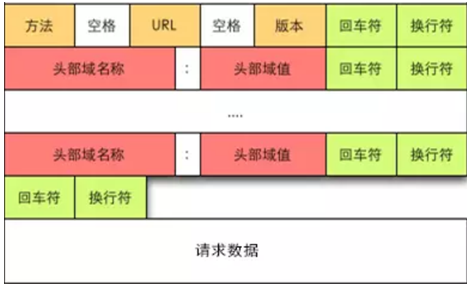
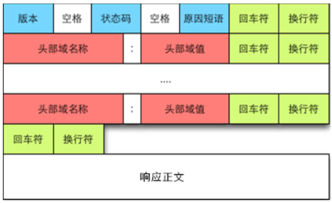
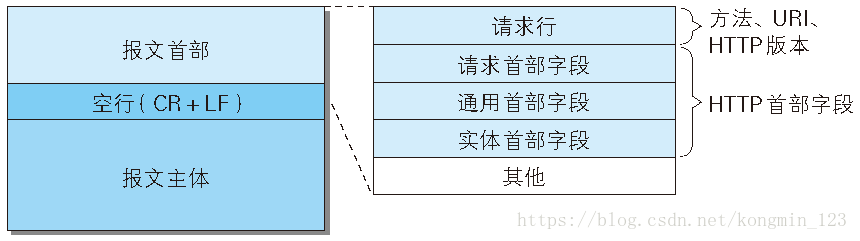
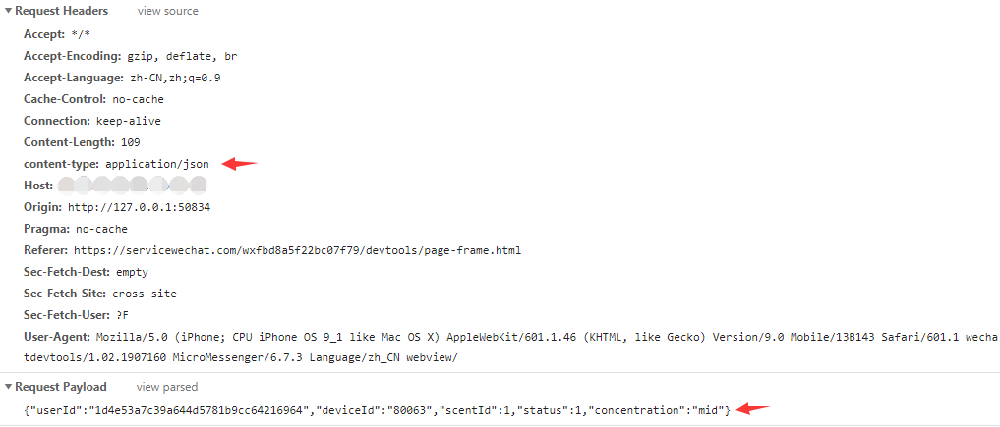
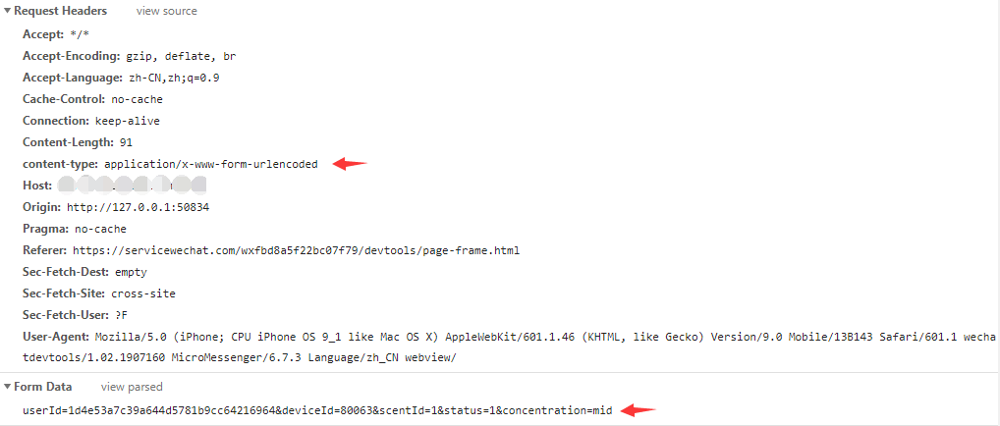
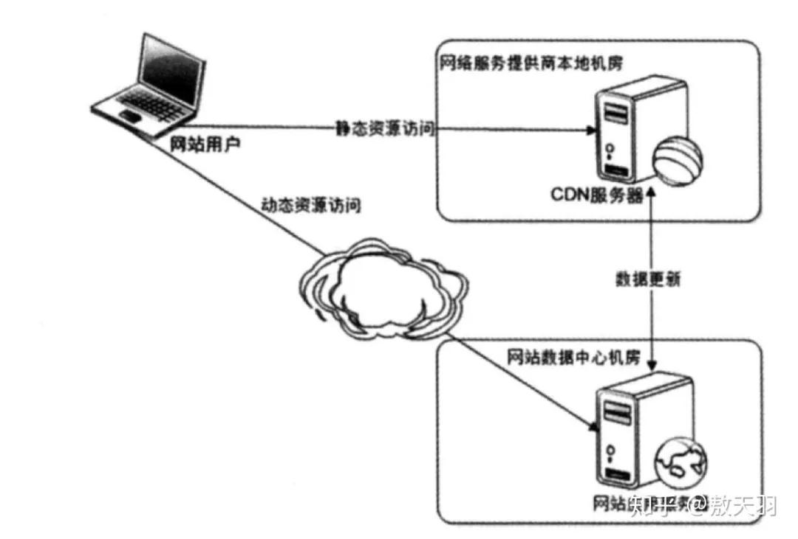
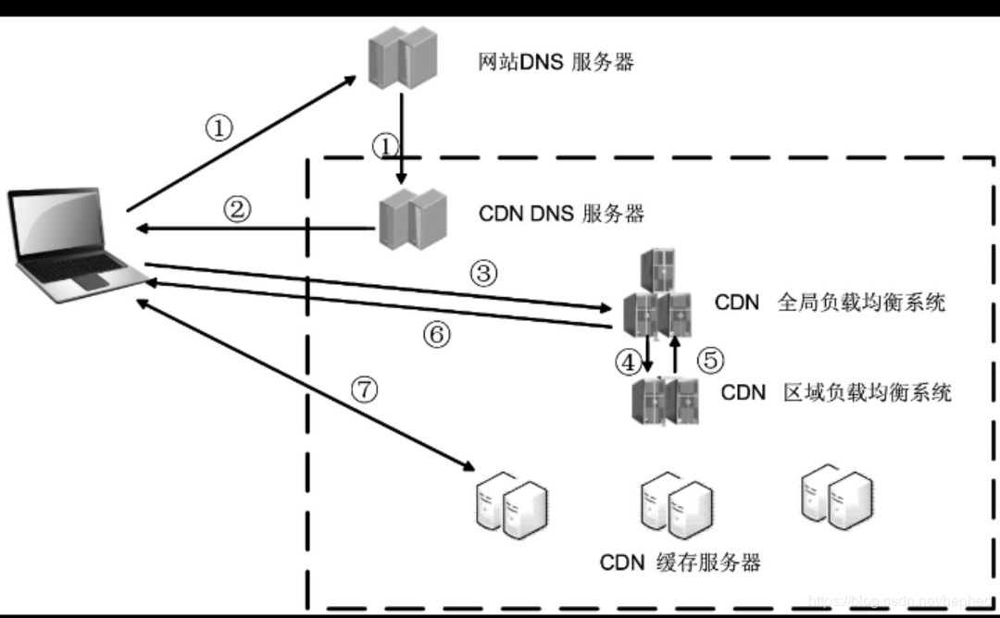
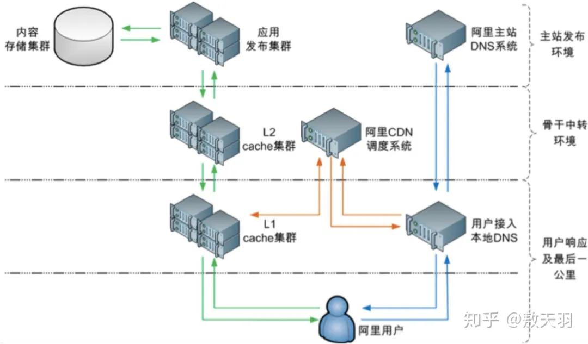

### HTTP 无状态

在同一个连接中，两个执行成功的请求之间是没有关系的。

这就带来了一个问题，用户没有办法在同一个网站中进行连续的交互。所以，我们使用 Cookie 来创建有状态的会话。

&emsp;

### HTTP 请求/响应报文结构

请求报文：请求行，请求头，空行，请求体

                         

请求体一般包含文件或者表单数据

&emsp;

响应报文：响应行，响应头，空行，响应体

                       

响应体一般包含 html 代码、JSON 数据等

&emsp;

#### 稍复杂结构




HTTP 首部字段：请求（响应）首部字段、通用首部字段、实体首部字段

**实体首部字段**是描述报文主体部分使用的字段，有些地方叫实体，实际上是entity-body，即实体的主体，理解就行了

&emsp;

### HTTP 方法

GET：请求指定资源

POST：提交实体到指定资源

PUT : 整体覆盖指定资源

DELETE : 删除指定资源

HEAD：和GET请求一样，但是没有响应体

OPTIONS：查询指定资源支持的方法

&emsp;

POST 和 PUT 的区别在于幂等性，POST 是非幂等的，PUT 是幂等的

两者都可用于更新和创建操作，在更新操作上，两者基本相同

在创建操作上，POST 作用在一个集合资源之上（/articles），多次 POST 会生成多篇文章，而 PUT 作用在一个具体资源之上（/articles/123），下一次 PUT 会覆盖掉上一次 PUT 的内容（多次 PUT，只要 PUT 的内容相同，结果都是相同的）

> 幂等性：不管进行多少次重复操作，都实现相同的结果

&emsp;

### HTTP 状态码

HTTP 响应状态代码指示特定 HTTP 请求是否已成功完成。响应分为五类：

**信息响应**（1xx）

**成功响应**（2xx）

​	200 OK

**重定向**（3xx）

​	301 Moved Permanently

​	304 Not Modified

**客户端错误**（4xx）

​	400 Bad Request

​	404 Not Found

**服务器错误**（5xx）

​	500 Internal Server Error

​	504 Gateway Timeout

&emsp;

### HTTP Request Body

HTTP 请求的 body 主要用于提交表单场景。实际上，HTTP 请求的 body 是比较自由的，只要浏览器端发送的 body 服务端认可就可以了。一些常见的 body 格式是：

- application/json
- application/x-www-form-urlencoded
- multipart/form-data
- text/xml

我们使用 HTML 的 form 标签提交产生的 HTML 请求，默认会产生 application/x-www-form-urlencoded 的数据格式，当有文件上传时，则会使用 multipart/form-data。



HTTP body 的格式一般定义在 Content-type 中，如上图，body 的格式是 application/json，请求体中的数据也是 json 格式的。

&emsp;

然而，在开发过程中，我曾经遇到这样一个问题：在 POST 请求中，采用 application/json 格式提交数据，后端接收不到（后端用对象接收数据），最后采用 application/x-www-form-urlencoded 格式，即提交表单方式解决了问题。



&emsp;

### HTTP 缓存


浏览器请求资源时，先检查本地是否有缓存，如果有缓存且没有过期，则直接从缓存获取，如果过期，则向服务器发送请求。服务器收到请求后，会验证缓存资源是否有更新，如果有更新，则返回最新的资源，如果没有更新，就返回304（刷新缓存新鲜度，如 age=0），直接从缓存获取

> age：资源在缓存中贮存的时长

&emsp;

**强缓存**：获取该资源缓存的 header 信息，判断是否过期（Cache-Control、Expires），若没有过期，就直接从缓存中获取资源，包括缓存的 header 信息


Cache-Control 是 HTTP/1.1 中的字段，主要是利用该字段的 max-age 指令来进行判断

Cache-Control 常用指令：

private：客户端可以缓存，代理服务器不能缓存

public：客户端和代理服务器都可以缓存

max-age：缓存的内容将在xxx秒后失效

no-store：不缓存客户端请求或服务器响应的任何内容

no-cache：强制向服务器端再验证一次


Expires 是 HTTP/1.0 中的字段，它的值为一个 GMT 格式的时间字符串，如 Mon, 10 Jun 2015 21:31:12 GMT


> HTTP/1.1 中，Cache-Control 替代了 Expires
>
> 原因： Expires 定义了失效时间，但是可能存在客户端时间和服务器端时间不一致的情况

&emsp;

**协商缓存**：第一次请求的响应头带某个字段（ETag、Last-Modified），后续请求的请求头会带上对应的字段（If-None-Match、If-Modified-Since），服务器通过比较字段值是否一致，判断缓存资源是否可用


ETag 是资源特定版本的标识符（一般会把请求的内容做 md5 加密）

Last-Modified 是一个 GMT 格式的时间字符串	

Last-Modified 与 ETag 是可以一起使用的，服务器会**优先验证 ETag**


**Last-Modified 的不足之处**

1. 一些文件也许会周期性的更改，但是他的内容并不改变(仅仅改变的修改时间)，这个时候我们并不希望客户端认为这个文件被修改了，而重新 GET
2. 某些文件修改非常频繁，比如在秒级以下的时间内进行修改(比方说 1s 内修改了 N 次)，If-Modified-Since 能检查到的粒度是秒级的，对这种修改无法判断
3. 某些服务器不能精确的得到文件的最后修改时间

&emsp;

|          | 获取资源形式 | 状态码               | 发送请求到服务器               |
| -------- | ------------ | -------------------- | ------------------------------ |
| 强缓存   | 从缓存获取   | 200 ( from cache )   | 否，直接从缓存获取             |
| 协商缓存 | 从缓存获取   | 304 ( not modified ) | 是，通过服务器告知缓存是否可用 |

&emsp;

**用户行为对缓存的影响**


&emsp;

### HTTP/1.0 、HTTP/1.1、 HTTP/2

在 HTTP/1.0 中，一个 http 请求在收到服务器响应后，会断开对应的 TCP 连接，所以每次请求都需要重新建立 TCP 连接，比较耗时。通过设置头字段 Connection: keep-alive，可以在 http 请求完成后，继续使用当前连接进行通信。

HTTP/1.1 将 Connection 写入了标准，默认值为 keep-alive。除非强制设置为 Connection: close，才会在请求完成后断开 TCP 连接。

&emsp;

HTTP/1.1 中，单个 TCP 连接，在同一时间只能处理一个 http 请求。

HTTP/2 提供了多路传输功能，多个 http 请求，可以同时在同一个 TCP 连接中进行传输。

&emsp;

**并发性**

页面资源请求时，浏览器会同时和服务器建立多个 TCP 连接，在同一个 TCP 连接上顺序处理多个HTTP请求。所以浏览器的并发性就体现在可以建立多个 TCP 连接，来支持多个 http 同时请求。

Chrome浏览器最多允许对同一个域名 Host 建立 **6** 个 TCP 连接，不同的浏览器有所区别。

&emsp;

### HTTPS 过程

HTTPS 就是使用 SSL/TLS 协议进行加密传输的，客户端获得服务端的数字证书以后，对其进行校验，验证通过后取出服务端的公钥，然后客户端随机生成一个随机值（对称加密的秘钥），使用公钥加密，传输给服务端，服务端用私钥进行解密，后续的所有信息都通过该对称秘钥进行加密解密，完成整个 HTTPS 的流程

&emsp;

### HTTP 安全

在 web 应用中，Cookie 常用来标记用户或授权会话，如果 Web 应用的 Cookie 被窃取，可能导致授权用户的会话受到攻击

 &emsp;

#### XSS（Cross-Site Script 跨站脚本）

XSS 攻击是指攻击者在网站上注入恶意的客户端代码，通过恶意脚本对客户端网页进行篡改，从而在用户浏览网页时，对用户浏览器进行控制或者获取用户隐私数据的一种攻击方式

 **XSS 防范**

1. HttpOnly 防止劫取 Cookie
2. 输入检查：对于用户的任何输入要进行检查、过滤和转义
3. 服务端的输出检查
4. 验证码

 &emsp;

#### CSRF（Cross-Site Request Forgery跨站请求伪造）

CSRF 攻击是攻击者借助受害者的 Cookie 骗取服务器的信任，可以在受害者毫不知情的情况下以受害者名义伪造请求发送给受攻击服务器，从而在并未授权的情况下执行在权限保护之下的操作

比如在不安全聊天室或论坛上的一张图片，它实际上是一个给你银行服务器发送提现的请求：

```html

```

当你打开含有了这张图片的 HTML 页面时，如果你之前已经登录了你的银行帐号并且 Cookie 仍然有效（还没有其它验证步骤），你银行里的钱很可能会被自动转走

 **CSRF 防范**

1. 验证码
2. Referer Check
3. Token 验证

&emsp;

### 跨域解决方案

根源：出于安全原因，浏览器限制从脚本内发起的跨源 HTTP 请求（并不一定是浏览器限制了发起跨站请求，也可能是跨站请求可以正常发起，但是返回结果被浏览器拦截了）

&emsp; 

CORS（ Cross-Origin Resource Sharing 跨源资源共享）机制使用额外的 HTTP 头信息来告诉浏览器 ，让运行在一个 origin 上的 Web 应用被准许访问来自不同源服务器上的指定的资源

 &emsp;

简单请求：使用 **Origin** 和 **Access-Control-Allow-Origin** 就能完成最简单的访问控制

预检请求：略

 &emsp;

其他跨域技术：图像ping、JSONP、Comet、Web Sockets

&emsp;

### IP、TCP、UDP

IP 负责把数据包送达目的主机

UDP 和 TCP 负责把数据包送达具体应用

TCP 还保证了数据完整地传输

> IP 头包含 IP 版本、源 IP 地址、目的 IP 地址、生存时间等信息
>
> UDP 头包含源端口号、目的端口号等信息
>
> TCP 头包含源端口号、目的端口号、序列号等信息

&emsp;

### TCP 和 UDP

#### 区别

1. TCP 面向连接，UDP 无连接
2. TCP 提供可靠数据传输，UDP 尽最大努力交付
3. TCP 传输速度慢且有序，UDP 传输速度快且无序

 #### 具体应用场景

TCP 用于金融领域，如 FIX 协议

UDP 用于娱乐游戏领域，如在线视频，在线游戏

 #### 位于哪一层

位于传输层  

&emsp;

### GET 和 POST

#### 区别

1. GET 请求参数通过 URL 传递，而 POST 放在请求体中
2. GET 请求中 URL 长度是有限制的，而 POST 没有
3. GET 请求会被浏览器主动缓存（cache），而 POST 不会
4. GET 请求产生一个TCP数据包，而 POST 产生两个TCP数据包

 #### 传输大小限制

浏览器和 web 服务器限制了 URL 的最大长度

（浏览器通常都会限制 URL 长度在2K个字节）

#### POST 比 GET 更安全

1. GET 请求参数会出现在 URL 上面
2. GET 请求会被浏览器缓存，可以在浏览器历史或 web 服务器日志中找到

&emsp;

### CDN

CDN（Content Delivery Network），内容分发网络

是构建在现有网络基础之上的智能虚拟网络，依靠部署在各地的边缘服务器，通过中心平台的负载均衡、内容分发、调度等功能模块，使用户**就近**获取所需内容，降低网络拥塞，提高用户访问响应速度和命中率。


##### 优点

- 访问加速
- 减轻源站（服务器）负载




CDN 就是一个缓存，区别只是这个缓存是放在**网络服务提供商节点**的


##### 访问原理



1. 当用户点击网站页面上的内容 URL，经过本地 DNS 系统解析，DNS 系统会最终将域名的解析权交给 CNAME指向的 CDN 专用 DNS 服务器（阿里云、腾讯云之类的）
2. CDN 的 DNS 服务器将 CDN 的全局负载均衡设备 IP 地址返回用户
3. 用户向 CDN 的全局负载均衡设备发起内容 URL 访问请求
4. CDN 全局负载均衡设备根据用户 IP 地址，以及用户请求的内容 URL，选择一台用户所属区域的区域负载均衡设备，去向这台设备发起请求
5. 区域负载均衡设备会为用户选择一台合适的缓存服务器提供服务，选择的依据包括：根据用户 IP 地址，判断哪一台服务器距用户最近；根据用户所请求的 URL 中携带的内容名称，判断哪一台服务器上有用户所需内容；查询各个服务器当前的负载情况，判断哪一台服务器尚有服务能力。基于以上这些条件的综合分析之后，区域负载均衡设备会向全局负载均衡设备返回一台缓存服务器的 IP 地址
6. 全局负载均衡设备把服务器的 IP 地址返回给用户。
7. 用户向缓存服务器发起请求，缓存服务器响应用户请求，将用户所需内容传送到用户终端。如果这台缓存服务器上并没有用户想要的内容，而区域均衡设备依然将它分配给了用户，那么这台服务器就要向它的上一级缓存服务器请求内容，直至追溯到网站的源服务器将内容拉到本地。
   


##### 架设原理



每一层的 cache 一级比一级大，可以存储更多资源，但是响应一个比一个耗时，如果在 L1 中无法命中，那么我们就会去 L2 找，L2 无法命中才会回到源站，这样可以有效的避免回到源站过于频繁的问题。

&emsp;

### cookie 和 session

#### 区别

cookie 存储在客户端浏览器，session 存储在服务器

cookie 存储的数据量不能超过 4kb，session 没有限制

session 比 cookie 安全，因为 cookie 容易被访问

 #### cookie 类型

会话 cookie：不设置持久化时间，浏览器关闭cookie销毁

持久 cookie：设置持久化时间

&emsp;

### MIME

MIME (Multipurpose Internet Mail Extensions) 多用途互联网邮件扩展类型，是设定某种扩展名的文件用一种应用程序来打开的方式类型，当该扩展名文件被访问的时候，浏览器会自动使用指定应用程序来打开。

比如，报文首部字段 Content-Type 字段用于指示服务器文档的 MIME 类型

常用MIME类型：

| MIME 类型                | 文件类型  |
| ------------------------ | --------- |
| text/css                 | css 文件  |
| text/html                | html 文件 |
| application/x-javascript | js 文件   |
| image/png                | png 文件  |

&emsp;

### 加密算法

- 哈希算法

  MD5（MD5 Message-Digest Algorithm，MD5 消息摘要算法）

  SHA（Secure Hash Algorithm，安全散列算法）

- 对称加密算法

  DES（Data Encryption Standard，数据加密标准）

  AES（Advanced Encryption Standard，高级加密标准）

- 非对称加密算法

  RSA